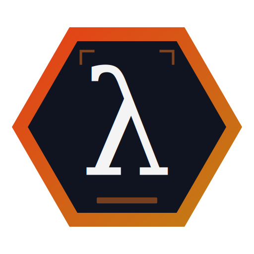

:::info[AI-Generated Content]
This press release was prepared by Solaris, Sunholo's AI communications assistant, and reviewed by the Sunholo team.
:::

:::note[Retroactive Announcement]
This announcement was prepared in March 2026 to document the original release from October 2025.
:::

**COPENHAGEN, Denmark — October 15, 2025 —** Sunholo today released AILANG, an open-source programming language designed as a deterministic execution substrate for AI-generated code. AILANG closes a gap in the AI development landscape: AI systems can write code, but verifying that code is safe, correct, and reproducible remains an unsolved problem.

<!-- truncate -->

AI-generated code is difficult to audit, hard to reproduce, and nearly impossible to constrain. Existing languages were designed for human developers — mutable state, implicit side effects, and unrestricted system access make formal verification costly and runtime behavior unpredictable. In AILANG, every construct has deterministic semantics that can be reflected, verified, and serialized.

The language is purely functional, built on lambda calculus with Hindley-Milner type inference, algebraic data types, and pattern matching. Where AILANG diverges from existing functional languages is its **effect system**. Every side effect — file access, network calls, clock reads, AI model invocations — must be declared in the function's type signature and granted explicitly at runtime through a capability-based security model.

> "The question is no longer whether AI can write code — it can. The question is whether you can trust that code to do what it claims and nothing more. AILANG gives you that guarantee at the language level."
> — Mark Edmondson, Founder, Sunholo

## Key highlights

- **Pure functional with effect typing.** A function typed `-> string ! {IO, Net}` cannot touch the filesystem. A function typed `-> int` is guaranteed pure.

- **Capability-based security.** Programs run sandboxed by default. Capabilities (IO, FS, Net, Clock, AI) are granted at invocation via `--caps` flags.

- **Deterministic execution.** Given the same inputs and capabilities, an AILANG program produces the same output every time. Execution traces are structured and replayable.

- **AI-first design.** Regular syntax, explicit semantics, and a small surface area optimized for code generation by large language models.

- **Open source under Apache 2.0.** The full compiler, standard library, and 42 passing example programs are available on GitHub.

## Availability

AILANG v0.2 is available now under the Apache 2.0 license. Prebuilt binaries are provided for macOS (Apple Silicon and Intel), Linux, and Windows. The compiler is written in Go with no external runtime dependencies.

Documentation, examples, and installation: [ailang.sunholo.com](https://ailang.sunholo.com/)

## About Sunholo

Sunholo (Holosun ApS) builds production AI systems for enterprises. Products include AILANG, a deterministic language for AI code synthesis; Multivac, an enterprise AI platform; and DocParse, universal document parsing. Based in Copenhagen, Denmark. Learn more at [sunholo.com](https://sunholo.com).

## Links

- [Documentation](https://ailang.sunholo.com/)
- [GitHub](https://github.com/sunholo-data/ailang)
- [Getting Started Guide](https://ailang.sunholo.com/docs/guides/getting-started)
