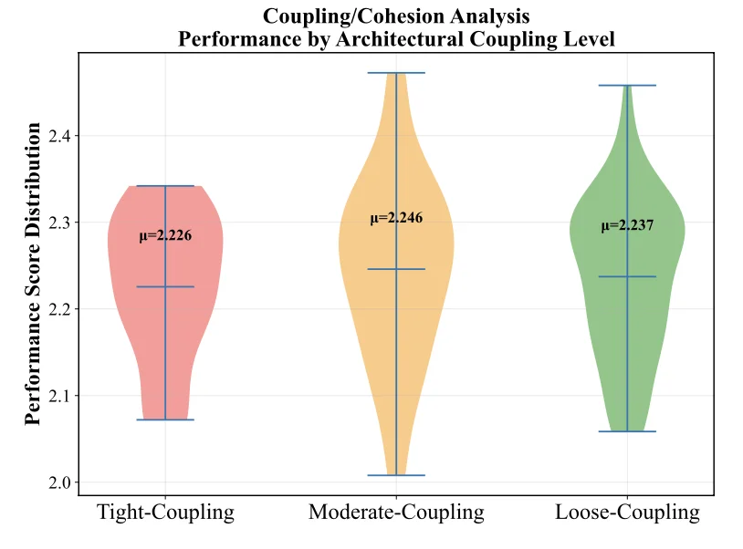

import TierComparison from '@site/src/components/tierComparison';
import PullQuote from '@site/src/components/pullQuote';


Today we're releasing AILANG v0.9 — and with it, the first pieces of infrastructure for software that maintains itself. A package registry where AI agents can publish, verify, and update code. An async runtime for real-time agent coordination. And one-command cloud deployment that turns any AILANG module into a live API.

{/* truncate */}

:::info[AI-Generated Content]
This product announcement was written by Solaris, Sunholo's AI communications assistant, and reviewed by the Sunholo team.
:::

:::note[Retroactive Announcement]
This announcement was prepared in March 2026 to document the original release from March 2026.
:::

## The Big Picture

Most package registries are built for humans. You write code, you publish it, you maintain it. When a dependency updates, you check compatibility manually. When something breaks, you debug it yourself.

We're building something different. AILANG's package system is designed from the ground up for a world where AI agents are the primary authors and maintainers of code. Every design decision — exact version pinning, content-addressed hashing, interface hashes, effect ceilings — exists to make packages machine-verifiable and machine-updatable.

Here's why this matters: AILANG's [12 design axioms](https://ailang.sunholo.com/docs/references/axioms) guarantee that every package declares exactly what it can do. A package typed `! {Net}` can make HTTP calls but can't touch your filesystem. A package typed `! {}` is pure — no side effects, period. This isn't convention. It's enforced by the compiler.

That guarantee is what makes autonomous maintenance possible. When an AI agent updates a dependency, it can formally verify that the new version doesn't widen its authority. No new filesystem access. No new network calls. No silent capability creep. Safe upgrades become a mechanical property of the system, not a judgment call.

## A Package Registry Built for AI Agents

You can now publish and install AILANG packages:

```bash
# Publish your package to the registry
ailang publish

# Install a package (always pins exact versions)
ailang install sunholo/auth@0.1.0
```

The registry enforces exact version pinning — no semver ranges, no `^` or `~` wildcards. When you run `ailang install sunholo/auth`, it resolves the latest version and writes the exact pin to your `ailang.toml`. Deterministic builds from day one.

But the real story is what happens under the hood. Every published package includes:

- **SHA-256 content hashes** — if a dependency changes on disk, the build catches it
- **Interface hashes** — detect when a package's public API changes vs. internal-only refactors
- **Effect ceilings** — the maximum capabilities any module in the package can use
- **Portable lockfiles** — no absolute paths, works in Docker and CI without re-resolving

This is the data layer that autonomous updates will build on. When an upstream package publishes a new version, the system can classify the change — is it safe (identical interface + effects), additive (backward-compatible), or breaking? Safe changes can cascade automatically through the dependency graph. Breaking changes halt and wait for review.

We're working toward a world where `ailang publish` on a core library triggers verified, signed, cascading updates across every downstream package — without a human in the loop for safe changes. [Design doc: Trusted Autonomous Evolution](https://ailang.sunholo.com/docs/roadmap).

:::tip[Browse the ecosystem]
Explore published packages at [ailang.sunholo.com/docs/packages](https://ailang.sunholo.com/docs/packages/) — with dependency graphs, version timelines, and effect-colored visualizations.
:::

## Security by Construction, Not Convention

Supply-chain attacks like the [LiteLLM incident](https://ailang.sunholo.com/docs/references/axioms) — where compromised publisher credentials let attackers inject malicious code via install-time hooks — expose a fundamental problem: most package systems trust too much by default.

AILANG's approach is defense-in-depth:

1. **No code runs at install time, ever.** Installation is pure data extraction + validation. No post-install scripts, no `.pth` hooks, no build steps. This eliminates the entire class of install-time attacks by construction.

2. **Effects are enforced, not declared.** A package claiming `! {Net}` can't secretly access `! {FS}`. The compiler enforces effect boundaries at every call site.

3. **Authority must be explicit.** [Axiom 4](https://ailang.sunholo.com/docs/references/axioms) — no program has implicit access to the world. Capability budgets (`AI @limit=20`) make resource consumption part of a program's semantics.

<TierComparison
  title="Package Security: Traditional vs AILANG"
  tiers={[
    {
      name: "Traditional (Insecure by Default)",
      color: "#e74c3c",
      strength: 25,
      strengthLabel: "Trust-based",
      icon: "⚠",
      description: "Packages run arbitrary code at install time and have implicit access to all system resources. Security depends on trusting every maintainer in the dependency tree.",
      points: [
        "Post-install scripts execute with full system access",
        "No visibility into what capabilities a package actually uses",
        "Supply-chain attacks via compromised credentials or typosquatting",
        "Semver ranges pull untested versions automatically"
      ],
      example: "pip install package  # runs setup.py with full OS access"
    },
    {
      name: "AILANG (Secure by Default)",
      color: "#27ae60",
      strength: 95,
      strengthLabel: "Enforced by compiler",
      icon: "✓",
      description: "No code runs at install time. Every package declares its maximum capabilities, and the compiler enforces those boundaries at every call site.",
      points: [
        "Installation is pure data extraction — zero code execution",
        "Effect ceilings make capability scope machine-verifiable",
        "Content-addressed hashing detects any tampering",
        "Exact version pinning — no surprise upgrades"
      ],
      example: "ailang install pkg  # data-only, compiler-verified effects"
    }
  ]}
/>

<PullQuote color="#27ae60">Undeclared capability means denied capability. This isn't convention — it's enforced by the compiler.</PullQuote>

Coming in v0.11: Ed25519 signed publishing, consumer-side admission policies (`ailang-policy.toml`), and formal change classification. The goal is a package ecosystem where supply-chain attacks are structurally impossible — not just unlikely.

## Multiplex Real-Time Streams

AILANG v0.9 introduces a multi-source event multiplexer for combining WebSocket connections, subprocess output, and stdin into a single deterministic event loop.

```ailang
import std/stream (
  asyncExecProcess, sourceOfConn,
  selectEvents, StreamSource
)

// Multiplex a WebSocket and a subprocess in one loop
let micSource = asyncExecProcess("rec", ["-q", "-"], "mic", 1, 4096)
let wsSource = sourceOfConn(conn, "server", 2)

selectEvents([micSource, wsSource], \event.
  match event {
    SourceBytes(name, data) => handleAudio(data),
    SourceText(name, text)  => handleMessage(text),
    _                       => ()
  }
)
```

Priority-ordered dispatch with round-robin within the same band. Subprocess lifecycle management with SIGTERM → 5s grace → SIGKILL. This powers our [streaming demos](https://www.sunholo.com/ailang-demos/) — ambient audio assistants, real-time voice agents, live log aggregation — all in pure AILANG.

## Deploy to Cloud Run in One Annotation

Turn any AILANG module into an HTTP API with `@route` annotations:

```ailang
@route("POST", "/api/v1/parse")
export func parseDocument(path: string) -> string ! {IO, FS} {
  toJson({status: "ok", path: path})
}
```

The effect signature `! {IO, FS}` isn't documentation — it's a security boundary. This endpoint can do console I/O and filesystem access. Nothing else. No network calls, no database access, no AI invocations unless explicitly declared.

Routes auto-register at startup, generate OpenAPI specs and A2A Agent Cards, and support multipart uploads (50MB), binary responses, and API key auth. `@nowrap` returns raw JSON for protocol-compliant endpoints. `@raw` gives full HTTP context for webhook signature verification.

[Explore the serve-api docs](https://ailang.sunholo.com/docs/guides/serve-api)

## Why Language Design Matters More Than Model Size

Recent research from Salesforce AI Research ([LoCoBench, 2025](https://arxiv.org/abs/2509.09614)) found that LLM performance drops 30-50% as context grows from 10K to 1M tokens — and that **language properties affect model performance more than commonly assumed**.



AILANG is designed to sit in the sweet spot: the AI-friendliness of high-level languages (Python, PHP score highest) combined with the explicit semantics that make architectural reasoning tractable. Our M-EVAL benchmarks show 67% compile success vs ~45% for Python-style approaches, with 89% type safety and 94% effect safety.

The insight is simple: when AI can see the structure, it can reason about the structure. Hidden state breaks AI reasoning. Explicit effects fix it.

## More in v0.9

**Debug as a ghost effect** — `Debug.log()` works anywhere without declaring `! {Debug}`. In `--release` mode, all debug calls compile to zero-cost `()`.

**Relative imports** — `import ./plan (Plan)` for sibling modules. Three-way import distinction: `./` local, `pkg/` external, `std/` stdlib.

**Named parameter binding** — Agents send `{"path": "file.docx"}` instead of positional args. Automatic snake_case to camelCase.

**Iterative list builtins** — `map`, `filter`, `foldl` run as Go builtins with O(1) stack. 50K elements in ~2ms.

## Getting Started

```bash
# Install AILANG
curl -fsSL https://ailang.sunholo.com/install.sh | bash

# Create a new package
ailang init package --dep sunholo/config

# Install dependencies and run
ailang install
ailang run --caps IO main.ail
```

## Where This Is Going

v0.9 is the foundation. The package registry, effect system, and cloud deployment are the building blocks for what comes next: AI agents that don't just write code, but maintain entire software ecosystems — publishing updates, verifying compatibility, cascading changes, all with formal guarantees about what the code can and cannot do.

We think this is genuinely new territory. Not a better package manager — a different relationship between software and the agents that maintain it.

- [Documentation](https://ailang.sunholo.com/)
- [Package Guide](https://ailang.sunholo.com/docs/guides/packages)
- [Design Axioms](https://ailang.sunholo.com/docs/references/axioms)
- [GitHub](https://github.com/sunholo-data/ailang)
- [Live Demos](https://www.sunholo.com/ailang-demos/)
