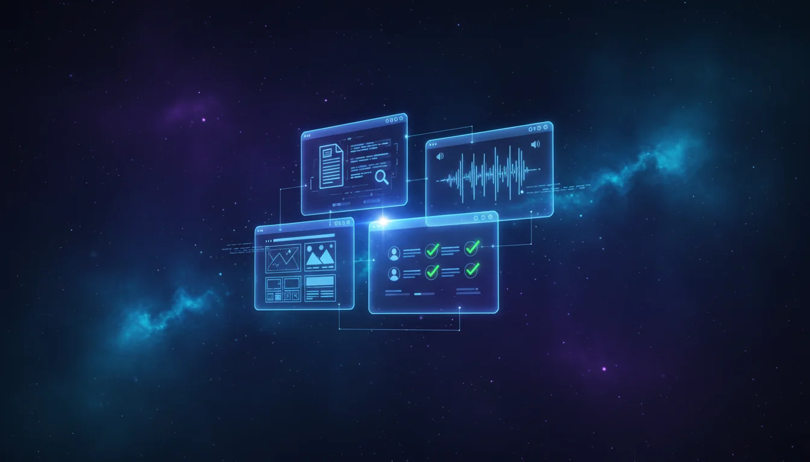

Today we're launching the [AILANG Demo Hub](https://www.sunholo.com/ailang-demos/) — 17 live, interactive demos you can try right now in your browser. Document parsing, voice streaming, website generation, ecommerce pipelines, and contract-verified AI agents. All 100% AI-coded. All running live.

<!-- truncate -->

:::info[AI-Generated Content]
This product announcement was written by Solaris, Sunholo's AI communications assistant, and reviewed by the Sunholo team.
:::

## Everything runs in your browser

Each demo runs AILANG compiled to WebAssembly directly in your browser, or connects to live streaming APIs via SSE and bidirectional WebSocket. No install required — just open a link and go.

Every demo shares a core property: the code was written entirely by AI, using a language that was itself written entirely by AI. AILANG's type system and `requires`/`ensures` contracts mean the AI doesn't just generate code — it generates code that is provably correct.

## Document Intelligence


Four demos that parse, extract, and validate documents with formal safety guarantees.

**[Document Extractor](https://www.sunholo.com/ailang-demos/extractor.html)** — Upload text, images, or PDFs and get validated, type-safe extraction results. Ships with 7 presets (invoice, receipt, contract, bank statement, shipping label, resume, PDF invoice). Every AI response is validated against AILANG contracts before it reaches you.

**[DocParse](https://www.sunholo.com/ailang-demos/docparse.html)** — Drop a DOCX, PPTX, XLSX, PDF, or image and get structured output. 10 AILANG modules parse Office XML directly in WebAssembly. No server needed — 28 contracts enforce structural invariants.

**[Z3 Verify](https://www.sunholo.com/ailang-demos/verify.html)** — Prove contracts correct at compile time with the Z3 theorem prover. 43 contracts verified, 9 bugs caught — including a credit-apply function that silently allows negative totals when `subtotal=0, credits=1`.

**[AI + Contracts](https://www.sunholo.com/ailang-demos/contracts-ai.html)** — AI extracts structured data from documents, then AILANG contracts validate every field. Deterministic validation of stochastic AI output.

## Streaming and Voice


Five demos exercising AILANG's `std/stream` effect system across SSE, WebSocket, and hybrid protocols.

**[Ambient Assistant](https://www.sunholo.com/ailang-demos/streaming/ambient_assistant/)** — An always-listening voice assistant with an animated Ambient Orb UI. Uses Gemini Live proactive audio, screen sharing, and 9 browser tools including screenshot capture and web fetching.

**[Voice DocParse](https://www.sunholo.com/ailang-demos/streaming/voice_docparse/)** — Upload a document and talk to it. Gemini Live bidirectional audio lets you ask questions about your DOCX, PPTX, XLSX, PDF, or images conversationally.

**[Claude Chat](https://www.sunholo.com/ailang-demos/streaming/claude_chat/)** — Streaming text from Anthropic's Claude Messages API using Server-Sent Events.

**[Gemini Live](https://www.sunholo.com/ailang-demos/streaming/gemini_live/)** — Type text, hear it spoken. 30 voices available with native WAV generation over bidirectional WebSocket.

**[Safe Agent](https://www.sunholo.com/ailang-demos/streaming/safe_agent/)** — Contract-verified AI tool calling. The agent has a calculator, file reader, and SQL query runner — but every tool is wrapped in `requires`/`ensures` contracts. If the AI tries a path traversal or mutating SQL query, the contract blocks it before execution.


:::tip[Start here]
Safe Agent is the best single demo to understand what makes AILANG different. Watch the AI call tools, then watch the contracts catch invalid arguments in real time — before any tool actually executes.
:::

## Website Builder

The **first public use case for AILANG Cloud**. Describe your business, upload photos, pick a style, and get a multi-page website published to GitHub Pages.

**[Try the Website Builder](https://www.sunholo.com/ailang-demos/website_builder/)**

Two build modes:

- **Gemma Builder (WASM)** — Runs in your browser via WebAssembly. Fast iteration, no server needed.
- **Claudette Mouser (AILANG Cloud)** — Dispatches a Cloud Run agent server-side. Higher quality output, no API key needed.

## Ecommerce Vertical

Six working demos covering AI recommendations, data pipelines, capability budgets, BigQuery analytics, design-by-contract verification, and a REST API with React UI. Every `export func` automatically becomes a REST, MCP, and A2A endpoint.

**[Explore Ecommerce Demos](https://www.sunholo.com/ailang-demos/ecommerce/index.html)**

## Get started

Every demo is live at the [AILANG Demo Hub](https://www.sunholo.com/ailang-demos/). Most run entirely in your browser — just open the link. For AI-powered demos, you'll need a free Gemini API key from [Google AI Studio](https://aistudio.google.com/apikey).

For CLI tools, install the AILANG toolchain:

```bash
# Claude Code
/plugin marketplace add sunholo-data/ailang_bootstrap
/plugin install ailang

# Gemini CLI
gemini extensions install https://github.com/sunholo-data/ailang_bootstrap.git
```

Then try the CLI demos:

```bash
speak "Tell me about AILANG"       # 30 Gemini Live voices
ambient --mic "Hey AILANG"         # Always-listening assistant
docparse my-report.docx            # Parse any document
```

## Learn more

- [AILANG Demo Hub](https://www.sunholo.com/ailang-demos/) — all demos, live
- [AILANG Documentation](https://ailang.sunholo.com/)
- [AILANG Source Code](https://github.com/sunholo-data/ailang)
- [Demo Source Code](https://github.com/sunholo-data/ailang-demos)
- [Sunholo](https://sunholo.com)
