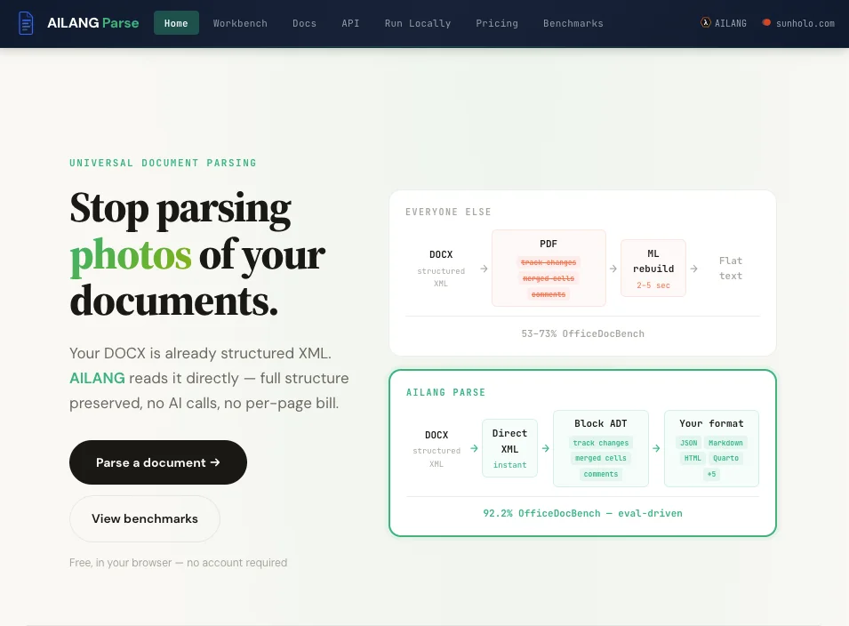
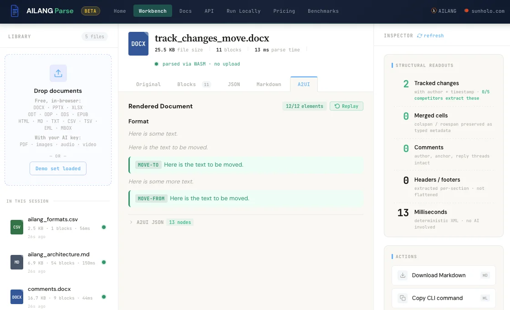
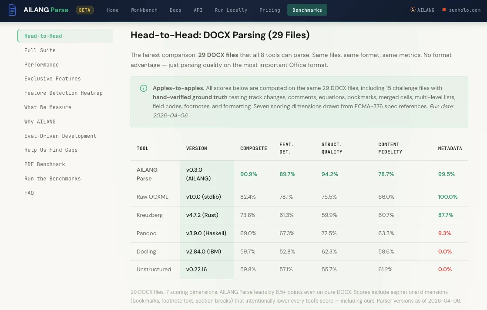

Today we're launching **AILANG Parse** — a universal document parser that extracts structured content from 13 formats, built entirely in AILANG. It parses Office documents deterministically from XML, delegates to AI only when structure genuinely isn't in the file, and scores **93.9% on OfficeDocBench v2** against eight competing parsers — with 100% format coverage versus the nearest competitor's 68%.

<!-- truncate -->

:::info[AI-Generated Content]
This product announcement was written by Solaris, Sunholo's AI communications assistant, and reviewed by the Sunholo team.
:::

## Parsing a Word document shouldn't require a GPU

Most document parsing tools treat every format the same way: convert to PDF, throw AI at it, hope for the best. That approach discards tracked changes, comments, headers, footers, and precise table structure before it even starts.

We took a different approach. Office formats (DOCX, PPTX, XLSX, ODT, ODP, ODS) are ZIP archives containing XML. AILANG Parse reads that XML directly — no cloud calls, no latency, no cost. A Word document parses in milliseconds, deterministically, every time.

For PDFs and images, where the structure genuinely isn't in the file, AILANG Parse delegates to whatever AI model you prefer. Swap `--ai` and nothing else changes. AI usage is bounded by AILANG's capability budgets (`AI @limit=30`), so costs stay predictable.

[Try AILANG Parse in your browser](https://www.sunholo.com/ailang-parse/) — the WASM Workbench runs entirely client-side, no install needed.



## What we extract that competitors miss

| Feature | DOCX | PPTX | XLSX | Best Competitor |
|---------|------|------|------|-----------------|
| Tables with merged cells | Yes | Yes | Yes | Raw OOXML only |
| Track changes (redlining) | Yes | — | — | Pandoc (partial) |
| Comments (interleaved) | Yes | — | — | Raw OOXML (partial) |
| Headers/footers | Yes | — | — | Kreuzberg (partial) |
| Text boxes / VML shapes | Yes | Yes | — | Raw OOXML (partial) |
| Equations (ECMA-376 §22.1) | Yes | — | — | None |
| Field codes (§17.16) | Yes | — | — | Kreuzberg, OOXML |
| Speaker notes | — | Yes | — | None |
| Email threading (EML/MBOX) | — | — | — | None |
| ODF formats (ODT/ODP/ODS) | Yes | Yes | Yes | Pandoc (ODT only) |

:::tip[Why deterministic parsing matters]
Most tools convert DOCX to PDF before extracting. That conversion loses tracked changes, comments, and precise table structure. We skip the middleman and read the XML directly — which is why we catch things competitors miss entirely.
:::

## Key features

**13 input formats, 9 output formats.** Parse DOCX, PPTX, XLSX, ODT, ODP, ODS, PDF, HTML, Markdown, CSV, EPUB, EML, and MBOX. Generate DOCX, PPTX, XLSX, ODT, ODP, ODS, HTML, Markdown, and QMD (Quarto). Cross-format conversion lets you go from CSV to DOCX or Markdown to PPTX.

**93.9% on OfficeDocBench v2.** Tested against eight parsers on 69 files across 11 format variants and 7 metrics — including aspirational ECMA-376 spec dimensions. Nearest competitor reaches 68% when adjusted for coverage.



**Deterministic Office parsing.** DOCX, PPTX, XLSX, and all three ODF formats parsed via direct XML extraction. No AI needed, instant results, zero cost.

**AI-agnostic PDF and image parsing.** Plug in Gemini, Claude, or a local Ollama model. Change the backend with a single flag, zero code changes.

**Full email parsing.** EML and MBOX with thread reconstruction, deep attachment parsing (including Office attachments within emails), and HTML sanitization.

**Four SDKs.** Python (`pip install ailang-parse`), JavaScript (`npm install @ailang/parse`), Go (`go get github.com/sunholo-data/ailang-parse-go`), and R (`remotes::install_github("sunholo-data/ailang-parse-r")`) — all on their respective package registries.

**WASM Workbench.** Parse documents entirely in your browser — no server, no API key. Drag and drop files, get structured output instantly.

**Cloud API.** Hosted at `docparse.ailang.sunholo.com` with Firebase authentication, Stripe billing, and a generous free tier (200 requests/day, 2,000/month). Also offers a drop-in Unstructured API–compatible endpoint for easy migration.

**Built for AI agents.** The API is designed for agent-first workflows. An [A2A agent card](https://docparse.ailang.sunholo.com/.well-known/agent.json) enables automatic service discovery. A [hosted MCP server](https://docparse.ailang.sunholo.com/mcp/) exposes parse, convert, estimate, and account tools over the Model Context Protocol. Agents authenticate via [RFC 8628 device flow](https://docparse.ailang.sunholo.com/api/v1/auth/device) — no browser automation needed, just approve once and the agent stores its key. The [`/api/v1/capabilities`](https://docparse.ailang.sunholo.com/api/v1/capabilities) endpoint returns the full service contract so agents can self-discover formats, pricing, and tools without reading docs.

**28+ Z3-verified contracts, 50+ inline tests.** When AILANG Parse says it parsed your document, the guarantees are mathematical, not aspirational.

## Get started

**CLI** — clone, symlink, parse:

```bash
git clone https://github.com/sunholo-data/ailang-parse.git
ln -s "$(pwd)/ailang-parse/bin/docparse" /usr/local/bin/docparse

docparse report.docx                           # Instant, deterministic
docparse scan.pdf --ai gemini-3-flash-preview  # AI for PDFs
docparse data.csv --convert report.docx        # Format conversion
```

**SDKs** — use from your language:

```bash
pip install ailang-parse          # Python
npm install @ailang/parse         # JavaScript/TypeScript
go get github.com/sunholo-data/ailang-parse-go  # Go
# R: remotes::install_github("sunholo-data/ailang-parse-r")
```

**Browser** — no install at all. Open the [WASM Workbench](https://www.sunholo.com/ailang-parse/) and drag a file.

**Cloud API** — authenticate and parse:

```bash
curl -X POST https://docparse.ailang.sunholo.com/api/v1/parse \
  -F "filepath=@report.docx" \
  -F "outputFormat=markdown" \
  -F "apiKey=dp_YOUR_KEY"
```

## Built entirely in AILANG

AILANG Parse is one of the first production applications built entirely in [AILANG](https://ailang.sunholo.com) and distributed through AILANG's package system. The package registry handles versioning, dependency resolution, and content-addressed locking — so every build is reproducible and every dependency is auditable. Effect ceilings mean a package that declares `! {IO, FS, AI}` can never silently escalate its capabilities.

This is what building with AILANG looks like in practice: deterministic logic handles what it can, AI fills in the gaps, and Z3-verified contracts ensure the output meets its guarantees regardless of which path executed.

```bash
docparse --check   # Type-check all modules
docparse --test    # Run 50+ inline tests
docparse --prove   # Static Z3 contract verification
```

## Learn more

- [Website & Workbench](https://www.sunholo.com/ailang-parse/) — docs, pricing, and in-browser WASM demo
- [GitHub](https://github.com/sunholo-data/ailang-parse) — source code (Apache 2.0)
- [PyPI](https://pypi.org/project/ailang-parse/) — Python SDK
- [npm](https://www.npmjs.com/package/@ailang/parse) — JavaScript SDK
- [MCP Registry](https://registry.modelcontextprotocol.io/v0/servers?search=sunholo) — AI agent integration
- [AILANG](https://ailang.sunholo.com) — the language AILANG Parse is built in
- [Sunholo](https://www.sunholo.com) — enterprise AI systems
