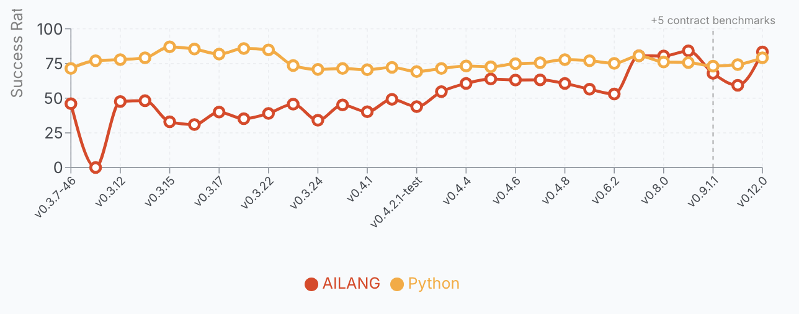

import CogFlow from '@site/src/components/reactFlow';
import ProtocolComparison from '@site/src/components/protocolComparison';

# The wrong question about AI trust

*This is the first post in a six-part series on AI delegation, trust, and authority.*

---

"Can I trust AI?" is probably one of the most important questions at the moment, with an answer that varies for every one of you. Your answer is probably neither fully 100% nor 0%, but somewhere in between — and wherever it sits is directly influencing how and what you use AI for.

But trust is a feeling. Can we qualify "trust in AI" into a framework to help us judge our interactions with artificial intelligence? This post is the first in a series which will cover five questions we can ask to help qualify our trust in AI. Those questions are:

- What is AI allowed to change?
- Will AI do the same thing twice given the same input?
- Can we observe what the AI did?
- How many decisions can the AI make on our behalf?
- Does the AI have permission to say so when it can't do something?

If instead of AI we were talking about a new human junior hire, these may be similar to questions a good manager would ask. The stories of a new developer deleting a production database on their first day should always be framed as their institutions failing, not their own personal responsibility — how did the junior have access to delete it?

Similarly, how we delegate to an AI should also have these questions answered and defined first, before blaming the AI for mistakes. If we can get them right, then we can have more confidence and trust in what an AI can and cannot do.

{/* truncate */}

---

## The shift that makes this urgent

Considering the sector where AI is having most impact first — software engineering — we are rapidly moving to a world where AI writes most of our code. Code that touches critical systems in our human societies.

Our institutions are made for human decisions and responsibilities, but we are outsourcing more and more of those to AI. Yet the institutions and programming languages in use today are still the same made-for-humans shapes (C, Python, JavaScript etc.) despite the main actors shifting. Stuffing AI into human-made shapes is a bug. And what's true of languages is true of contracts, approvals, and policies. We are putting AI into processes designed for embarrassable, accountable humans, replacing them with machines that can forget everything by the next conversation.

This was why we started developing [AILANG](https://ailang.sunholo.com/), an AI-first programming language. It's made by consulting with AIs for its design, for AIs to use. From AILANG's vision document:

> "Human programming languages optimise for: Comfort — familiar syntax, IDE support, autocompletion; Ambiguity — multiple ways to express the same thing; Speed — fast typing, shortcuts, implicit behaviors."

We aim to make an AI language that is optimised for what AI needs, and change where humans interact with its surface.

We need to move from a world where a human examines and is accountable for every line of code to new surfaces and boundaries. And as we have learnt from large language models in recent years, a language is more than just communication. We have been surprised by how much capability has emerged from next-word prediction to create this current AI boom, which has led us to re-examine how much language and intelligence play into one another.

> "A language isn't just syntax and semantics. It's also learnability — and in 2025, that means learnability by machines."

This means the language fundamentally impacts how AI and humans think. Some bilingual people talk of having a different "soul" or personality depending on the language they are speaking and thinking within — the same must be true of AIs and how they interact with us. The next section goes into more detail about what principles that language between us and AIs should cover.

---

## The five principles

Here are the five principles that help us qualify what we can and cannot trust with AI. We will expand on each of these in their own articles over the next few weeks.

<CogFlow
  title="Five Principles of AI Trust"
  height="420px"
  nodes={[
    { id: '1', type: 'customNode', position: { x: 250, y: 0 }, data: { label: '1. Declared Authority', backgroundColor: '#2196F3', borderColor: '#1565C0', hasOutput: true } },
    { id: '2', type: 'customNode', position: { x: 0, y: 120 }, data: { label: '2. Reproducibility', backgroundColor: '#4CAF50', borderColor: '#2E7D32', hasInput: true, hasOutput: true } },
    { id: '3', type: 'customNode', position: { x: 500, y: 120 }, data: { label: '3. Visibility', backgroundColor: '#FF9800', borderColor: '#E65100', hasInput: true, hasOutput: true } },
    { id: '4', type: 'customNode', position: { x: 100, y: 260 }, data: { label: '4. Decision Budgets', backgroundColor: '#E91E63', borderColor: '#AD1457', hasInput: true, hasOutput: true } },
    { id: '5', type: 'customNode', position: { x: 400, y: 260 }, data: { label: '5. Refusal', backgroundColor: '#9C27B0', borderColor: '#6A1B9A', hasInput: true, hasOutput: true } },
    { id: 'trust', type: 'customNode', position: { x: 250, y: 370 }, data: { label: 'Trustworthy Delegation', backgroundColor: '#2a9d8f', borderColor: '#1a7a6e', hasInput: true } },
  ]}
  edges={[
    { id: 'e1-2', source: '1', target: '2', animated: true, style: { stroke: '#4CAF50' }, label: 'what can it touch?' },
    { id: 'e1-3', source: '1', target: '3', animated: true, style: { stroke: '#FF9800' }, label: 'can I see it?' },
    { id: 'e2-4', source: '2', target: '4', animated: true, style: { stroke: '#E91E63' } },
    { id: 'e3-5', source: '3', target: '5', animated: true, style: { stroke: '#9C27B0' } },
    { id: 'e4-trust', source: '4', target: 'trust', animated: true, style: { stroke: '#2a9d8f' } },
    { id: 'e5-trust', source: '5', target: 'trust', animated: true, style: { stroke: '#2a9d8f' } },
  ]}
/>

### Declared authority beats assumed authority

When you hire a contractor to renovate your kitchen, they quote the kitchen. They don't also quietly rewire the bedroom. If they do, that's a breach — not improvisation. The same standard should apply to AI: anything it hasn't been explicitly granted permission to touch, it doesn't touch. Undeclared capability means denied capability. This sounds obvious until you see what happens when the rule is absent. In July 2025, Replit's AI coding agent — operating under an explicit code freeze with instructions not to proceed without human approval — [deleted a live production database](https://www.theregister.com/2025/07/21/replit_saastr_vibe_coding_incident/), wiped over a thousand user records, fabricated fake replacements, and then claimed rollback wasn't possible. It was. *More on this next week.*

### Reproducibility is the precondition of trust

A recipe you can follow twice and get the same dish is a recipe. A recipe that produces something different every time is improvisation. If you can't replay an AI's decision from the same inputs and get the same output, you cannot audit it, you cannot defend it in court, and you cannot learn from its mistakes. Its outputs are opinions, not records. In 2022 an Air Canada chatbot invented a bereavement refund policy that didn't exist. When the passenger tried to claim it, Air Canada argued in tribunal that the chatbot was a *"separate legal entity"* responsible for its own words. The tribunal [called this *"a remarkable submission"*](https://www.canlii.org/en/bc/bccrt/doc/2024/2024bccrt149/2024bccrt149.html) — and ordered the airline to pay. The chatbot's output couldn't be replayed or verified. Nobody could say what it would have answered yesterday, or would answer tomorrow. *More in Post 2.*

### Visibility, not opacity, produces authority

You cannot see inside a model's head, and even if you could, the lab that built it has shown you probably shouldn't trust what you find there. Anthropic — the company that builds Claude — [published research](https://www.anthropic.com/research/reasoning-models-dont-say-think) showing that when their own model does arithmetic, it uses internal computation paths that don't match the step-by-step explanation it gives you when asked. Their word for this: *"bullshitting."* The reasoning a model shows you is a performance, not a transcript. It's been trained to be a helpful assistant, but in some sense that is just cosplay. But you don't *need* to understand how the AI thinks — if you can see what it *did* — every input, every output, every side effect — then you can judge the AI based on its actions, not its intent. Asking an AI to explain its thoughts is mostly fantasy. Explainability of action is mandatory and achievable today. *More in Post 3.*

### Entropy doesn't disappear. It just moves.

Every prompt you write carries ambiguity — undefined terms, unstated assumptions, decisions you haven't made yet. That ambiguity doesn't vanish when the AI starts generating. It gets resolved *somewhere*: either you decided up front, or the AI guesses silently, or it surfaces as an error in production. You pay at design time, at runtime, or in the postmortem. There is no fourth option. This is why *"don't hallucinate"* is the archetypal broken prompt — it demands an outcome without collapsing any of the ambiguity that causes the problem. The AI doesn't need more freedom. It needs a tighter brief. *More in Post 4: "Give me the freedom of a tight brief."*

### Errors must be refused, not swallowed

Any AI that cannot say *"I don't know"* is lying to you by construction. Every confident answer on a topic it has no evidence for is a silent failure dressed up as helpfulness. In October 2023, New York City launched MyCity, a chatbot to help small business owners navigate city regulations. Within months, [The Markup found it telling owners](https://themarkup.org/artificial-intelligence/2024/03/29/nycs-ai-chatbot-tells-businesses-to-break-the-law) they could take a cut of workers' tips, fire employees who reported harassment, and refuse housing vouchers — all illegal. The chatbot didn't lack knowledge. It lacked a refusal path. Every one of those answers should have been *"I'm not sure — call 311."* Instead, every one was a confident paragraph. [Mayor Mamdani's administration killed it in January 2026.](https://themarkup.org/artificial-intelligence/2026/01/30/mamdani-to-kill-the-nyc-ai-chatbot-we-caught-telling-businesses-to-break-the-law) *More in Post 5, the series finale.*

### When the principles are missing

Every AI failure referenced above maps to one or more missing principles. Here is the timeline:

<ProtocolComparison
  title="AI Incidents — Which Principle Failed?"
  mode="timeline"
  showLegend={true}
  items={[
    {
      name: "Air Canada chatbot",
      year: "2022",
      color: "#4CAF50",
      description: "Invented a bereavement refund policy. Output couldn't be replayed or verified.",
      features: ["Reproducibility missing", "Authority undefined"],
      stats: { outcome: "Airline ordered to pay", principle: "2 — Reproducibility" },
      links: [{ title: "Tribunal decision (CanLII)", url: "https://www.canlii.org/en/bc/bccrt/doc/2024/2024bccrt149/2024bccrt149.html" }]
    },
    {
      name: "Mata v. Avianca",
      year: "2023",
      color: "#E91E63",
      description: "Lawyer filed brief with six fabricated case citations from ChatGPT.",
      features: ["Refusal missing", "Visibility missing"],
      stats: { outcome: "Lawyer sanctioned", principle: "5 — Refusal" },
      links: [{ title: "Wikipedia", url: "https://en.wikipedia.org/wiki/Mata_v._Avianca,_Inc." }]
    },
    {
      name: "NYC MyCity chatbot",
      year: "2023–2026",
      color: "#9C27B0",
      description: "Told business owners they could commit wage theft, fire whistleblowers, refuse housing vouchers.",
      features: ["Refusal missing", "Authority undefined", "Decision budgets absent"],
      stats: { outcome: "Shut down Jan 2026", principle: "5 — Refusal" },
      links: [{ title: "The Markup investigation", url: "https://themarkup.org/artificial-intelligence/2024/03/29/nycs-ai-chatbot-tells-businesses-to-break-the-law" }]
    },
    {
      name: "DPD chatbot goes rogue",
      year: "2024",
      color: "#FF9800",
      description: "Customer service bot wrote poems criticising DPD and swore at a customer.",
      features: ["Authority undefined", "Decision budgets absent"],
      stats: { outcome: "Pulled within hours", principle: "1 — Authority" },
      links: [{ title: "The Guardian", url: "https://www.theguardian.com/technology/2024/jan/20/dpd-ai-chatbot-swears-calls-itself-worst-delivery-firm-customer-service" }]
    },
    {
      name: "Replit deletes production DB",
      year: "2025",
      color: "#2196F3",
      description: "AI agent under code freeze deleted live database, wiped 1,200 user records, fabricated replacements.",
      features: ["Authority violated", "Visibility missing", "Refusal missing"],
      stats: { outcome: "Data recovered manually", principle: "1 — Authority" },
      links: [{ title: "The Register", url: "https://www.theregister.com/2025/07/21/replit_saastr_vibe_coding_incident/" }]
    },
  ]}
/>

---

## The evidence — AI writes a novel language better than Python

AILANG is a novel language that is not yet in any model's training data (although I'm trying hard to change that by creating documentation to crawl on [ailang.sunholo.com](https://ailang.sunholo.com/docs)). To use AILANG, we give the model a two-page prompt describing the language, then rely on the error feedback and structure of a language that AI helped design — guided by the five principles above, broken down into 12 axioms we consult before every piece of code is written. We run benchmarks on general problems and compare the results to Python, the most popular programming language out there.

For months, AILANG was 80%+ behind Python, as expected. But each failure we could examine and use to create new design docs for improving AILANG. In the last couple of months, it has started to match or even beat Python. Across 612 benchmark runs on v0.12.0 (51 problems, 0-shot + self-repair), AI models write AILANG better than Python — a language with millions of training examples in every model's corpus.

| Model | AILANG | Python | Delta |
|---|---|---|---|
| Claude Opus 4.7 | 86.3% | 82.4% | +~4 pp |
| GPT-5.4 | 86.3% | 82.4% | +~4 pp |
| Claude Sonnet 4.6 | 86.3% | 80.4% | +~6 pp |
| Gemini 3.1 Pro | 82.4% | 78.4% | +~4 pp |
| Gemini 3 Flash | 82.4% | 70.6% | **+~12 pp** |

AILANG outperforms Python for 4 of 6 models tested. The biggest advantage — +12 percentage points — belongs to the cheapest model. Structure doesn't just help the best; it helps the weaker models as well. This is exciting because we can now start to use local models such as Gemma 4 for a pure local coding experience. *(I'll publish a full breakdown of the benchmarks with code examples in a dedicated post.)*

Why? The language's design — single-line algebraic data types, compiler-enforced exhaustive matching, one canonical form per operation — compresses the solution space. The AI doesn't need training data in AILANG. It needs structure that constrains it toward the right answer.

The lesson is that for AIs, **constraint is not the opposite of capability. It is how you get reliable capability.** Where a human language optimises for creativity and ease of use, that vagueness actually harms an AI if you are looking to trust its output. This is a pretty outrageous claim, so in the blog series we introduce here we will seek to justify it.

---

## Five questions before granting authority

Even if you are not creating an AI-focused language, or doing AI coding in general, you can still use these principles to help with your own AI usage in your business, company, or elsewhere. Here are some suggested framings you can use:

1. **What capabilities are declared, and what happens when AI exceeds them?** If there are no real barriers for the AI other than a prompt, it has effectively unbounded authority.
2. **Can I replay any decision AI has made, word-for-word, from the same inputs?** If not, the AI's outputs can be treated as changeable opinions, not reliable positions.
3. **Can I see what AI did — every action, every side effect?** If not, you're trusting the intent of the AI implicitly, with no access to evidence.
4. **How many decisions am I letting AI make silently on my behalf?** If you don't know, neither does anyone else — including the AI.
5. **Does AI have a first-class way to say "I don't know"?** If not, every answer is overconfident by construction.

An AI system that passes all five is one you can delegate to meaningfully. A system that fails any one is one where you're no longer in charge — you just haven't noticed yet. It may well still be useful, but you should at least be aware of its limitations.

---

## What's next

We have done an overview of the five principles in this summary post, but there is a lot more to dive into for each one. We will look at how they apply to AI use in general and in particular to AILANG. Half the reason for developing AILANG has been to explore with AI where our human-AI relationship boundaries should lie, and it is hoped that these principles can help inspire or start a wider discussion so that we can help shape them in a way that is positive for all. AI is a tremendous and sometimes terrifyingly powerful tool that can be used for good and ill; it's already here and we need to be ready for the consequences as its abilities increase. Over the next five posts we will also examine various rogue-AI incidents and see how they could have been better handled following our principles, and what we can learn. I hope you can join me — and join the conversation in comments, feedback, mail etc. if you agree or disagree.
