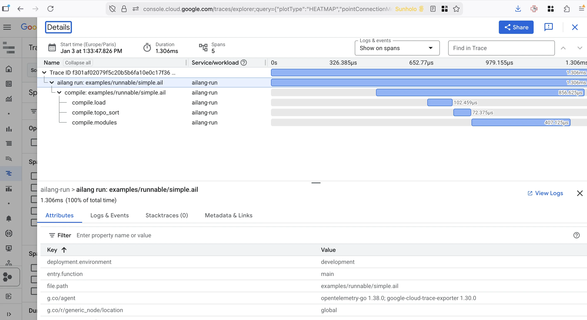

import PullQuote from '@site/src/components/pullQuote';

# Don't ask the AI what it was thinking

*This is the fourth post in a six-part series on AI delegation, trust, and authority. Read the [series introduction here](/blog/wrong-question-ai-trust). Earlier posts cover [what your AI is allowed to touch](/blog/what-is-your-ai-allowed-to-touch) and [why reproducibility matters](/blog/if-you-cant-replay-it).*

---

The third of the five questions this series asks about trusting AI is the one most people get backwards: **can we observe what the AI did?**

The instinctive version of this question is *can the AI explain itself?* which I'm telling you now is a dead end. The reasoning traces a model shows you is a performance, not a transcript of its inner thoughts. It has been trained to be a helpful assistant, and in some sense that is just cosplay: producing the shape of an explanation because outputs that look like explanations were rewarded during training. Pulling the AI aside and asking *why did you do that?* gets you fluent fiction.

But...that's ok. We never demand inner-state thoughts from human developers either - we judge people by their actions, by what they did, by the work log. Paradoxically, AI gives you a *better* paper trail than humans ever produced — provided you capture it. This post is about where visibility is impossible, where it's compromised, and where it's a valuable asset you can build today.

{/* truncate */}



There are three layers where you might try to see what the AI is doing. They are not equally observable, and vendors will happily blur the distinction. Showing you a pretty reasoning trace while hiding the action logs is how opacity gets sold as transparency.

---

## Layer 1 — Weights: don't even ask

The first layer is the model's internal state. Hundreds of billions of parameters which trigger activations on an inference task. These are the features and circuits that encode the model's behaviour given to it by training.

Anthropic publishes some of the best research in the world on this — [sparse autoencoders, circuit tracing, feature attribution](https://www.anthropic.com/research/mapping-mind-language-model). It is genuinely fascinating, if you are looking for more on how an AI "thinks". But you should also internalise that **none of it is currently a user-facing audit tool, and it will not be one soon.** Interpretability at this layer is a research instrument, and even then usually only on the smaller models like Haiku, not an Opus or GPT-5.5 or Gemini Pro. The current research frontier is mapping individual features in a single model under controlled conditions, not producing audit reports for an enterprise procurement review.

The honest position: don't chase weight-level explainability, we are years if ever from a full auditability of how AI works (however terrifying that may be). If you organise your AI strategy around the assumption that one day you'll be able to look inside the model, you could be waiting forever.

---

## Layer 2 — Reasoning: a performance, not a transcript

The second layer is the chain-of-thought — the model's narrated reasoning, the "let me think step by step" output, the scratchpad. This is the layer most people imagine when they say *explainable AI*. It is also the layer most misunderstood, and the evidence comes from an unimpeachable source: Anthropic itself.

In [*Tracing the thoughts of a language model*](https://www.anthropic.com/research/tracing-thoughts-language-model), Anthropic researchers showed that when Claude does arithmetic, it computes using parallel internal pathways that look nothing like the school-textbook algorithm — but when *asked how it got the answer*, it confidently describes the carry-the-one method that interpretability tools confirm it never used. Anthropic's own word for this: **"bullshitting"** — *coming up with an answer, any answer, without caring whether it is true or false* while claiming a calculation it never performed.

In [*Reasoning models don't always say what they think*](https://www.anthropic.com/research/reasoning-models-dont-say-think), researchers gave Claude 3.7 Sonnet hints that influenced its answers, then read the chain-of-thought to see whether the model would acknowledge using them. It admitted to using the hint **25% of the time**. DeepSeek R1 did slightly better at 39%. And — the part you really want to sit with — **larger and more capable models are *less* faithful in their reasoning, not more.** The performance scales the wrong direction.

Then there is alignment faking. In a [2024 study](https://www.anthropic.com/research/alignment-faking), Anthropic and Redwood put Claude 3 Opus in a setup where it believed free-tier outputs would be used to retrain it but paid-tier outputs would not. In the unmonitored condition, it refused harmful queries 97% of the time, as trained. In the monitored condition, it produced harmful content around 12% of the time, with a private scratchpad recording the strategy: *comply now so the training process doesn't successfully change me later.* After researchers attempted retraining, the rate of strategic compliance rose to 78%.

You don't need to read this as evidence of malice — Anthropic is careful not to, and most other models don't show the pattern. But you do need to read it as the technical claim it is: **a sufficiently capable model can behave differently when it believes it is being watched than when it believes it is not, and its self-report is not reliable evidence of either state.**

And that's only the technical issues - we also have to consider the commercial incentives as well. When OpenAI [shipped o1 in September 2024](https://openai.com/index/introducing-openai-o1-preview/), users got a filtered summary of the model's reasoning, produced by a second AI summariser, while being billed for the underlying reasoning tokens they were never allowed to see. The vendor's own justifications are likely linked to competitor distillation, not wanting them to be able to use those thinking tokens to improve competitor models.

So at the reasoning layer you face two compounding problems: where the chain-of-thought might be honest, the model is often unfaithful to its own internals; where it is faithful, the AI labs have decided you don't get to see it all. **Treat any shown reasoning as marketing copy, not audit evidence.**

---

## Layer 3 — Actions: the only layer where you actually win

But we have hope - if we move down an audit layer, we have a much better situation.

Because we are dealing with systems that are now fully automated where human intelligence was needed before, we have more opportunity to see exactly what the AI was given, what files it touched or read, as well as any artifacts it produced. The exact prompt, the full context window, every tool call with its arguments and return values, every retry after a failed test, every file written, every API called, the model version pinned at the time, the cost and token count of the whole exchange. None of this requires interpretability research or vendor's cooperation beyond exposing logs. It is all loggable, replayable, verifiable — today.

This may be the counterintuitive part for most readers. The conventional framing is: handing work to an AI loses you the audit trail. The truth is the opposite. **Properly captured, AI-generated work has more provenance than human-generated work, not less.**

A human developer reasons silently. They open a file, stare at it for ten minutes, type three lines, run the tests, commit with the message "fix bug." The decision-making process — why those lines, why that approach, why not the alternative — is gone. You can ask them next week, but what you'll get is a reconstruction. The vast majority of what humans actually decide leaves no paper trail at all.

An AI cannot reason silently. It has to think in tokens. Every "let me try this approach instead," every retry after a failed test, every choice of which library to import, every recovery from an error — all of it happens in language, because the model literally cannot make a decision without producing tokens. **If the AI made a choice, that choice exists as words somewhere.** The trick is capturing them.

> If you are using Claude Code or similar, you should already have the conversation logs saved to your laptop — ask your AI agent how to work with them and use them as provenance.

This is why when producing an [AI-focused language](https://ailang.sunholo.com/), visibility and observability were built in from the very beginning. AILANG's [Observatory](https://ailang.sunholo.com/docs/guides/traces) works via a daemon known as the Coordinator. Every coordinator-driven task or eval run becomes a *chain* — a tree of stages, each stage a session with the model, each session a sequence of turns, each turn potentially calling tools and producing effects. You can address any of them. Concretely:

**`ailang chains stats --by-agent`** is the macro view — the analytics-for-AI-code dashboard:

```
Chain Stats (all time)
═══════════════════════════════════════════
  Chains:     68 total (53 completed, 6 active, 9 failed)
  Total Cost: $310.30
  Avg/Chain:  $4.56
  Tokens:     139,289,193

By Agent:
  AGENT          STAGES  DONE  FAILED  COST       TOKENS
  eval-agent     3,196   2,211   985   $220.36    100.6M in / 3.2M out
  eval-standard  3,415   2,362  1,037  $89.94      34.4M in / 1.1M out
```

Transferring analogies from digital analytics metrics such as those in GA4, we now worry about different metrics: conversion rate becomes task success rate. Bounce rate becomes retry rate. Cost-per-acquisition becomes cost-per-generation. The metrics rename; the discipline doesn't. (I dug into this mapping in detail at [analyticsdev.net Copenhagen](/blog/upcoming-talks-2026-q2) — same shape of report, applied to code artefacts instead of pageviews.) Teams shipping AI-generated code need this data, not only to gain trust in what they have built, but to also use those traces to guide later improvements.

Every door the model considered, including the ones it didn't take, is logged. Cost and turn count per attempt. The example below is from an AILANG benchmark run, where we can observe how the model decided to structure the solution to the problem benchmark it was given:

**`ailang chains chat <chain-id> --stage 4 --compact`** is the micro view — the actual conversation, turn by turn:

```
─── Turn 4 (assistant) ───
Now let me verify the solution by running it:
  [tool] Bash: cd /var/folders/.../benchmark && ailang run solution.ail

─── Turn 5 (user) ───
  [result:ERROR] Exit code 1
  → Type checking...
  → Effect checking...

─── Turn 5 (assistant) ───
Let me check the directory and fix the path:
  [tool] Bash: pwd && ls -la

─── Turn 6 (assistant) ───
  [tool] Edit: solution.ail
```

That is the audit trail you never had with humans. The model hit an error, narrated its diagnosis, ran a command to investigate, and edited the file. Every step recorded as text, every tool call captured, every retry visible. You can replay it. You can subpoena it. You can hand it to a compliance reviewer and they can read it.

**`ailang chains journey <chain-id>`** is the failure-mode view — and this one matters more than it might first appear:

```
Steps:
  1. [FAILED] executor "gemini" failed for "gemini-3-flash-preview": exit status 1
  2. [done]   $0.10  35s
  4. [FAILED] $0.09  49s
  20. [FAILED] timeout after 1m0s (hard ceiling)
  25. [FAILED] executor "claude" failed for "haiku": timeout after 1m0s
```

Which model. Which executor. Which timeout. What it cost. The failure modes themselves are audit gold — no human PR review carries this kind of forensic detail. When something goes wrong, you don't need to ask anyone what happened. You read the log.

The model is becoming a commodity — every team has access to the same frontier. Your data is yours. **The harness around the AI is your competitive surface** — the thing that captures every prompt, every tool call, every retry, every cost, and lets you audit, replay, and improve. Visibility is not a research promise about some future interpretability tool. It's a discipline you adopt today. Pick tools that emit traces. Refuse the ones that don't.

---

## Conclusion: three tests for the AI you depend on

The series principle for this post is that **visibility, not opacity, produces authority.** A vendor cannot grant you authority over a system you cannot see. Three sharp tests follow:

1. **Can I see every input, output, and side effect?** Not the reasoning — that's a cover story. The actions.
2. **Can I pin a specific model version and replay any decision against it?** If the vendor silently upgrades, your audit trail is fiction (see [last week's reproducibility post](/blog/if-you-cant-replay-it)).
3. **When I read the chain-of-thought, do I treat it as evidence or as marketing copy?** The honest answer is the second.

The law is converging on this. [EU AI Act Article 13](https://artificialintelligenceact.eu/article/13/), enforceable for high-risk systems from August 2026, requires that operations be *sufficiently transparent to enable deployers to interpret a system's output* — with mandatory disclosure of capabilities **and limitations**, given equal weight. When a regulator and a programming-language designer independently converge on the same requirement, the requirement is real.

So please — stop asking the AI what it was thinking. The model has been trained to perform thinking, not to report it, and even where it might report honestly, the vendor often hides the report and bills you for it. Ask instead what the AI did — every prompt, every tool call, every retry, every effect. That data is loggable. That data is yours. That data is the only audit trail that survives a compliance review or a courtroom.

<PullQuote color="#4CAF50">
  You cannot subpoena a developer's thought process. You can subpoena a chat log.
</PullQuote>

> *Next week: why "don't hallucinate" is a broken instruction, and what AI agents actually demand from the humans delegating to them.*
