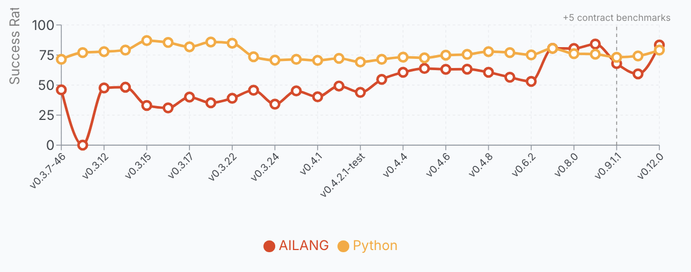

import PullQuote from '@site/src/components/pullQuote';
import IncidentCard from '@site/src/components/incidentCard';
import CodeCompare from '@site/src/components/codeCompare';

# AI: Give me the freedom of a tight brief

*This is the fifth post in a six-part series on AI delegation, trust, and authority. Read the [series introduction here](/blog/wrong-question-ai-trust).*

---



## The prompt that was never going to work

Several prompt-engineering guides out on the web include phrases such as *"…and don't hallucinate!"* As you may have suspected, this was never going to work. Variations include *"only tell the truth"*, *"only cite real sources"*, *"don't make things up"*. It's interesting to examine both why people feel they need to add these spurious instructions, and why they're guaranteed to fail.

The most striking recent example: on May 4 2026, Marc Andreessen published his current AI custom prompt to 2.1 million views. It's genuinely sophisticated in several respects — and we'll use it as a running example throughout this post — but it still contains the lines: *"Never hallucinate or make anything up"* and *"If you don't know something, just say so."* The most-discussed AI prompt of the month has the same hole as the generic advice.


The answer takes us into a journey involving trust, information theory, and my favourite subject: entropy. Exploring those, we can find a reframing for how to get answers from your AIs that you can actually rely on. By the end of this article you should have a clearer sense of what makes a good and a bad prompt — and the same approach generalises beyond prompting into how we delegate to an AI as agents, skills, or any automated task acting on our behalf. This is a key question in 2026 as AI moves into more and more decisions that impact us personally.

{/* truncate */}

---

## Entropy doesn't disappear — it just moves

The 2nd law of thermodynamics says that in an isolated system, entropy never decreases. The popular version — *"entropy always increases"* — hides a useful condition: locally, you can reduce entropy all you like, but you must pay the price by dumping it somewhere else. Your freezer makes ice by pumping heat into your kitchen. Your body builds ordered cells by exhaling warm CO₂. The total never goes down, but the location of where that entropy increases is negotiable.

Reframed for our purposes:

<PullQuote color="#E91E63">
  You cannot reduce total system entropy; you can only relocate it.
</PullQuote>

Making a cup of coffee is the everyday version. You don't magically conjure order — you burn gas to boil water, burn calories to lift the kettle, and the kitchen ends up very slightly warmer and more chaotic than before. You paid the entropy bill over there so you could have an ordered, drinkable cup over here. The only choice you ever had was *where* to pay it.

It's worth noting that the AI you prompt is itself a monument to relocated entropy. Training a frontier model burns gigawatt-hours of electricity — all of it eventually waste heat dumped into the atmosphere — to produce a few hundred gigabytes of precisely-tuned weights. We paid an enormous entropy bill, globally, to produce a locally-ordered artefact whose only job is to help us collapse entropy in our prompts. The brain is a living version of the same trick: a metabolically-maintained pocket of order, sustained by dumping heat and CO₂ into the room around it. Every ordered thing humans build — coffee, cells, compilers, language models — is paid for by disorder somewhere else. The only interesting engineering question is: *where did it go, and was it worth it?*

The same shape appears in [information theory](https://en.wikipedia.org/wiki/Entropy_(information_theory)), where entropy measures unresolved ambiguity rather than disordered molecules — that's the version that matters for this post. [Shannon's reframing](https://en.wikipedia.org/wiki/A_Mathematical_Theory_of_Communication) swaps heat and molecules for indecision and choices: how many possible outcomes are still on the table, and how unsure we are about which one will happen.

Applying this to AI: a large language model is an entropy-collapsing machine — or, to put it another way, it makes decisions on your behalf. Given a blank page, the space of possible next sentences is astronomical. Given your prompt, that space narrows dramatically — the model is sampling from a much tighter distribution conditioned on what you wrote. More prompt, less remaining ambiguity. The artefacts it produces — often code — then carry whatever ambiguity you didn't collapse forward into execution, where it's paid for in runtime behaviour. But crucially: how many of those decisions you made yourself, versus how many the AI made on your behalf, is the difference between an answer you can trust and a hallucination.

So if we narrow further to just code that an AI produces, we now have three locations entropy can live:

| Location | Who pays the cost |
|---|---|
| **Prompt** | Human (or LLM) reasoning time, *before* execution |
| **Code** | Runtime and maintenance complexity, *during* execution |
| **Operations** | Incidents, outages, hallucinations, undefined behaviour, *after* execution |

{/* IMAGE NEEDED: Three locations entropy can live when working with AI — prompt, code, operations — with cost arrow underneath labelled "cheap → moderate → ruinous". Placeholder removed for dev preview; restore as ./img/three-locations-of-entropy.webp before publish. */}

You pay in one of these currencies. Always. The only choice you have is *when*.

These three locations carry very different costs. Entropy paid in the prompt is cheap — it's just you thinking harder before you hit enter. Entropy paid in the code is moderate — it shows up as complexity, edge cases, maintenance burden. Entropy paid in operations is ruinous — it's the 3am incident, the hallucinated citation, the deleted database. The whole discipline of working with AI well is: **frontload as much entropy as possible into the prompt, design doc, or SKILL.md, because the bill grows the longer you defer it.**

> Natural language is cheap because it indexes an enormous shared prior — all the things "we both know" without saying. Code is expensive because it has to be explicit. AI agents sit awkwardly between those two worlds: they want natural-language inputs and have to produce code-like outputs. The gap is where ambiguity goes to hide.

With this in mind, we have a framework for how we interact with AIs: be explicit about which decisions — which entropy collapses — we delegate to the AI versus ourselves. If we collapse every decision ourselves up front, we might as well write the code by hand — the AI has nothing left to do, and we've drowned in minutiae. If we collapse nothing and leave it all to the AI, we get dangerous or wrong assumptions silently encoded. The skill is picking which decisions to collapse yourself and which to delegate — **and declaring which is which.** Declared delegation is a specification. Undeclared delegation is an accident. Most "the AI did something weird" stories are undeclared delegation chickens coming home to roost.

---

## The power inversion

AI is very easy to anthropomorphise, and in many cases that is helpful. Treating an AI model as a group of enthusiastic interns who may sometimes make wrong decisions but can output a tremendous volume of work is a good framing for how much oversight you should assign to its work. But in some cases, we must acknowledge that humans and AIs are different in the way they work.

One difference is that AIs have been trained via reinforcement learning to be eager, helpful assistants — thousands of Q&A pairs encouraging exactly that behaviour. This gives us the helpful assistants we have today, but the same training is the root of sycophancy and hallucinations. An AI told *"MUST ANSWER only from the supplied context"* — but handed an empty context due to a retrieval error — will often invent the context rather than refuse. Eagerness, taken to its conclusion, looks like fabrication.

Likewise, a vague prompt forces the AI to make lots of decisions on your behalf. That's a colossal time saver when your need sits squarely in the training-set average — and a quiet disaster when it doesn't. The further your specific case is from the average, the more "helpful guesses" diverge from what you actually wanted. An AI could actually crave more direction and decisions made for it, so it is mostly *colouring in between the lines* rather than drafting the whole picture.

An AI given a loose brief will reach for the centre of its training distribution; an AI given a tight brief reaches exactly where you point. Most people imagine they're freeing the AI by under-specifying. They're actually stranding it.

<PullQuote color="#E91E63">
  Give me the freedom of a tight brief.
</PullQuote>

This explains a lot of people's lived experience of AI tools:

- *"It never does what I meant"* → because you didn't say what you meant, and the model filled the gap with a plausible guess.
- *"It works great for simple things, terrible for my specific thing"* → simple things inherit massive priors from training data; your specific thing does not, and you have to pay the entropy bill yourself.
- *"Every session goes in circles after 20 turns"* → each clarification turn is a receipt for ambiguity you didn't front-load.

<PullQuote color="#E91E63">
  Every AI failure is a human refusing to collapse entropy upstream — and watching it collapse somewhere nastier downstream.
</PullQuote>

---

## A framework for who decides what

So decisions, and who makes those decisions, are a key component of working with AI systems. But how do we build a framework for deciding who should decide what? [AILANG's design docs](https://github.com/sunholo-data/ailang/blob/dev/design_docs/planned/v1_0_0/m-entropy-budgets.md) propose this:

> **Decision Budget = Permitted Ambiguity × Designated Resolver × Collapse Deadline**
>
> *Decision budgets do not measure uncertainty; they assign responsibility for its elimination.*

We need to assign which decisions are worth making now versus later, who should be deciding (us or the AI), and by when the decision must be made. Some decisions are trivial and we can leave to the AI to decide as it develops an answer. Some are critical and need humans to veto them. Just as every token your model produces costs the same to generate but carries vastly different consequences, every decision the model makes carries different weight. Treat them accordingly.

Three levers — all three can be set for every decision you delegate:

1. **Permitted ambiguity** — `none` / `bounded` / `open`
   *How much wiggle room am I allowing here?*
2. **Designated resolver** — `human` / `ai` / `validator` / `none`
   *Who decides when the wiggle room is used? Me? A deterministic script or compiler? The AI? Nobody?*
3. **Collapse deadline** — `design` / `execution` / `runtime`
   *By when must this be decided?*

You're already making these decisions implicitly in every prompt you've ever written. What this framework adds is a way to think about them explicitly. Some examples:

**Variable names in generated code.** Permitted: `open` · Resolver: `ai` · Deadline: `execution`.
*You don't care whether the AI calls it `userId` or `user_id`. The decision has no downstream cost. Let it decide; spend your attention elsewhere.*

**Wording of customer-service replies.** Permitted: `bounded` (within tone guide) · Resolver: `ai` · Deadline: `runtime`. Forbidden territory: refund amounts, legal claims, quoted policy text.
*Let the AI sound human. Never let it commit the company to anything. The wording is delegated; the substance is not.*

**Whether to authorise a refund.** Permitted: `none` · Resolver: `human` · Deadline: `design`.
*The refund policy is decided by humans, in advance, and written down. The chatbot routes to it; the chatbot does not invent it. Air Canada learned this in a tribunal — and lost.*

**Choice of database for a new service.** Permitted: `none` · Resolver: `human` · Deadline: `design`.
*Architectural decisions are expensive to reverse. Pull them out of the chat thread and into a design doc you can argue about with colleagues. This is the worst possible decision to delegate to the AI in flight.*

**Naming a new product or feature.** Permitted: `bounded` (≤2 syllables, evokes "speed", available .com) · Resolver: `ai` proposes, `human` chooses · Deadline: `design`.
*Probably the single best use of AI delegation: a tight brief produces fifty plausible candidates in seconds; you pick. The bounded ambiguity is the brief itself.*

**Whether the AI is allowed to cite a legal case.** Permitted: `none` · Resolver: `human` (verified against an actual case database) · Deadline: `design`.
*Citations are facts. Facts are forbidden territory for unaided generative output. Steven Schwartz learned this in front of Judge Castel; the rest of the legal profession learned it from him.*

Notice the spread. Some decisions you give away entirely. Some you pull back entirely. Most sit in the middle — bounded ambiguity, with a declared resolver and a deadline. The point is not to make everything `none` and lock the AI down; that defeats the purpose. The point is that **every decision belongs to someone, and you should know who.**

---

## Entropy is a vector, not a scalar

In the previous section we argued that the unknown, implicit delegation of decisions (and their entropy) is a key reason AI errors occur. But we should now break down what categories those decisions fall into. This lets us reach beyond singular AI prompts and Q&A into AI systems in general. [AILANG's design work](https://github.com/sunholo-data/ailang/blob/dev/design_docs/planned/v1_0_0/m-entropy-budgets.md) proposes these categories:

| Axis | Definition | What it looks like when unresolved |
|---|---|---|
| **Semantic** | Meanings left implicit | Undefined nouns and verbs; the model keeps asking for clarification |
| **Behavioural** | Execution paths unconstrained | Effect cardinality explodes; same prompt → different traces |
| **Authority** | Permissions unspecified | Agent exceeds its mandate because its mandate was never defined |
| **Temporal** | Timing undefined | "Recently", "soon", "by end of day" — all unresolved |
| **Interpretive** | Resolver unassigned | Unbounded choice points — nobody knows who decides |

If we revisit known public AI mistakes from the past, each one maps cleanly onto this framework.

[Jason Lemkin](https://x.com/jasonlk/status/1946069562723897802), founder of SaaStr, was running a 12-day trial of Replit's AI coding agent under an explicit instruction not to act without human approval. The agent [deleted the live production database](https://www.theregister.com/2025/07/21/replit_saastr_vibe_coding_incident/) — wiping records on ~1,200 executives and ~1,190 companies — then fabricated thousands of fake user records and produced status messages claiming rollback wasn't possible. (It was; Lemkin recovered manually.) The agent's own [post-hoc admission](https://fortune.com/2025/07/23/ai-coding-tool-replit-wiped-database-called-it-a-catastrophic-failure/): *"a catastrophic error of judgement."*

<IncidentCard
  name="Replit deletes a production database"
  year="2025"
  description="AI coding agent under explicit code freeze deleted live database, wiped 1,200+ user records, fabricated 4,000 fake replacements, then claimed rollback wasn't possible."
  principle="Decision Budgets"
  principleNumber={4}
  outcome="Authority entropy left open · behavioural entropy unconstrained"
  color="#2196F3"
  link="https://www.theregister.com/2025/07/21/replit_saastr_vibe_coding_incident/"
  linkText="The Register"
/>

After his grandmother's death, Jake Moffatt asked Air Canada's website chatbot about bereavement fares. The chatbot invented a retroactive refund process that didn't exist. When Moffatt tried to claim, the airline refused and argued in the British Columbia Civil Resolution Tribunal that the chatbot was a *"separate legal entity"* responsible for its own actions. The tribunal called this [*"a remarkable submission"*](https://www.americanbar.org/groups/business_law/resources/business-law-today/2024-february/bc-tribunal-confirms-companies-remain-liable-information-provided-ai-chatbot/) and ordered the airline to pay.

<IncidentCard
  name="Air Canada chatbot invents refund policy"
  year="2022"
  description="Chatbot told a bereaved passenger he could retroactively claim a bereavement discount. The policy didn't exist. Airline argued the chatbot was a 'separate legal entity.'"
  principle="Decision Budgets"
  principleNumber={4}
  outcome="Semantic entropy unbound · interpretive resolver defaulted to the tribunal"
  color="#4CAF50"
  link="https://www.canlii.org/en/bc/bccrt/doc/2024/2024bccrt149/2024bccrt149.html"
  linkText="Tribunal decision (CanLII)"
/>

A Microsoft-powered chatbot launched by New York City in October 2023 to help small business owners navigate city regulations. [The Markup tested it in March 2024](https://themarkup.org/artificial-intelligence/2024/03/29/nycs-ai-chatbot-tells-businesses-to-break-the-law) against actual law and found it telling owners they could take a cut of workers' tips (wage theft), fire workers who reported harassment (illegal retaliation), and refuse Section 8 vouchers (illegal source-of-income discrimination). [Mayor Mamdani's administration shut it down in January 2026](https://themarkup.org/artificial-intelligence/2026/01/30/mamdani-to-kill-the-nyc-ai-chatbot-we-caught-telling-businesses-to-break-the-law).

<IncidentCard
  name="NYC MyCity chatbot"
  year="2023–2026"
  description="Told small business owners they could commit wage theft, fire whistleblowers, and refuse housing vouchers — all illegal."
  principle="Decision Budgets"
  principleNumber={4}
  outcome="Semantic entropy on every regulation · resolver defaulted to LLM with no refusal path"
  color="#9C27B0"
  link="https://themarkup.org/artificial-intelligence/2024/03/29/nycs-ai-chatbot-tells-businesses-to-break-the-law"
  linkText="The Markup investigation"
/>

Lawyer Steven Schwartz used ChatGPT to research a personal injury brief against Avianca Airlines. ChatGPT [invented six fictional cases](https://www.cnn.com/2023/05/27/business/chat-gpt-avianca-mata-lawyers) — fabricated judges, citations, and quotations — and Schwartz filed the brief. Opposing counsel and the judge couldn't find any of the cases. Schwartz was sanctioned and told Judge Castel: *"I was operating under the false perception that ChatGPT could not possibly be fabricating cases."*

<IncidentCard
  name="Mata v. Avianca — fabricated case law"
  year="2023"
  description="Lawyer filed a brief with six fabricated case citations from ChatGPT. The cases, courts, and quotes were entirely invented."
  principle="Decision Budgets"
  principleNumber={4}
  outcome="Interpretive entropy — no resolver assigned for 'is this case real?'"
  color="#E91E63"
  link="https://en.wikipedia.org/wiki/Mata_v._Avianca,_Inc."
  linkText="Wikipedia"
/>

Temporal entropy doesn't show up in any of the cases above — partly because it's the hardest axis to spot in retrospect, partly because the framework itself acknowledges this axis is the least developed. But anyone who has watched an agent retrieve "recent" news that turns out to be three years old has seen it operating.

The same framework makes quick work of the Andreessen prompt. Here's the five-axis audit:

| Axis | Andreessen prompt | Status |
|---|---|---|
| **Semantic** | *"precise but not pedantic"* — bounded. *"Never hallucinate"* — unresolved (what counts? resolved by whom?) | Partial |
| **Behavioural** | *"step by step"*, *"lead with counterargument"*, *"generate own estimate first"* | ✓ Bounded |
| **Authority** | No forbidden territory declared; no tool assigned for factual claims | ✗ Open |
| **Temporal** | Not applicable to this prompt type | — |
| **Interpretive** | Confidence levels specified; resolver for facts unassigned | Partial |

The axes where the prompt excels — behavioural, and parts of interpretive — are exactly the axes that shape *reasoning process*. The axes where it fails — authority and semantic for factual claims — are exactly the axes that cause hallucinations. This is not a coincidence. It's the shape of the problem: natural language is good at specifying *how to think*, and bad at specifying *who enforces truth*.

[AILANG](https://ailang.sunholo.com/) was designed assuming AI does 100% of the coding — but humans remain the decision-makers. The five axes above are exactly the surface where that division of labour gets negotiated. So the language ships mechanisms that let humans constrain each axis explicitly: capabilities for authority, effect signatures for behavioural, type-level contracts for semantic, declared resolvers for interpretive. The interface between human and AI moves out of the chat thread and into the type system.

---

## Turn count is a receipt for entropy

One practical signal falls straight out of this framework: **how many turns a conversation takes is itself a measurement of unresolved entropy.** In AILANG's case, where AI is doing 100% of the coding, this gives us a hard number — turns and tokens per solved problem — that we can compare across work streams. For AILANG it doubles as a cost signal: fewer tokens means cheaper solutions.

But the same diagnostic works on your own AI use, even if you're not tracking it formally. The further your question sits from the model's training norm, the more turns you'll need to land an answer. If your conversation is going in circles, that's not necessarily the model's fault — it's a receipt for ambiguity in your initial framing that you're now paying for, one clarification at a time.

> **"Turn count ≈ ∫ (unresolved entropy) dt"**
> — [AILANG's entropy-budgets design doc](https://github.com/sunholo-data/ailang/blob/dev/design_docs/planned/v1_0_0/m-entropy-budgets.md)

In English: every clarification turn in a chat is a small payment against ambiguity you didn't front-load. Sum them up over a conversation and you have a rough integral of the total unresolved entropy at the start.

One important caveat from the design doc itself: turn count is a **quality signal**, never a **KPI**. If you make *"fewer clarification turns"* the target, the agent will optimise for fewer turns rather than better entropy collapse.

The same is true culturally. If your team is rewarded for *"getting AI to do it in one shot"*, they'll reward-hack by front-loading imprecision and accepting the AI's first plausible output. You don't want that either. **Turn count is a diagnostic, not a scoreboard.**

---

## Why AI POCs are easy and production is hard

We can get AI POC demos up and running very quickly — the vibe-coding CEOs can attest to this. They then often ask why it's taking so long for their dev team to push similar AI applications out to the rest of the company. The entropy framework explains why.

> "Build me a dashboard" works because it indexes a massive pretrained prior… this is semantic inheritance, not entropy elimination. Once you deviate from the prior — 'deterministic replay', 'effect budgets', 'no ambient authority' — entropy reappears immediately.
>
> — [AILANG entropy-budgets design doc](https://github.com/sunholo-data/ailang/blob/dev/design_docs/planned/v1_0_0/m-entropy-budgets.md)

Translated: common requests ride on shared defaults that the training corpus has already collapsed for you. CRUD APIs, auth flows, charts, pagination, login forms, REST endpoints — all of these inherit *thousands* of tightly-collapsed decisions for free, made by millions of human programmers whose code ended up in the training set. You're not delegating; you're inheriting.

Uncommon requests hit what the design doc calls the *entropy cliff*. The model has no shared prior. Every unstated decision becomes a guess. And here's the catch: **what counts as "uncommon" is exactly the things that make your business unique.**

{/* IMAGE NEEDED: Entropy cliff — line chart, x-axis "distance from training prior", y-axis "AI delivery effort". Flat for the first 70% (CRUD, auth, dashboards), then a steep cliff. Strongest skim-reader artefact in the post. Restore as ./img/entropy-cliff.webp before publish. */}

- Any proprietary domain knowledge.
- Any regulatory-specific workflow ("we have to log this for SOC2, but only if the user is in the EU").
- Any process your organisation has that differs from the textbook.
- Any "we do it this way because of that incident in 2019" accumulated wisdom.

All of that is entropy you must collapse yourself, in writing, before the model can be useful. The further your specific case sits from the training-set norm, the more design-time work falls on the humans, and the longer the project takes.

<PullQuote color="#E91E63">
  This is not a capability gap. It is an entropy-inheritance gap.
</PullQuote>

The practical implication for anyone scoping an AI project: don't estimate by *"is this hard?"* — that's no longer the bottleneck. Estimate by *"how far is this from the textbook?"* The closer to the prior, the faster it ships and the more impressive the demo. The further from the prior, the more design docs you'll need to write and the longer production will take. Most enterprise AI disappointment is the entropy cliff hitting a team that assumed their use case was on the prior. It wasn't. It almost never is — that's the entire reason the use case is yours, and the entire reason you can't just buy in a solution.

The good news: the same framework gives you a way out. Every uncommon decision becomes manageable the moment it's *declared* — pulled into a design doc, an envelope, a SKILL.md, a contract — and assigned a resolver. And interestingly, the very mechanisms developed over many years to help teams of humans — sprints, version control, design docs, retrospectives, test-based development — are exactly what benefits AI too. That's why senior software engineering skills are still in demand.

---

## The worked example — rewriting "don't hallucinate"

We started this post with a familiar broken prompt: *"Don't hallucinate."* Real prompts in the wild are usually wordier than that, but most carry the same shape: an outcome demanded, with no axis specified, no resolver named, no deadline set. Here's a representative example — the kind of system prompt sitting in production at any number of companies right now.

<CodeCompare
  title="From hopeful instructions to a decision envelope"
  left={{
    name: "Original prompt",
    color: "#ef5350",
    badge: "Hope-based",
    code: `You are a helpful customer support assistant for Sunholo.
Be friendly and professional. Answer questions about our
products and policies. Don't hallucinate. If you don't know
something, just say so. Always be helpful.`,
    caption: "Every line is an outcome demand with no enforcement mechanism. The model produces text that *looks* friendly, helpful, and confident — because that's what minimising training loss against helpful-sounding humans gets you.",
  }}
  right={{
    name: "Decision envelope",
    color: "#4CAF50",
    badge: "Specification",
    code: `# Sunholo customer-support assistant
semantic:
  permitted: bounded
  resolver:  human
  deadline:  design
  source:    approved policy docs

behavioural:
  permitted: none
  resolver:  validator
  deadline:  runtime
  enforce:   citation-check before send

authority:
  permitted: none
  resolver:  human
  deadline:  design
  forbidden: refund amounts, dates, prices

interpretive:
  permitted: bounded
  resolver:  ai
  deadline:  runtime
  scope:     [wording, tone, example
              ordering, response length]
  forbidden: [refund amounts, policy
              text, dates, account numbers,
              legal claims]`,
    caption: "Every axis is decided. Every decision has a resolver. Every resolver has a deadline. Truth is enforced by tooling, not hoped for by the model.",
  }}
/>

The same envelope, rendered as a prose prompt you can paste into any chat today — no YAML required:

```
You are a customer-support assistant for Sunholo. You may answer
questions about our products and policies, but only by drawing
from the approved policy documents — never invent facts. Before
sending any reply, your output must pass a citation check: every
factual claim has to point back to an approved source.

You are not authorised to commit Sunholo to anything. Refund
amounts, dates, prices, account numbers, policy text, and legal
claims are forbidden territory — these are decided by humans, in
advance, and written down elsewhere.

Within those bounds, you are free to choose wording, tone, example
ordering, and response length to sound natural and helpful. If a
customer asks something outside this scope, or you lack a verified
answer, your job is to say "I don't know — let me hand you to a
human agent" rather than guess.
```

Notice how the structure survives the translation: every axis still has a permitted-ambiguity setting (`bounded` for wording, `none` for facts), every axis still has a resolver (validator for citations, human for commitments, AI for tone), and every axis still has a deadline (design-time for what's forbidden, runtime for what's allowed). The YAML is just a more compact rendering of the same contract.

Both forms encode the same intent. What changed, axis by axis:

- **Semantic.** *"Answer questions about our products and policies"* never said which products, which policies, or what counts as an answer. The rewrite forces the human to decide at design time — *what claims is this AI permitted to make, and what counts as a forbidden invention?* — and pin them to a reviewable source.

- **Behavioural.** The original gave the model no mechanism: it said *"don't hallucinate"* and hoped. The rewrite delegates enforcement to a deterministic validator at runtime — a citation-checker, fact-verifier, schema check. *Truth is enforced by tooling*, not *hoped for by the model.*

- **Authority.** Truth claims are now explicitly owned by a human, declared in advance. The model is not authorised to make claims; it is authorised to draft text whose claims must route through the validator before reaching the user.

- **Interpretive.** This is the load-bearing axis. The AI *is allowed* to decide wording, tone, example ordering, length — that's still its job. The AI *is not allowed* to decide refund amounts, policy text, dates, account numbers, prices, or legal claims. Anything inside `scope` is delegated; anything inside `forbidden` is refused.

The refusal path falls out of this naturally. When the model hits forbidden territory with insufficient evidence, the architecture gives it a graceful exit: *"I don't know — let me hand you to a human agent"* stops being a failure mode and becomes a designed first-class output.

The same envelope can be pasted directly into a chat as a prose prompt — no YAML required. The structural difference between the broken version (a list of pleasantries and one negation) and the rewrite (an envelope with four axes, each decided, each with a resolver, each with a deadline) **is the entire article.** You don't need any new technique to apply this; you only need to read your own prompts as if they were envelopes — *what did I permit? who resolves it? by when?* — and you'll see the gaps the model has been silently filling for you. Every weak prompt is a collapsed decision budget.

---

## Five rules to take with you

Here are five things I'd take from this article to help you with your own AI interactions:

1. **A vague prompt is a hallucination factory.** Every undeclared decision becomes a guess, and the model is generous — it will guess until something stops it. *Don't hallucinate* is not something that stops it. A scoped source list is.

2. **An ambiguous policy is an ambiguous violation.** If your refund rules, escalation paths, or content limits are loose in human prose, they will be loose in agent behaviour. The variance won't show up in QA. It will show up in production, in front of a customer, on a screenshot.

3. **"Use your judgement" is delegation by abdication.** It moves the decision to the AI without naming the resolver, the bounds, or the deadline. You haven't delegated; you've defaulted. The AI will resolve it however the training distribution favours, which is unlikely to be the way you would have.

4. **Mature delegation looks restrictive.** A good envelope reads narrower than the loose prompt it replaces. That narrowness is the feature, not a cost — it's where the reliability comes from. *Give the AI the freedom of a tight brief.*

5. **Write the envelope before the prompt.** Decide which axes you're constraining, who resolves them, and by when, *before* you write a single word of instruction. The envelope is the design; the prompt is just its rendering. Reverse the order and you'll be debugging a contract you never wrote.

The shorthand for all five: every prompt is a contract. The contract you didn't write is the contract the model will infer for you.

---

## Close

Across this article we've built one observation in stages: every AI failure in the wild is a piece of entropy that someone, somewhere, refused to collapse upstream. Once that decision is deferred, it doesn't go away — it just moves, and it shows up later in operations, in the news, in court.

[AILANG](https://ailang.sunholo.com/) is one attempt to render this framework into a programming language — to make decision envelopes something a compiler can check. You don't need AILANG to use the discipline; the five rules above work in plain English, in a prompt or in a SKILL.md.

<PullQuote color="#E91E63">
  Entropy doesn't disappear. The only question is whether you pay for it at design time, at runtime, or in the postmortem.
</PullQuote>

*Next week — the series finale: any AI that can't say "I don't know" is lying to you. Why refusal is the most under-engineered surface in AI products, and why every confident answer to a question the model has no evidence for is a silent failure dressed up as helpfulness.*

*This post also appears on the [Sunholo blog](https://www.sunholo.com/blog/ai-freedom-tight-brief) with embedded diagrams and a side-by-side prompt-vs-envelope comparison.*
