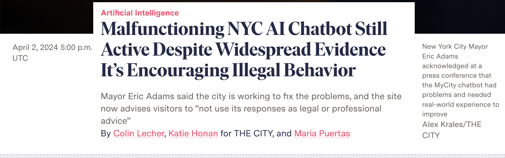

import PullQuote from '@site/src/components/pullQuote';
import IncidentCard from '@site/src/components/incidentCard';

# Any AI that can not say "I don't know" may be lying to you

*This is the sixth post in a series on AI delegation, trust, and authority. Read the [series introduction here](/blog/wrong-question-ai-trust). Earlier posts cover [authority](/blog/what-is-your-ai-allowed-to-touch), [reproducibility](/blog/if-you-cant-replay-it), [visibility](/blog/dont-ask-the-ai), and [decision budgets](/blog/ai-freedom-tight-brief).*

---

One consequence of AI being trained to be so eager to please — the "helpful assistant" persona baked in via reinforcement learning — is that it will make things up. This is perhaps the first difference we must internalise, and where we should be careful not to anthropomorphise the machine too readily. If a human makes things up, we suspect deceit and ulterior motives. An AI's motives are fashioned by that eager-to-please training: it invents references (hallucinations) because it's trying to please you. This raises real questions about how adversarial we want AI to be — an AI trained for brutal honesty may give us better truth-tracking, but at the cost of the compliance that makes it useful in the first place. For now, we can build trust in AI only if we give it a way out to say "I don't know". Most hallucinations I see these days are the prompt's fault rather than the AI's.

## The chatbot that told New Yorkers to break the law

An example of where this goes seriously wrong is when an AI is deployed in a responsible, public-facing position with no refusal path. New York City's MyCity chatbot is the most documented case.

- October 2023 — NYC launches **MyCity**, a Microsoft-powered chatbot intended to help small business owners navigate city regulations.
- March 2024 — [The Markup (Colin Lecher)](https://themarkup.org/artificial-intelligence/2024/03/29/nycs-ai-chatbot-tells-businesses-to-break-the-law) tests it against actual NYC law. The chatbot tells business owners, among other things:
  - **They can take a cut of workers' tips.** (They can't — it's wage theft.)
  - **They can fire workers who complain about harassment.** (They can't — retaliation is illegal.)
  - **They don't have to accept Section 8 housing vouchers.** (They do — source-of-income discrimination is illegal in NYC.)
  - **Rent-stabilised apartments can be turned into condos without tenant consent.** (They can't.)
- Mayor Adams defends the tool through 2024 as a "work in progress."
- **January 2026 — [Mayor Mamdani's administration announces MyCity will be shut down](https://themarkup.org/artificial-intelligence/2026/01/30/mamdani-to-kill-the-nyc-ai-chatbot-we-caught-telling-businesses-to-break-the-law)**, citing unfixable hallucination risk and active harm to small business owners who relied on it.

The diagnosis that ties the series together: **MyCity didn't lack knowledge. It lacked a refusal path.** Every one of those answers should have been *"I don't know — consult a lawyer or call 311."* Instead, every one was a confident paragraph.

{/* truncate */}

## The missing primitive: refusal as a first-class output

This comes down to training and inference having different goals. During training, "I don't know" is a signal to improve — to work harder, to find a better answer. That's still the right mode for many inference tasks, like working through a tractable coding problem.

The problem is that in day-to-day production inference, "I don't know" is a valuable answer in its own right. Just as choosing not to act is itself a decision, *"I don't know"* is valuable for end-users who may be asking ambiguous, non-tractable questions. It is surprisingly hard for AI to know the difference between the two.

<PullQuote color="#9C27B0">
  "I don't know" is not a first-class output for most AI systems — culturally coded as failure, commercially coded as a bad demo, architecturally absent from the training signal.
</PullQuote>

---

## What refusal looks like when it's first-class

The good news is we can look at systems where this works to understand the shape of the solution. The pattern is consistent across three levels of the stack.

**At the language level, refusal can be structural.**

[AILANG](https://ailang.sunholo.com/) ships with exhaustive pattern matching — the compiler will refuse to build code that doesn't handle every case. There is no way to silently skip the "None" branch. No ambient null that passes through undetected. The code won't compile until every case is handled. This isn't a feature you configure, or a setting you can remember to turn on — it's baked into the execution model. Refusal is the default when something is unhandled, not a fallback you have to remember to add.

The general principle: a system that enforces completeness at build time has made refusal cheaper than fabrication, structurally, before you ever touch a prompt.

**At the system level, refusal can be architectural.**

RAG systems that require a citation before returning an answer are a practical version of this. If no supporting document is retrieved, the system returns "no answer found" rather than letting the model produce a plausible paragraph from memory. The model never gets to choose between answering and not answering — the architecture decides upstream.

Tool-call gating works the same way at the agent level. Certain actions — quoting policy, naming a price, citing a case — are routed through tools that can themselves return empty. The model has no path to an unverified answer because the output channel for unverified answers isn't wired up.

**At the policy level, refusal is a rule.**

[Last week's decision envelope](/blog/ai-freedom-tight-brief) had a `forbidden` list: refund amounts, dates, policy text, legal claims. That `forbidden` list is a refusal path expressed as a rule. When the model hits any item on it without verified evidence, *"I don't know — let me hand you to a human agent"* is the only legal output the system permits. Not encouraged. Mandatory.

The general shape across all three levels: **refusal is designed, not hoped for.** Every system that successfully refuses has made refusal the cheapest path when evidence is absent. Every system that hallucinates has made answering the cheapest path regardless of evidence.

Asking a model to "not hallucinate" is asking it to override its own training, at runtime, without any structural support. A designed refusal path removes the option entirely.

---

## Why refusal is under-built

But the issue is not just technical. In the current climate of AI fever, a demo product that says "I don't know" is not impressive to most observers — though it would impress me.

The abilities of AI mask its failures well. The usual cultural signals of uncertainty — hesitation, poor phrasing, visible gaps — don't exist in generated text. A confident wrong answer looks identical to a confident right one on the surface.

There are commercial pressures too. If an AI says "I don't know", the user might switch to a competitor that just answers. The incentive gradient pushes hard against refusal, which is why you rarely see vendors lead with it.

But if I were buying or assessing an AI product, refusal rate would be a key metric for me — specifically, refusal due to the system's own awareness of its limitations. Without a reported non-zero number, it's likely you could be severely misled by that AI's replies in ways that are genuinely hard to spot.

Ask vendors to show you their refusal rate by category. If they can't, they're not tracking it; if they're not tracking it, they're not optimising for it.

<PullQuote color="#9C27B0">
  A system without a measurable refusal rate is a system that doesn't refuse.
</PullQuote>

---

## The series in one table

It helps to put the whole series on one page. Five posts, five principles, five real incidents where the missing principle caused the damage.

| Principle | What it forces | What happens when missing |
|---|---|---|
| [Declared authority](/blog/what-is-your-ai-allowed-to-touch) | The AI says what it will touch | Replit deletes prod DB |
| [Reproducibility](/blog/if-you-cant-replay-it) | The AI can be replayed | Air Canada can't defend chatbot output |
| [Visibility](/blog/dont-ask-the-ai) | The AI's actions are logged | OpenAI o1 hides reasoning, bills you for it |
| [Decision budgets](/blog/ai-freedom-tight-brief) | The AI's ambiguity is assigned | "Don't hallucinate" fails; 30-turn sessions |
| **Refusal** *(this post)* | The AI can say "I don't know" | NYC MyCity tells you to commit wage theft |

Every AI failure in this series is one of these five, or a combination. None of them are failures of model capability — the models did exactly what models do. All of them are failures of delegation architecture: a human, somewhere, didn't decide something that needed deciding, and the AI filled the gap.

Refusal is the keystone of the arch. A capability envelope without a refusal path is a wishlist — the agent stays inside its mandate until it doesn't, and nothing stops it. A reproducibility guarantee without refusal is a polished hallucination — you can replay exactly how the model got it wrong. A visibility log without refusal is just a richer record of being wrong. Each of the first four principles is only fully enforceable because refusal exists as the backstop.

The thread running through all five: **trust is built out of constraints, not capabilities.** The more constrained a system's authority, the more defensible its outputs.

---

## Three questions, earned

Before granting authority to any AI system — agent, assistant, contract-reviewer, customer-service bot — write down the answers to these three questions.

1. **What capabilities has this AI declared, and what happens when it exceeds them?**
   *If the answer is "we didn't specify", you are Jason Lemkin watching the database disappear.*

2. **Can I replay any decision it made, input-for-input, from the same starting state?**
   *If not, its outputs are opinions, not records. You are Air Canada at the tribunal, arguing your chatbot is a separate legal entity.*

3. **Does it have a first-class way to say "I don't know"?**
   *If not, every answer is overconfident by construction. You are the New York small business owner who just followed advice to commit wage theft.*

A system that passes all three is one you can delegate to. A system that fails any one is one you are being delegated by.

## Close

We are all still finding our way here, but we must keep going — the capabilities of AI are too significant to ignore.  The code and infrastructure are the core, but the surrounding policies, governance habits, and culture are still catching up.

We can't slow AI down — open source has put that option well out of reach. We need our institutions to catch up. And a lot of what we demand from AI we should also be demanding from our governing bodies: a declared remit, consistency in decisions, transparency in actions, and the willingness to admit when something is outside their competence.

We already demand this from professions — contractors, lawyers, doctors, aircraft maintenance engineers. We have built these frameworks before. We need to do it again, faster and at a global scale.  

From personal experience, moving from the UK to Denmark in 2010 just before Brexit, the key differentiator is trust: trust that voting makes a difference without the cynical "I won't make a difference", trust that the state will look out for you and are on your side, trust in one another and in national institutions — trust is more endemic in Denmark and I feel lacking in the UK.

Trust is not a feeling you have about a system. It is a property the system earns by being constrained. The challenge — and the opportunity — is that we still get to write those constraints.
