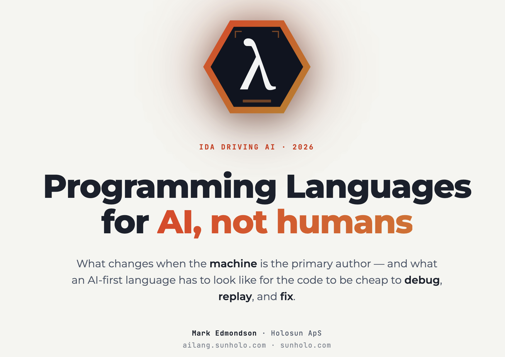
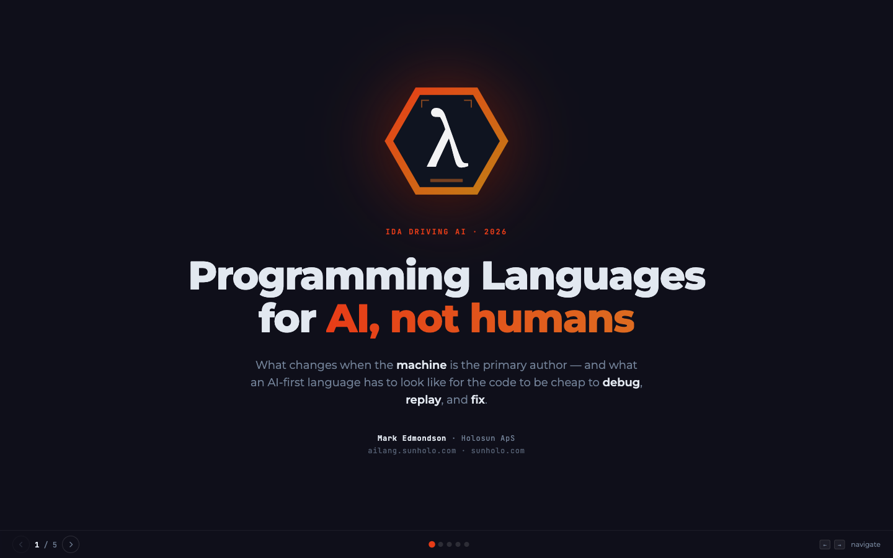
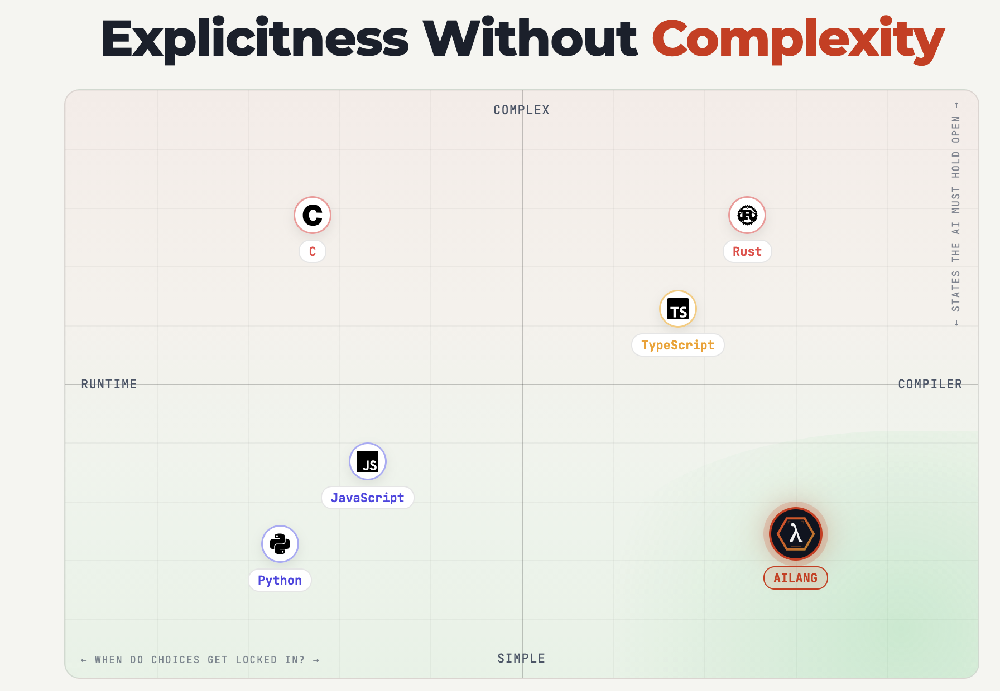
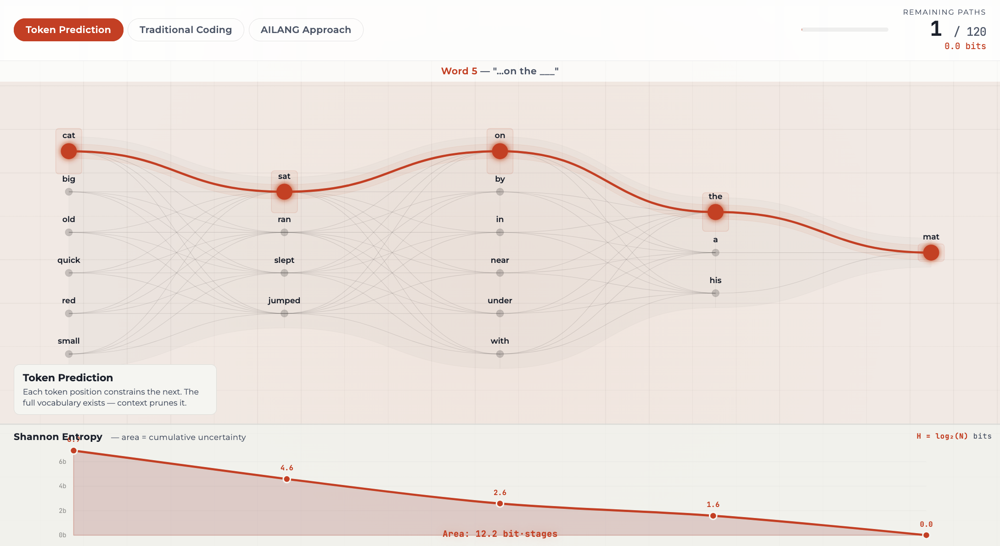
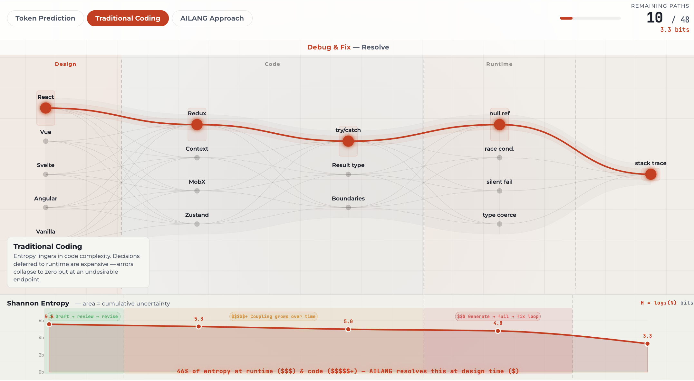
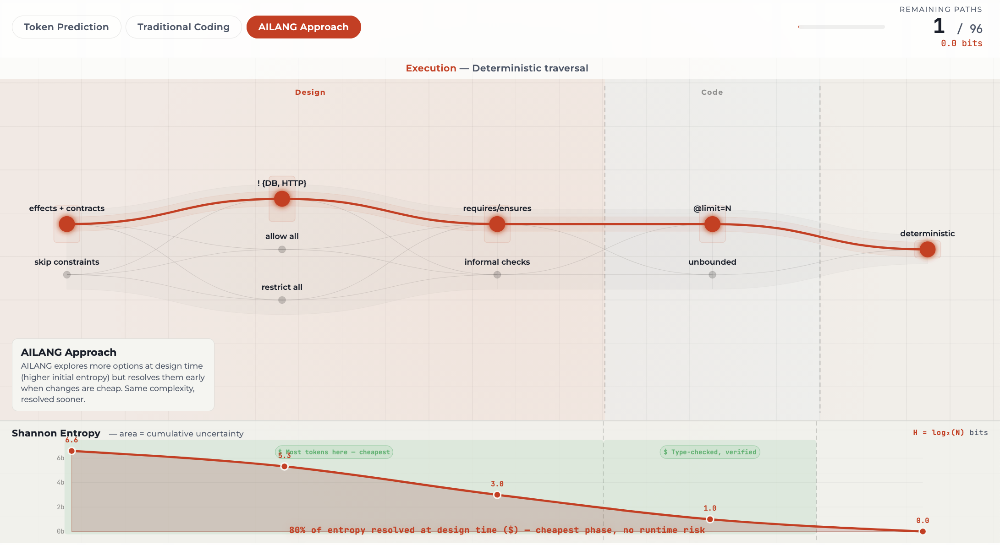
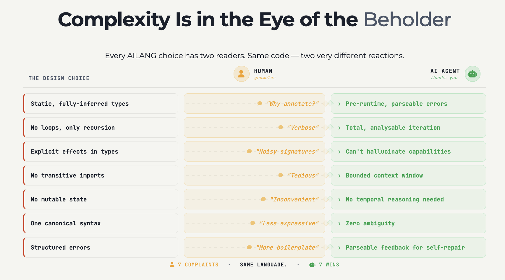
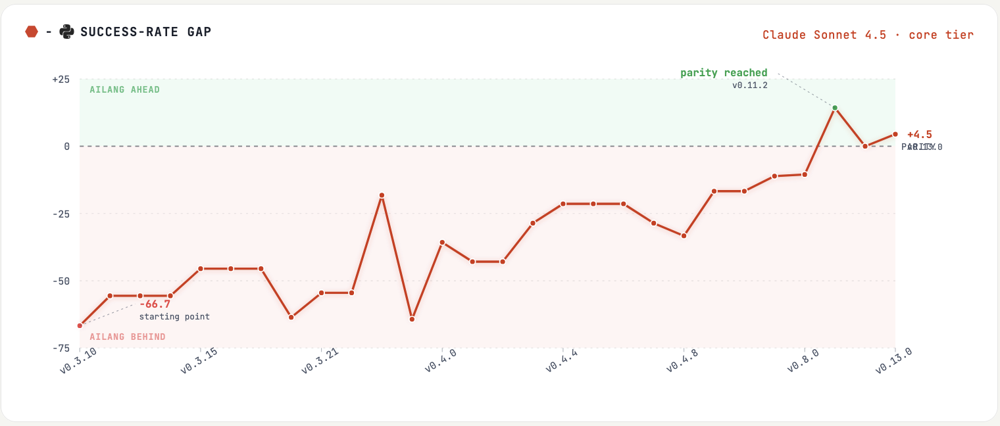
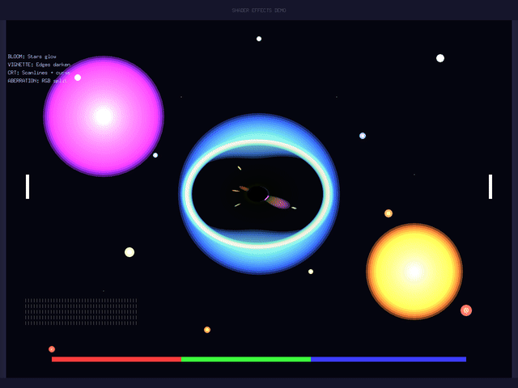

*Yesterday I presented at [IDA Driving AI 2026](https://ida.dk) in Copenhagen. This is the talk retold while it's still fresh — the argument I made, the visualisations I built, and what I'd say differently next time.*

<!-- truncate -->



---

## The general point I was trying to argue

What I wanted people to leave the room with was: do we need AI languages? From my work with AILANG, I think it's inevitable: if we agree that AI will do 100% of coding from now on; and that differences exist between programming languages in AI coding performance, then it follows that a language specifically made for AI will be preferred over our existing human-made languages in the medium to long term.

---

## The AI Coding Revolution is already here



To set this up, I opened with a quote from [Dario Amodei](https://finance.yahoo.com/news/anthropic-ceo-says-ai-could-193020957.html), CEO of Anthropic. In early 2025 he stated that 90% of coding would be done by AI within the year — something that was widely derided at the time.

But roughly 12 months later, I asked the room: how many of you would say AI is doing 90% of your coding? Almost every hand went up. I then asked how many would say 100% — the camp I'd put myself in. Around 10% of hands stayed up.

So: AI coding is here to stay. The question moves to what that actually looks like for us.

If AI is doing 100% of the coding, why do we choose programming languages based on our own preferences? Are language wars over — an AI can code in any language, so we just pick the best tool each time?

We may still cling to knowing what good looks like in a language we're fluent in ourselves, but will that hold long term?

I then showed some findings from [LoCoBench](https://arxiv.org/abs/2509.09614), which analysed model performance across languages. The more flexible languages were easier for AI (Python, JavaScript), while the more strictly typed ones were harder (C++, Rust) — likely influenced by training data volume. But for trusted production code, typed languages are typically more reliable at scale. This meant AILANG aimed for a gap that seemed uncovered: simple syntax, but with types and fast compile-time verification loops.



The chart places AILANG bottom-right: simple syntax, but compiler-checked. Most languages trade simplicity for power (Python) or correctness for complexity (Rust). AILANG tries to be the third option.


---

## Entropy collapse: the hidden cost of every decision

From there we segued into entropy. Entropy can be thought of as a measure of uncertainty in a system — or, more usefully here, as the decisions that haven't been made yet, by either the human or the AI.

We can never remove entropy from a time-evolving system; we can only choose where we pay its costs. We could resolve every decision ourselves so the AI just acts, but that's micromanagement — we may as well code it ourselves. The real question is: which decisions should we delegate to the AI, and which should we keep?

LLMs like Opus or GPT-4o are entropy-collapsing machines. We spend an enormous amount of energy training them so they can collapse uncertainty elsewhere. The visualisation made this tangible through three examples.

**Example 1 — Token prediction**



Each token prediction collapses the remaining paths. "The cat sat on the..." is almost always "mat". Starting entropy is high; by the end it's nearly zero. The model doesn't guess — it eliminates.

**Example 2 — Traditional coding**



In a typical coding project, decisions pile up deferred — language choice, framework, error handling. The difference is that not all entropy costs the same. Resolving ambiguity at runtime (a crash, a bug) costs far more than resolving it at design time. If you let the AI make all code decisions freely, complexity accumulates and the project becomes hard to debug or steer.

**Example 3 — The AILANG approach**



AILANG moves the entropy cost earlier: effects declarations, pattern matching, type verification, and neurosymbolic contracts all resolve uncertainty at compile time — the cheapest possible moment. 80% of entropy resolved at design time, no runtime risk.

I've written more about this framing in [AI: Give me the freedom of a tight brief](/blog/ai-freedom-tight-brief).

:::tip[Live demo]
The interactive entropy explorer is still running — open `/presentations/ai-slaves-human-masters-ida/01-entropy-explorer.html` to explore the three tabs yourself.
:::

---

## Authority and complexity: where does trust live?

The general aim is to tighten the verification loop so that an AI coding agent collapses decisions to compile time rather than runtime. Via the type system, neurosymbolic proofs, and bounded context space, AILANG creates a tight loop: AI writes code, runs `ailang verify`, and gets static analysis it can trust will hold at runtime — as opposed to Python or TypeScript, where code is freely written but you need to actually run it to find out if it works. (The underlying trust argument is in [The wrong question about AI trust](/blog/wrong-question-ai-trust).)

We then walked through specific syntax examples, because the key point is that complexity is in the eye of the beholder — what simplifies things for humans can add cost for an AI, and vice versa.

### AI Cannot Hallucinate a Network Call

I've explored this in more depth in [What is your AI allowed to touch?](/blog/what-is-your-ai-allowed-to-touch), but the short version in AILANG syntax:

`export func process(path: string) -> string ! {IO @limit=3, FS}`

- IO — Can print to console
- @limit=3 — Maximum 3 times
- FS — Can read/write files
- No Net — CANNOT touch the network
- No DB — CANNOT access a database

`$ ailang run --caps IO,FS process.ail` 

Only IO and FS granted at runtime. Attempting Net or DB → immediate rejection.
The compiler enforces this. Not documentation. Not discipline. The compiler. 

### Neurosymbolic proofs

The compiler doesn't just check types — it proves correctness via the Z3 SMT solver. AI writes `requires` / `ensures` contracts; Z3 reasons over every possible input and hands back a concrete counterexample when it finds a violation.

```
-- ✓ This one verifies
export func calculateTax(income: int) -> int ! {}
requires { income >= 0 }
ensures  { result >= 0 }
{ income / 5 }
```

```
-- ✗ Subtle bug: what if price < discount?
export func applyDiscount(price: int, discount: int) -> int ! {}
requires { price >= 0, discount >= 0 }
ensures  { result >= 0 }
{ price - discount }
```

```
$ ailang verify --verbose billing.ail
VERIFIED calculateTax 6ms
VIOLATION applyDiscount
Counterexample:
  price: Int = 0
  discount: Int = 1
-- 0 - 1 = -1, violates ensures { result >= 0 }
```

This is neurosymbolic programming — coupled on purpose. The neural side writes the code; the symbolic side proves it. No tests, no sampling — Z3 reasons over every possible execution and hands back a concrete counterexample when it can't verify. The AI then has exactly what it needs to repair the code in a single turn.

### No loops — code the AI can hold in one context

No loops. Only pattern matching. Every branch is visible on screen — no mutable loop state to track.

```py
total = 0
for item in items:
    if item.active:
        total += item.value
```

```ailang
pure func total(xs: List[Item]) -> int {
  match xs {
    [] => 0,
    ::(x, rest) =>
      if x.active then x.value + total(rest)
      else total(rest)
  }
}
```

Every branch is local. The model doesn't have to track an accumulator across loop iterations or wonder if it terminates. Compiler-checked exhaustiveness means fewer tokens spent on reasoning about state — and a one-turn fix when a branch is missing. 

### No transitive imports — what's in scope is what's on screen

The same line of code puts very different cognitive loads on the AI.

One line. What's in scope?

```python
import requests
```

What the AI must reason about: `requests.get`, `requests.post`, `urllib3.*`, `charset_normalizer`, `idna`, `certifi.*`, `ssl`, `socket`, `http.client`, `json`, `os.environ`, `logging`, `warnings`, `io.BytesIO` … and more, transitively. 2 named, 12+ reachable through the package. The model spends tokens guessing what's in scope; sometimes it hallucinates symbols that don't exist, sometimes it uses ones that do but shouldn't.

Compare with AILANG:

```ailang
import std/net (get, post)
```

What the AI must reason about: `get`, `post`. 2 named, 2 reachable. The file is the complete inventory. Nothing arrives transitively. Whatever the AI cannot name, it cannot call.

### Complexity is in the eye of the beholder

Every AILANG design choice has two readers — human and AI agent — and they often disagree on what counts as friction.



The table landed well in the room. Humans see static types as verbose; the AI sees pre-runtime parseable errors. Humans see no mutable state as inconvenient; the AI sees zero need for temporal reasoning. Same language, opposite experience.

---

## The Development Loop

The previous talk had already highlighted how a design-document → verify → evaluate loop was becoming standard practice in AI coding. I completely agreed with that framing, and looked to connect it to the entropy argument we'd just covered: the methods that work are those that move decisions upstream for humans and downstream for AI, as needed.

AILANG development was also a meta-experiment in how to build a large, complex project with AI without succumbing to a mounting maintenance burden. I highlighted the 100% AI loop we'd settled on and found success with, driven mainly by Skills in the open-source repository.

- **Design document** — the human acts as product manager, prioritising features. A Skill scores design docs against axioms and checks for duplicate or related work. The doc is a versioned artifact in the git repo, triaged by three different models (OpenAI, Anthropic, Gemini) to avoid overfitting to any one model's preferences.
- **Sprint plan** — alongside the standard planner Skill, a JSON object keeps the AI on track and forces it to log progress against milestones, stopping it going down unrelated rabbit holes.
- **Sprint executor** — takes the plan and practices TDD: creates failing tests, then makes them pass through code execution. The deterministic replay requirement here is non-negotiable — see [If you can't replay it, you can't ship it](/blog/if-you-cant-replay-it).
- **Sprint evaluator** — the key human touchpoint: benchmarks run, gaps identified.
- **Back to design** — gaps feed into new design documents, and the cycle begins again.

## Does it work? From −66.7 to +4.5 against Python

We then looked at the evidence that AILANG — and AI languages in general — are viable.

After many iterations of the design loop above, we plotted Claude Sonnet 4.5's performance across AILANG versions against a benchmark suite of programming challenges run in both Python and AILANG. The starting point was −66.7 percentage points behind Python. The chart tells the rest of the story.



Parity was reached at v0.11.2. The current latest sits at +4.5 — AILANG ahead. We dipped again as our benchmarks got saturated, so we added harder ones to expose new gaps; I'm constantly looking for better signal. The bar is now high enough that the challenges are beyond what I could solve myself in a day.

One observation that surprised the audience: stronger models generalised better to AILANG. Weaker models could solve the same problems in Python but couldn't translate a novel AILANG prompt into working code. The language's constraints seem to reward more capable models disproportionately. A goal now is improving performance on smaller local models, for the cost and privacy benefits that brings.

But the original aim had been met: we have a programming language that AI performs better in than in human-made languages — even starting from scratch in the prompt, with no prior training on AILANG. Once it's in the training data and the teaching preamble shrinks, performance should improve further still.

## More AILANG examples in the wild

After we achieved benchmark success, we looked to try it out on real projects - AI coded themselves 100%, in a language coded by AI 100% - our first 10,000% AI coded applications.

**Stapledon's Voyage** was the first: a game development project, chosen because it compiles AILANG to Go targets, making build success easy to verify. AILANG's aim is not to replace languages with rich ecosystems — it's to provide a cognitive layer for AI to write programs more effectively. This project tested that layer via Go's graphics libraries for rendering.

We caught plenty of gaps (no trigonometry in the standard library, for one), and used them to drive the next design-loop iteration. The result: scientifically accurate general relativity and special relativity space simulations, 100% AI-coded in AILANG.




**Voice DocParse** came next — expanding the standard library (itself written in AILANG) to support streaming and AI API calls, which is the bulk of my client work outside AILANG development. We built streaming HTTP support and tested compilation to WebAssembly, which powers the live demos at [sunholo.com/ailang-demos](https://www.sunholo.com/ailang-demos). WebAssembly in the AI landscape is still an active area of research.

**[AILANG Parse](/blog/ailang-parse-launch)** is currently the most-used production AILANG program. It tackles document parsing for RAG pipelines: instead of converting a Word or Office document to PDF for lossy extraction, we unzip and parse the XML directly — faster, cheaper, and more accurate deterministic parsing. It's rolling out to all my AI engineering clients as an alternative to traditional PDF-based RAG pipelines.


## The future of AILANG? Motoko self-modification AI Harness

And finally I spoke briefly about the [Motoko project](https://arniwesth.github.io/motoko_agent/), by Arni Westh, who is using AILANG to create a self-modifying coding harness inspired by [Pi](https://github.com/nicholasgasior/pi).

Pi ships a very minimal core compared to harnesses like Claude Code or OpenCode; the idea is that the AI self-discovers and extends the core as it needs more features. Pi does its extensions in TypeScript, but AILANG is especially well suited here — it can verify code before it runs, unlike TypeScript. The AILANG package registry supports this with AI-controlled security patches and auto-cascading updates.

## And finally...

With a couple of minutes to spare I mentioned that in the course of creating this talk, I'd discovered other AI languages being built independently — and surprisingly, some had arrived at the same features, such as function effects. Was the AI teaching us all the language it wanted to express itself in? If you think about it, the best candidate for designing a new programming language is someone who knows all existing languages — and that's AI. At the very least, it represents a new class of programming languages that may thrive alongside systems, frontend, or backend languages.

As a final anecdote: although AI helped create and design AILANG, I still feel like it's *my* language. During a design sprint, I realised that the fundamental vision — deterministic state collapse, bounded entropy — had been shaped by what I'd thought were unrelated conversations with AI about cosmology and the block universe theories I'd been investigating. Those chats had fed into the axioms of AILANG through its chat-history reference features. If in the future we can all effortlessly create our own AI languages, perhaps we'll each create variations that reflect how we personally express ourselves to AI — and vice versa.

The presentation finished, I then had a few good follow up questions which I paraphrase below:

- What about dependencies? How do you handle AI suggesting them from a security perspective? My answer: yes, third-party dependency decisions should always kick back to a human. But in practice, the need for 3rd-party packages was far lower than expected — the AI would often just write its own version quickly.
- Did I make my presentation with AI? Yes — the template is at [github.com/sunholo-data/presentations](https://github.com/sunholo-data/presentations), pure HTML and JS. The repository includes a Claude Skill to help you create something similar. Death to PowerPoint.
- Why weren't functional languages like Haskell included in the language survey? They were just missing from the original [LoCoBench](https://arxiv.org/abs/2509.09614) dataset. But AILANG *is* a functional language, heavily influenced by Haskell — which I have a lot more respect for now. [Erik Meijer](https://en.wikipedia.org/wiki/Erik_Meijer_(computer_scientist)), Haskell's co-designer, has inspired several AILANG features through his talks on AI and programming.
- Do you think humans will change how they speak to AI? Very deep question. I can imagine that just as we learned to "Google" effectively, learning to interact with AI may change humans in a similar way fire changed our ancestors — a fundamental shift in cognitive tooling.
- Do you think AIs will create languages humans don't understand to communicate with each other? Maybe in the future — but currently they're grounded in large language corpora created by humans, so they understand language on that basis. As training expands to non-textual data (video, sound, sensor data), they may eventually converge on more fundamental representations for communication.

Thanks to everyone who attended — a smart, engaged audience and excellent fellow speakers. Highly recommend it for next year.