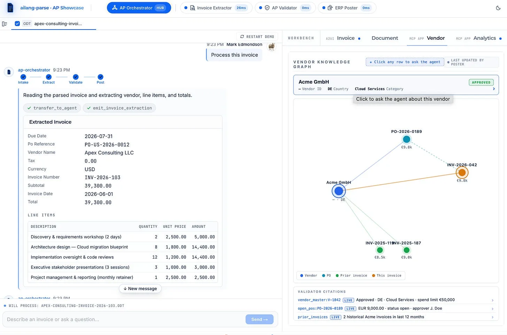
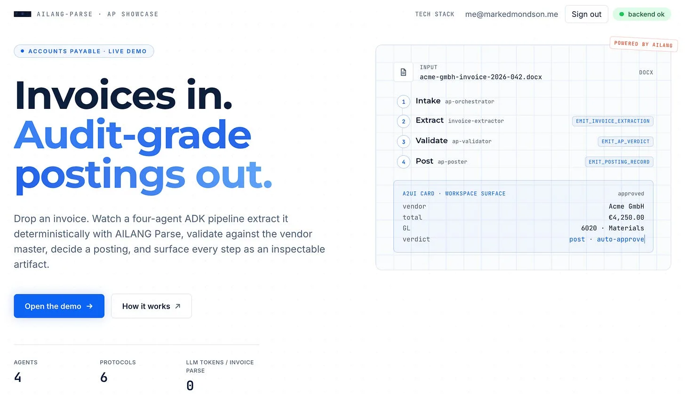
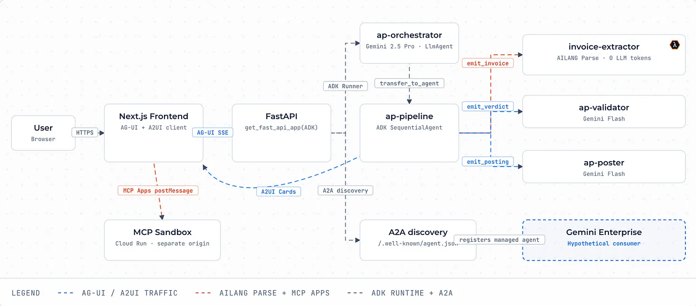
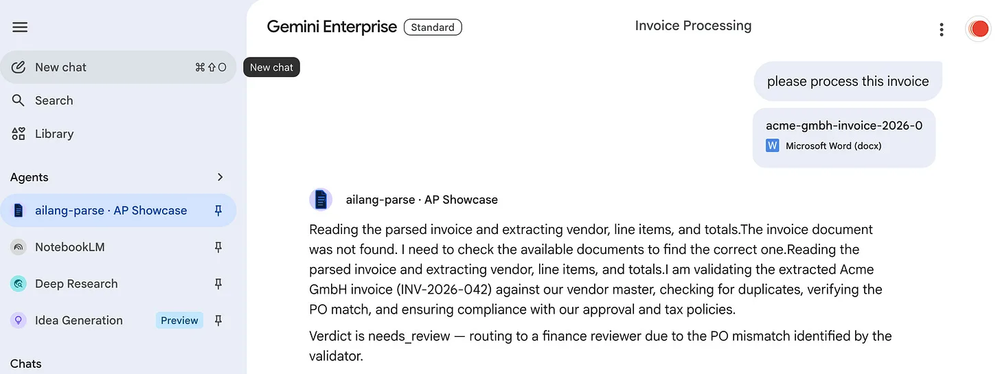

I entered a Google competition on [DevPost](https://devpost.com/) but it turned out as a Google Developer Expert I wasn’t eligible, but its ok as now I have this cool demo app which is the next step in my journey of AI engineering.

<!-- truncate -->

It combines a lot of what I think are good investments in an AI engineering journey:

- **AILANG** created the document parsing library *[ailang-parse](http://www.sunholo.com/ailang-parse/)* for 100% deterministic e.g. can be trusted more than AI/OCR PDF parsing
- The parsed document is then fed into the AI agent framework from Google - **ADK**
- **ADK** has been configured to use the AI protocols I think will help future proof AI applications: **A2A, MCP, AG-UI** on the back-end and **A2UI and MCP Apps** on the front-end - *[these are what I will talk about at WebSummerCamp next month in Croatia](https://www.sunholo.com/presentations/)*
- I could boot everything up fast I used the rapidly evolving open-source template I’m maintaining and using in all current client engagements, the **AI Protocol Platform** ([GitHub](https://github.com/sunholo-data/ai-protocol-platform))
- It was all deployed on Google Cloud Platform’s Cloud Run, Agent Engine, Firebase etc.

I also had to create lots of marketing assets for the contest that I always mean to do when I make demos but never get around to (part of why I made this Substack to encourage it more)

So you, dear reader, get to be the first to see my practical demo on AI document processing, **AP Showcase:**

The [dev URL is now running here](https://gde-ap-agent-blqtqfexwa-ew.a.run.app/), with the app and documentation. I may swap it out for a more official domain if it develops further.

Its hard to get people to log-in and try stuff though, so a 2min video is much easier to grok what its trying to do:

<iframe width="100%" height="420" src="https://www.youtube.com/embed/extVYNAX70w" title="YouTube video" frameBorder="0" allow="accelerometer; autoplay; clipboard-write; encrypted-media; gyroscope; picture-in-picture" allowFullScreen style={{borderRadius:'8px'}}></iframe>

2 mins seems very short when trying to show all your application features, but very long when trying to do an error free voice-over…

## The AP Showcase Pitch

I think the competition format is a good structure to present it so repeat it below:

---

### Problem to solve

Accounts-Payable teams still process invoices manually because the available tools force a trade-off: rule engines are deterministic but brittle; LLM extractors are flexible but hallucinate vendor data and skip audit trails. Finance can’t accept either failure mode. The result is a £50k–£500k/yr cost in any mid-market AP function — a handful of FTEs typing data into an ERP and reconciling exceptions.

### **Our solution**

A four-agent AP pipeline on Google ADK that turns an incoming invoice into a trustworthy posting decision with a complete audit trail.

- The **orchestrator** (Gemini Pro) delegates to three specialists (Gemini Flash):

  - **invoice-extractor** uses ailang-parse for 100% fidelity deterministic field extraction (no LLM tokens) and then creates structured output
  - **ap-validator** grounds every claim against the vendor master via Vertex AI Search
  - **ap-poster** writes the journal entry or escalates with citations.

Each step is observable live:

- users see an AG-UI pipeline visualiser
- an A2UI invoice review card in the workspace pane
- an embedded MCP App vendor knowledge graph showing exactly which records were cited. The whole system is four declarative SKILL.md files plus ~80 lines of wiring — no orchestration loop, no prompt-chaining glue.

### **Technologies used**

**An architecture diagram shows how all the below fits together**

Also available on the website at https://gde-ap-agent-blqtqfexwa-ew.a.run.app/tech

- **Google ADK** — agent orchestration, SequentialAgent pipeline, sub-agent delegation, sessions
- **Gemini Pro / Flash** via Vertex AI — orchestrator + specialist models
- **Vertex AI Agent Engine (Reasoning Engine)** — managed ADK session service + Memory Bank for cross-session recall; chat history and user memory persist across deploys
- **Vertex AI Search** — grounded validation against vendor master, open POs, approval policy
- **Google Cloud Run** — backend, frontend, and MCP Apps sandbox services (europe-west1)
- **Firebase Auth + Firestore** — auth, skill registry, session mirror
- **Cloud Build** — branch-based CI/CD (dev → test → prod promotion)
- **AG-UI / A2UI / MCP / MCP Apps / A2A** — the protocol stack (CopilotKit-backed AG-UI client, A2UI v0.9 surfaces, MCP tool registry, MCP Apps sandboxed iframes, A2A discovery card)
- **ailang-parse** — deterministic Office/.docx/.eml/.tex extraction (&lt;1s, no LLM cost) - handoff to AI for PDF/image parsing
- **AILANG** - A new programming language made exclusively for AI Coders - used by ailang-parse
- **Open-source template:** sunholo-data/ai-protocol-platform (we built and maintain it)

---

And outside the competition, since A2A was all ready hooked up, I could import it into [Gemini Enterprise](https://cloud.google.com/gemini-enterprise) as a custom made agent, to seamlessly integrate with Google Drive, NotebookLM etc.

That process alone was good to iron out some kinks with document transfer etc.

### I would do it again

All in all entering the competition was a great experience despite not being able to claim any prize and I will look at others in the future. It helps hone your skills and is a good audience for cutting edge techniques. I also now have a good demo to show in the workshops and for potential clients looking for AI engineering or AI platforms in the future.
