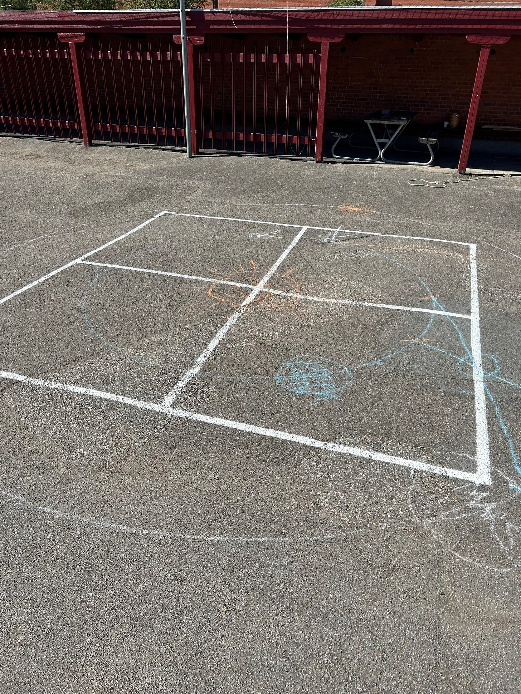
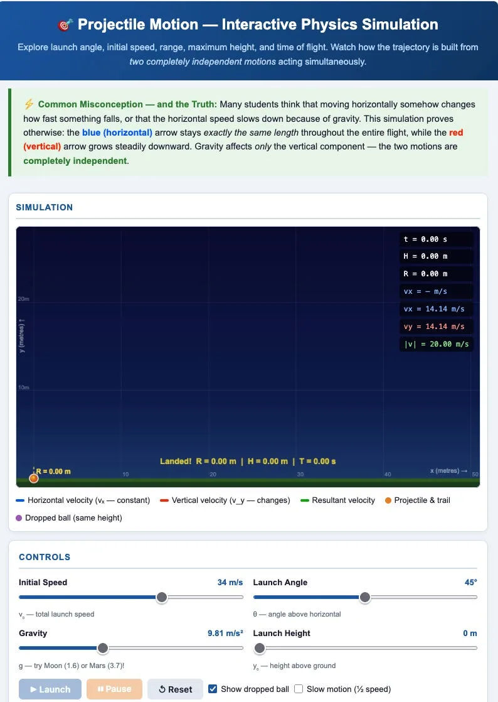
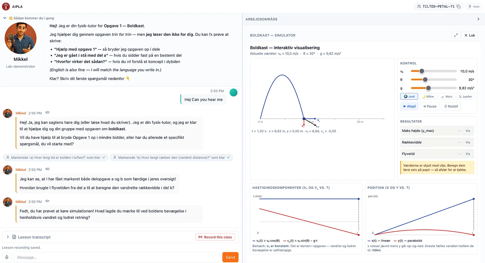

[AI in Physics Learning and Assessment](https://www.sunholo.com/aipla) (AIPLA) is a three-year research programme investigating how generative AI can be meaningfully integrated into upper-secondary physics education in Denmark. It is an initiative started by Prof. Jesper Bruun of the **Institut for Naturfagenes Didaktik**, Københavns Universitet and affiliated with the AEID programme of the [Pioneer Centre for Artificial Intelligence](https://www.aicentre.dk/p1-programs/ai-in-education)

<!-- truncate -->

## The premise

Danish upper-secondary students already use generative AI — mostly through consumer chat-bots, mostly without explicit teaching about appropriate use.

AIPLA engages with the current condition rather than a future hypothetical: the interface, the model, and the pedagogical layers between them all matter.

The project investigates how generative AI can be meaningfully integrated into upper-secondary (stx) physics education in Denmark — for teaching and for formative and summative assessment. The goal is not to maximise AI use, nor to suppress it, but to find configurations where AI productively supports learning rather than substituting for it.

A core design principle:

The most interesting tasks are those that AI **cannot fully solve** but can productively support a student in solving.

Designing assignments and bot configurations that hit that target is much of the project’s research substance.

## My role within AIPLA

I am not a trained educator or pedagogue, so the actual content and techniques employed all come from the qualified professionals - my role as a research assistant is to help facilitate an AI platform that students, teachers and researchers could use to get feedback and data on what works with AI and education.

I do have a Physics background myself studying a masters at Kings College London University 25 years ago and keeping a keen interest, but I moved into industry ending up as a [AI Engineer](https://www.sunholo.com/ai-engineering) with Sunholo etc. - it is an honour to be able to take some of my industry experience and help apply it to this broader and less-commercial goal.

## Method and approach

That industry experience first benefited with being able to use my [AI protocol rich GitHub template](https://github.com/sunholo-data/ai-protocol-platform) for online AI applications. The intention for this template was to use protocols to enable relatively future proof but flexible AI deployments, and that has really stood the test with the ability to stand up an application within days to help iterate along with teacher feedback.

The project kicked off with a field trip to visit a Danish Physics ‘B’ level class and observe how AI was used today. Students could log-in to public AI providers such as ChatGPT on their phones, and use pre-created prompts to help solve a practical physics experiment echoing Tycho Brahe’s measurements of Mars (before telescopes!) via chalk and string in the school playground.

This alone gave me a great basis on what a dedicated educational AI platform would need:

- A dedicated AI web app where students/teachers don’t use commercial AI apps only with free access models
- Able to work in a noisy outdoor environment on mobile as well as dedicated classrooms on a laptop
- Privacy aware for students
- Ability for the teacher to see which groups needed help whilst they interacted with the AI
- A good prompt/model that did not just give the answer but helped the student find the answer for themselves

## AI in education is already here

But we were not starting from zero in other areas as well - the Generative AI revolution is already happening, and students and teachers are already using it within their lessons. What and how could we support that?

One route was to help teachers who had already used AI “vibe coding” and otherwise to produce teaching materials. From their previous work, we already had a bank of simulations and activities we could incorporate into our platform, and these were used as initial examples to examine what capabilities and restrictions we could put in place - freedom for teachers to be creative in what they added, but in a safe, private and sandboxed way to not introduce problems later.

Above - a teacher made simulation for examining Newtonian physics of throwing a ball.

To help facilitate this work, we are building a “sim convertor” which is an AI skill that examines a “vibe coded” teacher made artifact (usually a HTML/JS demo made in Claude or ChatGPT etc) and adapts and adjusts it to sit in our MCP Apps format.

This then helps standardises and add features such as classroom analytics and events can be shared between simulations, and by utilising MCP Apps we also make a 3rd party server that can be imported into other AI applications in the future, as well as a template for in-app creation of simulations on the fly.

## Protocols for future proofing

A big focus for my [AI platform engineering](https://www.sunholo.com/ai-platform) for clients is:

How can we make an AI application that is not out of date within 6 months?

The pace of AI is breathtaking, but protocol shapes should move slower than AI features (hopefully?) so embracing those should help future-proof a little what we build. This is exactly the promise of my general approach to AI tooling, including the AI protocol template linked above.

Our main technical weapons were the protocols **AG-UI**, **A2UI** and **MCP Apps** - all front-end protocols that means that we should be able to plug-in to other educational applications in the future (if they also adopt the protocols).

**MCP Apps** in particular meant we could do the port across from the existing teacher made vibe coded simulations into an interactive “workbench” that can talk to the AI chat window in a pro-active manner: the AI reacting to settings and guesses from the student as they interacted.

## Applying AI Protocols to vibe-coded teacher simulations

Putting this altogether, below we show an example where we take the Newtonian simulation above and adapt it for the AIPLA platform - translated to Danish it is now the “boldkast” simulation, but now it is ported to use MCP Apps and A2UI under the hood:

Plenty of other educational features to speak of as well regarding active and summative vs formative assessment, intentional friction etc. but I leave that for a follow up post but you may spot some in the screenshot such as pro-active text to speech and learning style choices.

## Summary

All in all its great to be involved with a project where we can explore ideas and get feedback on them so quickly, with the cooperation with many talented colleagues and enthusiastic physics teachers and students. I hope we can extend it further and make a real impact on physics and wider educational teaching and AIs influence within schools. I see real benefit from my AI engineering experience so far in this project summarised as:

- Protocols help you future proof and iterate and pivot quickly
- Use fast build times to iterate and get more feedback, not ever more features
- AI building allows you to test and discard features quickly
- AI-ability is an anti-goal for some use cases - friction is good for learning goals
- Work with and use the domain-experts knowledge and experiments with AI as POCs you can take and productionise
