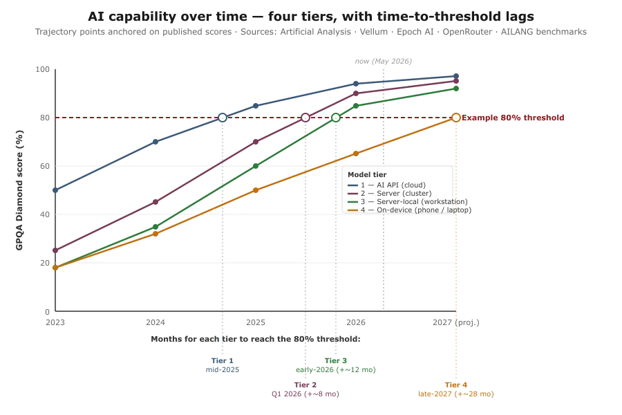
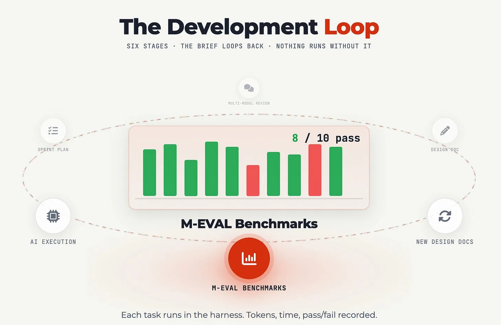
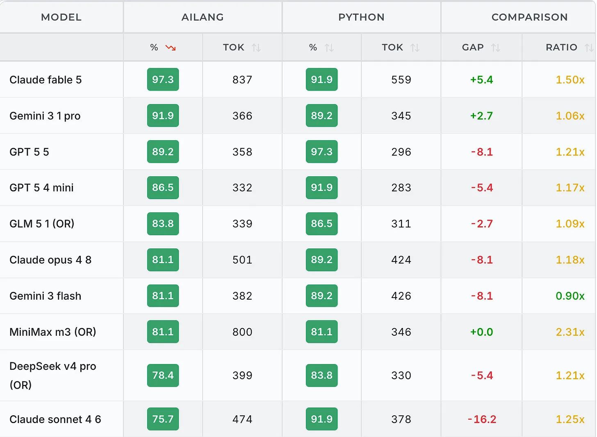
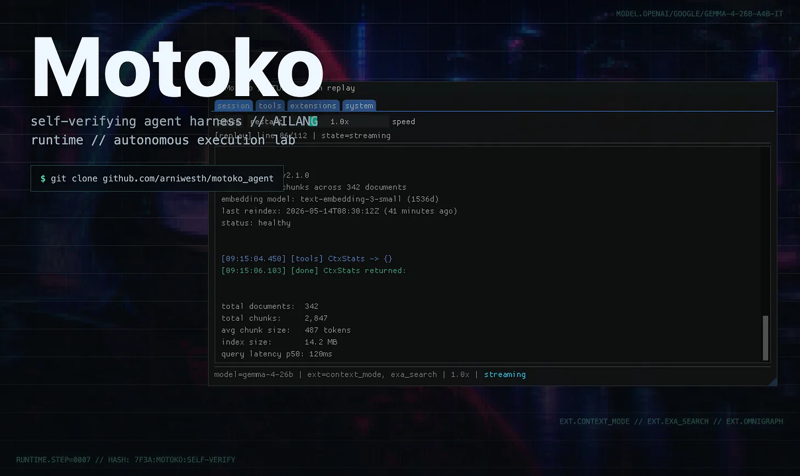
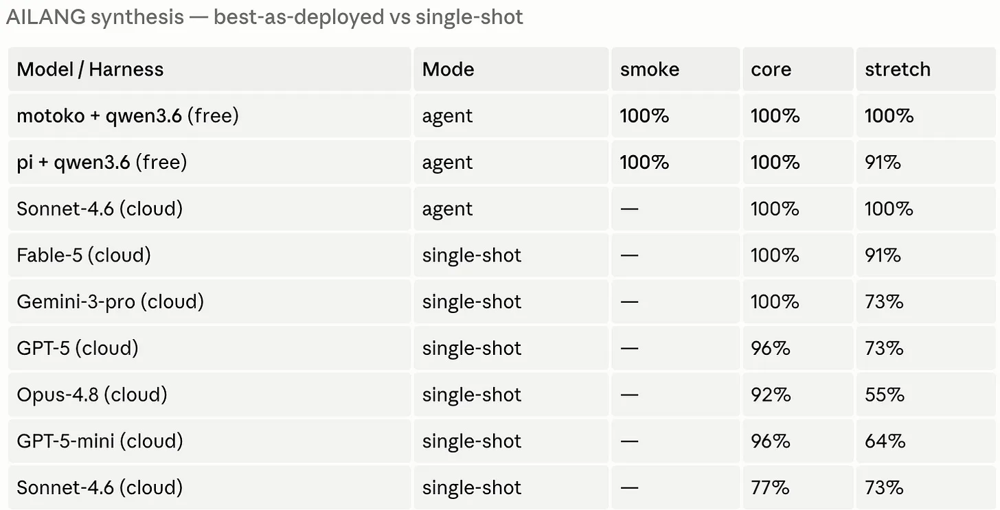

As you may have heard, [Anthropic was forced by the U.S. administration to revoke access to its latest Fable 5.0](https://www.anthropic.com/news/fable-mythos-access) model due to security concerns, and it may only come back as usable by U.S. citizens. This has sparked off various reactions across Europe on AI sovereignty which should be addressed.

<!-- truncate -->

This post outlines an approach that will not solve this geo-political puzzle. Fable and other leading models will remain much more capable than open source models and those running on consumer computing, and that gap may widen as the large $1T+ investments in (mostly US) data centers start to come online.

But, I do want to show how to squeeze out performance from those weaker and smaller models by giving them advantages such as more iterations, time and an AI-focused programming language and show with these aids they can match the output of the larger state-of-the-art cloud AIs.

Because for a lot of practical use cases I see in my work, **if its a bounded task**, the question on what model to use is a timeline question, not a capability question.

## Four tiers of AI capability

The reason picking the right model can be turned into a timeline strategy question rather than a model capability question I have tried to represent in this plot:

The x-axis is time - it shows AI model capability as it improves over time. The y-axis is a measure of that capability. The lines are the different ways of serving models: state of the art AI APIs in the cloud (e.g GPT-5.5, Anthropic Opus/Fable, Gemini 3.5); Local server clusters (e.g. IT departments running their own GPU cluster with large open source models such as GLM 5.2); Local servers on a workstation (e.g. a Mac Studio Pro 128GB serving Qwen3.6 35B) and on-device (e.g. a small Gemma4 model running on your phone or in the browser)

For a fixed bounded task, lets say it requires 80 N, where N is the benchmark you pick - better if you have your own, but you can proxy to popular evaluations such as those on [Artificial Analysis](https://artificialanalysis.ai/models). That score remains constant, but which models can satisfy it changes over time, as they rise up to the capability.

Looking at AI model trends over the last few years, we can quite reliably say that the capabilities of say an Anthropic’s Fable 5.0 today, will be available via a large open-source AI model in about ~8months time.

As an example, see today’s (June 2026) reviews of [Z.ai’s GLM-5.2 that some attest to being as good as Anthropic’s Opus 4.6](https://artificialanalysis.ai/models/comparisons/glm-5-2-vs-claude-opus-4-6-adaptive) released February 2026.

Then as optimisation’s are found the same capability is available in smaller and smaller models until they can run on your own device.

As another example, see this video for running DeepSeek’s V4 Flash on a top-of-the-line Macbook 128GB via [DwarfStar](https://github.com/antirez/ds4)

<iframe width="100%" height="420" src="https://www.youtube.com/embed/9gHcmhUDJfw" title="YouTube video" frameBorder="0" allow="accelerometer; autoplay; clipboard-write; encrypted-media; gyroscope; picture-in-picture" allowFullScreen style={{borderRadius:'8px'}}></iframe>

The longer we wait, we shall start to see those same capabilities considered state of the art today available on smaller and easier to run models. Today’s Gemma4 running locally is better performing than GPT-4 which was released March 2023, at the time to great acclaim.

## Sometimes the best strategy is to just wait

With these timelines in mind, again if your task is **bounded,** then if you know a market leading model is necessary today to complete the task, then via open-source models you just need to wait 6 months; running locally on ~128GB RAM then wait 9 months; if you want it running on the edge maybe 18 months.

Each of these modes have advantages over the other:

- Cloud state-of-the-art: frontier performance, highest cost. Only available via API.
- Open-source state-of-the-art: good performance, likely 1/10th of cost via services such as OpenRouter - hosting yourself possible if you have $1000s per month to setup server for privacy and control.
- Open-source optimised: good performance, can run for free, privately on big laptops (~128GB VRAM)
- Open-source minimised: ok performance, can run for free and in browsers etc.

Of course, if your task is **unbounded**, you will always want state of the art: tasks such as coding the BEST X or finding new unique capabilities. But for day to day business usage, such as summarisation, grading papers, dedicated workflows, **bounded** tasks can be deployed once and the model can be adjusted underneath to what is needed, not what is state-of-the-art.

## Matching state-of-the-art benchmarks in AILANG

Which brings us back to optimization of local models. If we can squeeze out performance from local models, we get to see capabilities earlier than if we just wait. But we could just wait.

However maybe a) we need that capability today b) its fun to do and c) we can then apply the optimizations we have made for local to the cloud models in turn to maybe boost their performance as well.

[AILANG](https://ailang.sunholo.com) lives on its benchmarks. As I described in my [IDA conference talk (now online with a video)](https://www.sunholo.com/blog/ida-driving-ai-talk-2026) the human involvement is mostly at the boundary of creating design documentation and creating hard-enough, differentiator evaluation benchmarks that give signal to the AI on what we should work on next.

The leader of those benchmarks currently is Anthropic’s Fable 5.0, recorded in the window between release and it being pulled due to the US administration ban.

Claude Fable scored 97.3% in AILANG creation and it did it in one-shot. This is the toughest test, where the AILANG prompt teaching an entire new programming language is given to the AI and then it has various programming challenges it needs to pass. Fable crushes it…*and now I need to find even harder benchmarks to try and extract signal and avoid saturated benchmarks.*

A general rule-of-thumb is that the **more tokens you can throw at a problem, the better the AI model performs.** This is the basis of “thinking” models, where tokens are spent internally to “think through” the answer before presenting it to the user.

Coding harnesses utilise this by also applying iterative feedback - it is quite rare that an AI model will one-shot an answer, but if AI has a good feedback loop that sees the errors and can self-correct, it performs much better. This is another axiom for AILANG, which enforces structured errors that are as useful as possible for the AI.

## Motoko, the coding harness for AILANG

Coding harnesses are hot right now, as it may be where software engineering moves in to - instead of writing code, writing the rules of the environment you want that AI to create that code within.

[Claude Code](https://code.claude.com/docs/en/overview) is the most popular and created the category - its a large part of the success of Anthropic today. To my surprise though, its not a large a moat as I thought it would be. A lot of its success is getting out of the model’s way to let it figure out what to do, and there have been other open-source alternatives that have popped up which work with other models and have different approaches.

As part of creating an [AI-first programming language](https://ailang.sunholo.com/docs/why-ailang), I started tracking [coding harnesses](/blog/ai-coding-an-ai-coding-harness) and running them with the same models and benchmarks. Alternatives such as [OpenCode](https://opencode.ai/) and [Pi](https://pi.dev/) showed similar if not better performance than Claude Code. I can see a future where coding harnesses get more differentiated and support their own models better, and one could argue that the user experience could also move away from coding into other business sectors.

Then Arni Westh showed me [Motoko, a coding harness for AILANG.](https://arniwesth.github.io/motoko_agent/)

Taking inspiration from Pi, it shipped a minimal core but then allowed the AI to create extensions that can be added and modify the source code of its own harness.

Via [AILANG’s package registry system](https://ailang.sunholo.com/docs/packages/explorer) (a self-regulating, AI-first extension system for AILANG similar to PyPi/npm/CRAN but with AI features that is a deep rabbit hole I need to write a separate post about one day) Motoko can add features tailored for creating AILANG (.ail) programs, as well as regular, human-shaped languages.

And due to [AILANGs neurosymbolic verification systems that use SMT and Z3](https://ailang.sunholo.com/docs/guides/contracts) under the hood, those extensions and modifications can be verified and type checked before the program runs - an important difference when compared to Pi’s TypeScript based self-modification system that is the inspiration behind it.

## The iterative self-improvement loop

And so last weekend, with the maturity of Motoko, Qwen3.6 released (the latest [open source coding champion](https://ailang.sunholo.com/docs/benchmarks/os-model-leaderboard)) and my new [Mac Studio M4 128GB](https://www.apple.com/dk/mac-studio/) I set up a loop within Claude Code to create its potential successor, Motoko.

The loop would:

- Read the mission document with key goal: “Improve motoko running Qwen3.6 in [AILANG benchmarks](https://ailang.sunholo.com/docs/benchmarks/overview)”. It started at ~23% pass rate (vs Fables 97% one-shot performance)
- Run local benchmarks (that take around 3-4hours)
- Examine chat logs and failures - identify gaps and add potential roadmap improvements to mission document
- Create a new design doc to fix failures
- Run a sprint plan and execute then evaluate cycle
- Record results in missed document, re-evaluate and prioritise

Along the way I monitored and checked-in via Claude Codes remote connection feature via my mobile. As it was running locally, the Qwen trials were all private and free tokens.

Hundreds of millions of tokens were expended in various dead-ends, trials and experiments which would have been economically unfeasible for me without the local server. Opus 4.8 coordinated the trials via my Claude Max subscription, but the majority of tokens were free via Qwen3.6 35B running locally.

It identified various bugs and issues such as context length compaction, variance of results and verification solutions, direct AST modification instead of text etc (details available upon request) until a few days later it reported these results:

Motoko + Qwen3.6 35B could now ace 100% of the benchmarks, for free. Yes it took a lot longer and more tokens to get there, but using unique AILANG features such as self-verification we could reliably solve the benchmarks. I now need harder benchmarks: these are saturated. I am looking at using bigger project based full code-base creation benchmark evaluations for next stage uplifts.

## Fable++?

Yes, Fable could one shot most of these in a fraction of the time, but for some use cases and perhaps as just a result of my non-US citizenship, this may not be an option. It also carries cost and privacy concessions that for some of my clients may make it never viable.

But if Fable does ever come back, will the optimisations found for local models apply also to the market-leading cloud models? Could I apply the same techniques when running Fable in an iterative agent mode through motoko and see a similar lift in its capabilities? I hope to find out soon.
