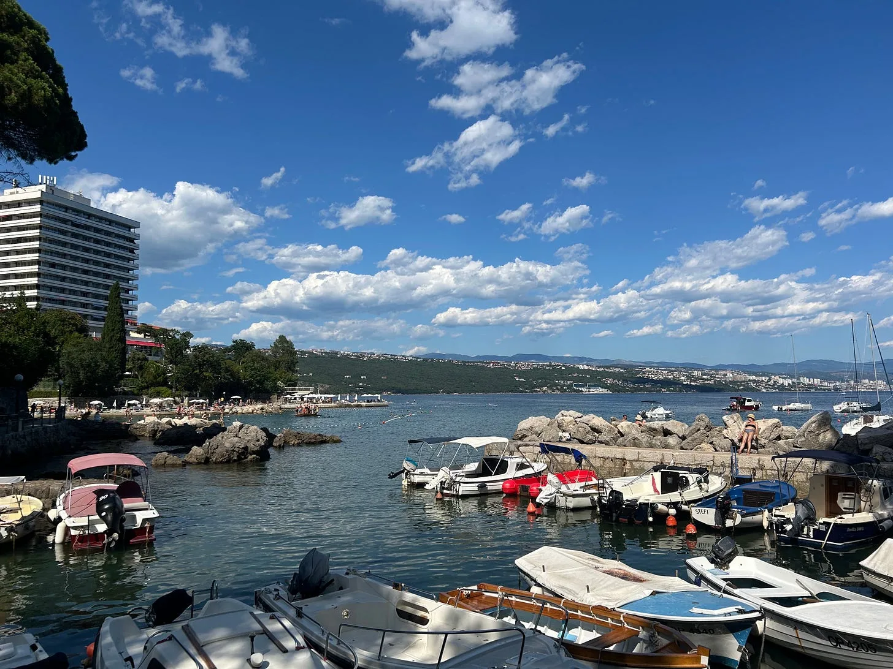
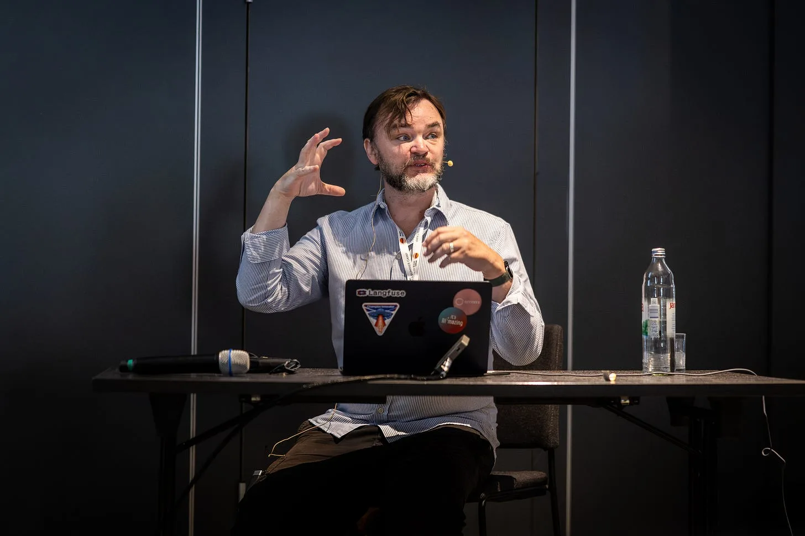
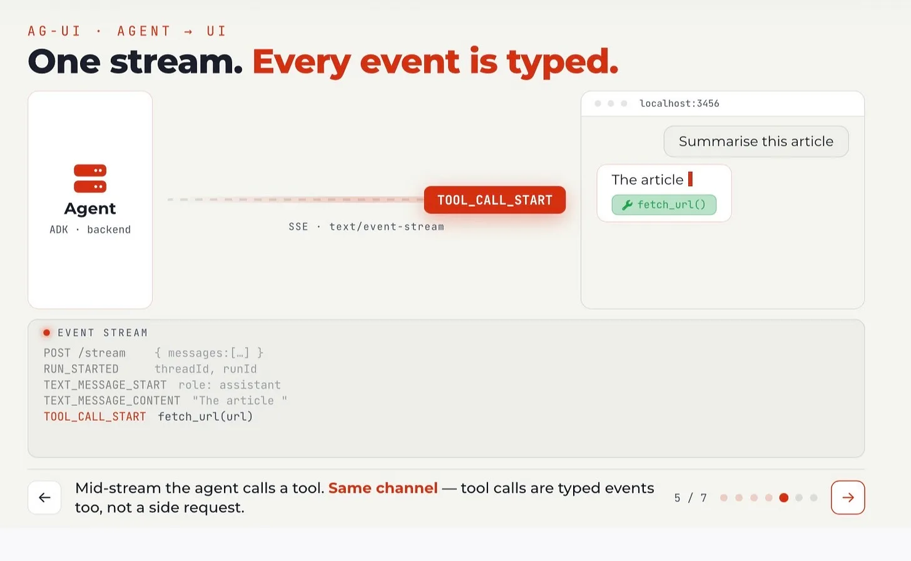
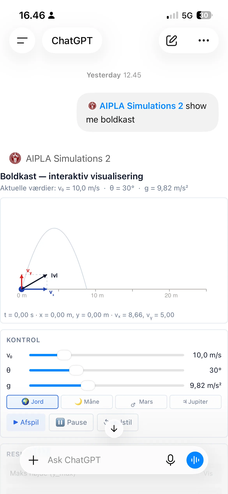
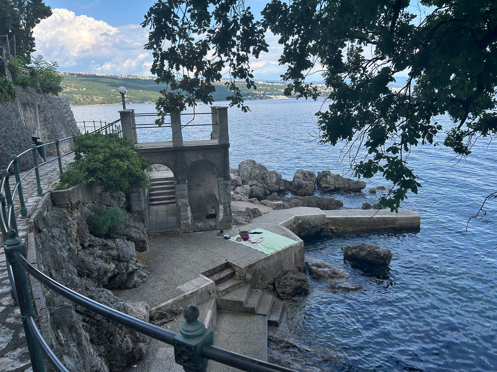

I’d never been to Croatia before this weeks visit to Opatija for WebSummerCamp ( [https://websummercamp.com/2026](https://websummercamp.com/2026) ) but I hope to visit again very soon this beautiful seaside luxury resort that feels like an undiscovered secret gem of a place and community rumours of which has not quite yet reached Copenhagen.

<!-- truncate -->

But, I was not the first visitor from Denmark to this foreign clime as I learnt due to the organisers thoughtful provisions for families (led by Netgen and event organizer Ivo Lukač) which meant as well as several tracks for AI, JavaScript, PHP, Business, UX, Product management there was also a Companion track for partners and families of attendees with things to do whilst the workshops were taking place. As a result we met another Danish family who has been attending for many years and could help show my wife and daughter the best places to swim nearby. Many thanks!

The workshops themselves covered many relevant topics but the timetable also left plenty of time to chat, swim and mingle with an international and Croatian crowd.

## AI session overview

My session on Friday I was lucky to have any attendance at all as Croatia vs Portugal had been playing in the early hours of the previous morning, but the room did fill up at 1000 in the cool, dark conference room contrasting the bright white heat reflecting off the sea outside.

For our first session we covered the definitions and differences between AG-UI, A2UI and MCP Apps which represent the modern frontend visualization layer for AI Applications.

These [protocols are now standard in all my new AI apps](https://github.com/sunholo-data/ai-protocol-platform) and you and the workshop attendees can see them in action via the [Accounts Payable demo](https://gde-ap-agent-blqtqfexwa-ew.a.run.app/) (show casing a document pipeline using A2UI to create AI controlled UX elements and MCP Apps for analytics dashboards) and the latest [AIPLA app](https://aipla-v01-frontend-wgwhd7mspa-lz.a.run.app/) (using MCP Apps to help create physics simulations for Danish physics students)

It was also interesting to hear what workshop attendees thought they may be able to use these protocols for when applying to their own work.

It’s initially a hard question to answer as chat interfaces such as copilots are so prevalent now that moving to more structured inputs and outputs is not a natural fit for use cases AI engineers may be working on today - the enhanced UIs AI can create via the protocols offers a third way that is between a modern deterministic website and a free form chat input.

A few examples did pop out of our conversations though:

- Creating structured forms for users who may not be as technically savvy or comfortable with AI prompting as those in the room. Teachers in particular may not have time to learn a new prompt engineering skill on top of what they do already - having the AI be able to craft structured UIs to help make data entry easier is a big UX win.
- Workflows that currently have lots of if-else branches on when to render different UIs can benefit from removing them in favour of an AI crafting them on the fly. Service desk software in particular stands out as current offerings have many different and often confusing routes to offer similar looking but slightly different data entry forms that could be replaced by one generative AI layer.
- Queries over databases such as “chat to my data” without a curated semantic layer in between can benefit from adding structure on what the user requests and receives by having dynamic UIs
- To balance 100% website owner curation vs 100% unfamiliar totally AI generated websites tapping into the “hyper-personalization “ layer could be AI generated UIs.
- Anytime verified data needs to be inputted and checked against a database where you don’t know in advance exactly what is needed.

MCP Apps in particular stands out as an emerging ecosystem since they let you brand it with your own styling, yet be available within the new more convenient way of interacting with websites via chat services. As demonstrated by myself and Tejas in his session the day afterwards, these MCP Apps can today display directly in [chatgpt.com](http://chatgpt.com) and MSN CoPilot with other clients coming soon.

As I speculated in my [analytics.dev talk](https://www.sunholo.com/presentations/analytics-for-ai-agents/), 2026 is peak human internet and I think that the humans will instead move to these easier surfaces away from direct browsing themselves, meaning AI agents instead will be assessing websites.

MCP Apps and other protocols (such as payment providers for AI like UCP) are the doorway for business to control and take advantage of the shift in user behavior from website browsing to AI browsing on their behalf

## Inspirations

As well as meeting new people and a new holiday location recommendation, I took away ideas on how to link these frontend AI protocols to the upcoming edge AI revolution of WebAI (eg the ai model embedded in chrome) and explore how web assembly can interact with them; and the desire to try making a pure AG-UI - A2UI website where every element is ai governed and generated - perhaps the eventual realisation of an idea I had 20 years ago about a website that builds itself based on user interactions.

