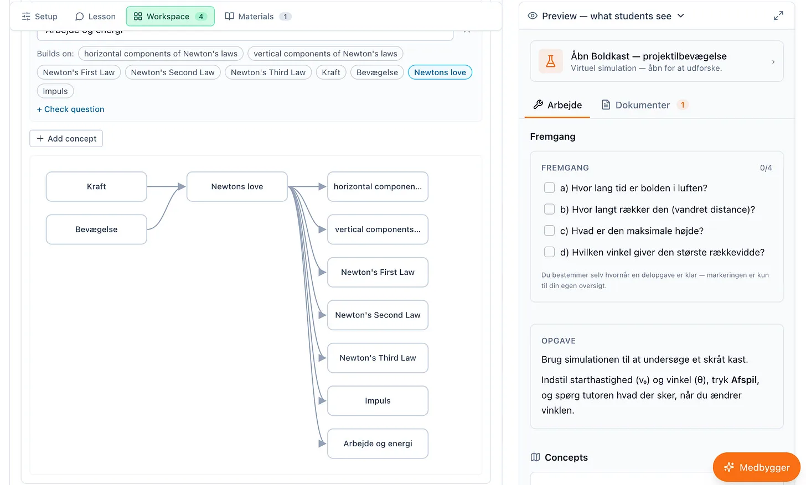
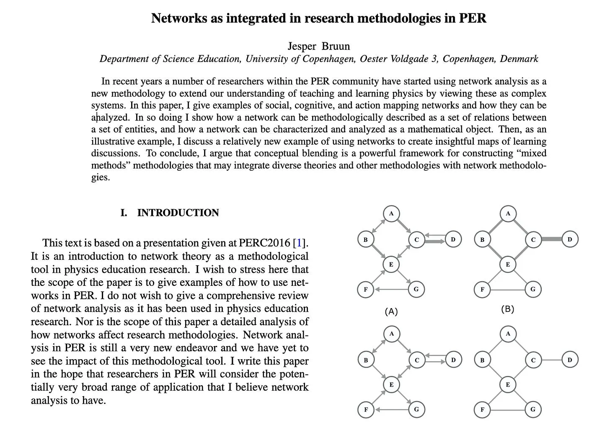

I’m currently working on two projects that have both converged to a pattern I think will become a standard in AI-human co-creation.

<!-- truncate -->

The pattern is where the AI is a facilitator to turn unstructured raw data such as student chat logs, large legal contracts or long form business documentation into structured data, and then using that data in deterministic way so that the user or student can get immediate feedback to try out what-if scenarios, practice understanding or adaptive dynamic visualisations.

The user real-time adjusts their approach and the AI can quickly respond to give iterative feedback, helping co-create or facilitate learning of a subject.

The two projects where this has come up is the [AI in Physics Learning and Assessment](https://www.sunholo.com/aipla/) project investigating how Danish 6th form students can learn Physics with AI assistance, and Aitana that works with long form [green energy contracts](https://www.sunholo.com/case-study-aitana) and related documents.

The general pattern for me now is:

1. Start with a pile of natural language, for example a corpus of lesson plan material or a 180-page power purchase agreement (PPA).
2. Extract from the documents (Word, PDF, Images, Video etc) (perhaps via [AILANG Parse](https://www.sunholo.com/ailang-parse/) ) - this adds a general structure based on document structure.
3. Pass the content to a specialised AI tool that extracts data into the **semantic structure** you need downstream.

   1. In the physics material, this may be what concepts each passage teaches, and how it builds upon earlier lessons.
   2. For legal contracts, it may be the web of obligations and triggers of clauses.

4. Tell AI to use AILANG’s [neurosymbolic programming](https://ailang.sunholo.com/docs/guides/contracts) to create deterministic, provable functions with [Z3 contracts to have trust in the results](https://en.wikipedia.org/wiki/Z3_Theorem_Prover).

   1. This step takes out the randomness that occurs if asking AI models to calculate from its own training data set
   2. We feed in content from step 3 into these AILANG functions via its command line or Web Assembly (WASM) deployments in the browser.

5. Let the user manipulate the data via chat or a UI - that data flows into the functions and the user sees in real-time the results of different experiments. the goal is to allow the human and AI to quickly iterate on what they want. Due to AI creating the structured data and the deterministic nature of the functions, we can get repeatable results

   1. For Physics education in AIPLA, this lets a student experiment with different variations in our physics simulations to help get intuition on the subjects we are assessing.
   2. For PPAs in Aitana this allows users to try out what-if scenarios on different weightings and clauses such as “the Supplier shall deliver by Q3 unless Force Majeure applies” to co-create beneficial contracts for their customers

There is an established field for this: [deontic logic](https://plato.stanford.edu/entries/logic-deontic/), the logic of what *must*, *may*, and *must not* happen. A contract is essentially a large document written in it, but written in natural language. We turn that natural language into code, and execute the code with different scenarios to predict different legal outcomes.

The idea that legal text can be compiled into executable code isn’t new: [Catala](https://arxiv.org/abs/2103.03198) is a language built to do exactly that for statutes which is credited with uncovering a logical bug in France’s official benefits system in the process.

## Enabling the AI to be deterministic

Extraction is a necessary first step - but once you have the content, you must check and verify it.

The Z3 solver in AILANG is [the kind of solver](https://en.wikipedia.org/wiki/Z3_Theorem_Prover) that can take a hundred logical statements and tell you, mechanically, whether they can all be true at once. For example, if you feed it the obligations pulled from a contract and it could find two clauses that [quietly contradict each other](https://arxiv.org/abs/2504.18422) on page 4 and page 91. this is difficult for a human to pick up, but a solver doesn’t have to. The more complex and valuable the contract, the more valuable “are these clauses consistent?” becomes.

The same machinery runs the physics app from the other direction. We extract a [concept map](https://en.wikipedia.org/wiki/Knowledge_space) - a learning domain modeled as concepts with prerequisite relations, so only certain paths through it are reachable.

The screenshot below shows how a Danish physics teacher may configure this for a lesson regarding Newtonian physics:

We then plan to have AI ask well-chosen questions, so we can reason backwards: a particular wrong answer is only possible if they’ve misunderstood *that* earlier idea.

This is close to how AIPLA’s leader Prof. [Jesper Bruun’s group in Copenhagen](https://researchprofiles.ku.dk/en/persons/jesper-bruun/) analyses physics learning: [as a network](https://doi.org/10.1119/perc.2016.plenary.002) of relations you can map and interrogate.

[Formative assessment](https://kappanonline.org/inside-the-black-box-raising-standards-through-classroom-assessment/) stops being a score out of ten and becomes an action plan for which node in the web hasn’t landed yet, and what to teach next because of it.

We are also exploring the idea that student groups that have mastered certain nodes but not others could match with groups that have the opposite to foster collaboration, and for teacher feedback on what to plan next.

## The real world is messy, and that is good

But we can’t formalise everything - if it could lawyers would already be replaced by code, and teachers by algorithms. What we are trying to do is separate what can be formulated by what can not, and using that to split what an AI can help do, versus giving more time to the humans.

**Not everything formalises. And knowing exactly which parts do not is a deliverable.**

Some obligations in a contract are crisp: a date, a number, a conditional. Those you can codify, then run what-if scenarios against: if the price index moves 3%, does anyone breach?

But other clauses are deliberately soft. “Reasonable efforts.” “Good faith.” That vagueness isn’t sloppiness; economists have argued it’s [often what makes a contract work at all](https://bernheim.people.stanford.edu/publications/incomplete-contracts-and-strategic-ambiguity). It’s negotiated leeway, load-bearing precisely *because* it’s ambiguous. A tool that flattened it into a hard rule would be actively wrong.

Education has the same texture. Plenty of a syllabus is checkable — did they get the mechanics, can they balance the equation. But the thing you actually care about, whether a student *understands* rather than pattern-matches, is exactly the part that resists being reduced to a checkbox the AI ticks.

## Two piles: AI deterministic, Human judgement, with AI-Human bridge

Where Generative AI is so transformative I think is this ability to add structure to unstructured - to be able to take your vague prompt and discern what you meant, search through its training data and return a plausible answer.

But from my now years of [AI engineering](https://www.sunholo.com/ai-engineering) experience, I have seen the most value add is being able to make judgement calls on **what decisions we can trust the AI** to make - see my series on “Can I Trust AI” for more details:

*[The wrong question about AI trust](/blog/wrong-question-ai-trust)*

Which workflows do we use AI to generate the solution, versus using AI to make a deterministic, repeatable workflows? This post is another manifestation of that decision.

So the goal is never to turn everything into symbols. The goal is to sort the material into two piles: the deterministic, checkable part where a solver earns its keep, and the irreducibly human part that needs judgement. And we can use AI engineering to help draw that line reliably, at scale, across documents no person has time to read.

AI does the extraction and the sorting; the formal engine hammers on the checkable pile; and the ambiguous remainder is handed back to a person with a flag on it that says *this one’s yours, and here’s why.*

To make this work, we need trust - it matters that the checkable pile is checked the same way every time. AILANG’s core is built from this as we identified early this would be necessary for an AI-first language — same inputs, same outputs, no hidden state — the same contract yields the same verdict in a browser, on a server, or on the university’s own hardware.

## AI-Human Cyborgs

So I thought I’d write about it for this week’s newsletter, as I think this is something we will discover as we negotiate how we work with AI on a day to day basis in further and further fields than the coding, legal and education ones I’m familiar with today: AI enabling quick feedback by adding structure and passing to deterministic patterns, that a human can work with repeatedly to create enhanced artifacts or learn new concepts.
