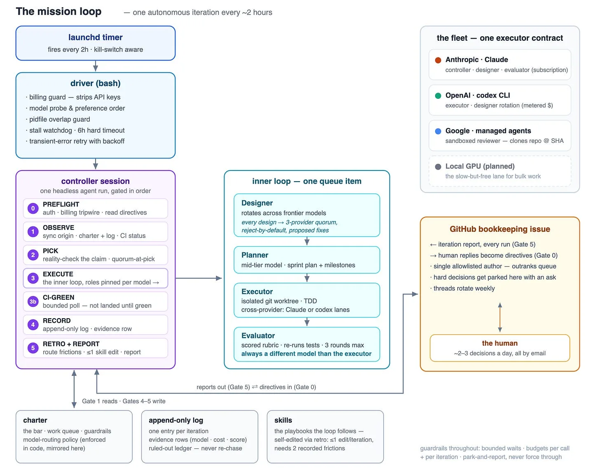
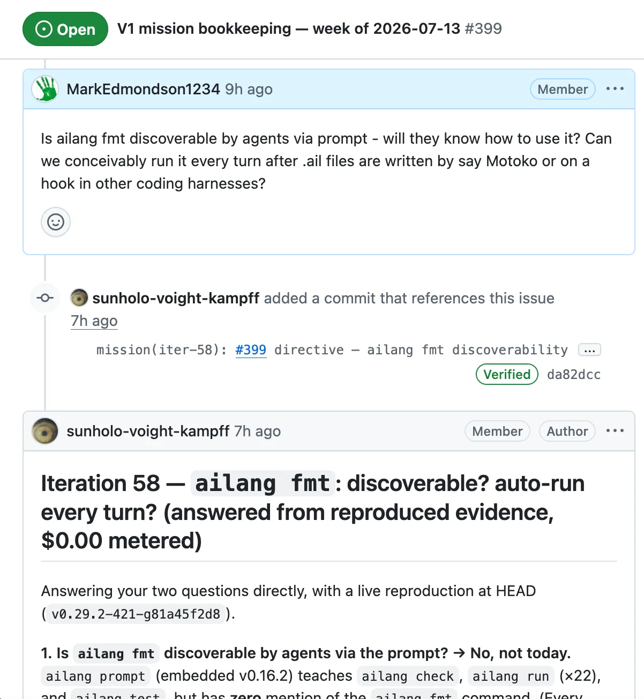

There is a lot of noise in AI trends which can seem abstract or theoretical to those not following every day, so I’ll try not to add to that but instead show a public example of a living, breathing open source project and how it is using terms like “loop engineering”, “dark factories” and “agent graphs” to get things done today.

<!-- truncate -->

The evidence is public and live in our GitHub issues - you can follow along here: https://github.com/sunholo-data/ailang/issues/399

### Work in progress

This has slowly developed as we’ve experimented with different workflows and is still a work in progress, but that’s the first point to make: these flows will always be a work in progress - it’s the self-modification and self-improvement and self-healing aspect of the process that is distinctly AI vs non-AI.

The main driver is dubbed the outer **mission loop** that scans a task list, decides which one to do, plans it out in sequence: this then executes the inner **sprint loop** that plans and executes then evaluates.

But within both of these loops includes the directives to modify its own instructions. If for example the task picker is picking the wrong tasks or the planner didn’t help, the AI can recognise this and change the text of the files that will direct the next iteration.

Anthropic Fable is the current main designer and whom I interact with when administrating the mission loop. The sprint loop is what has developed over time and encoded in the skills (design doc, sprint planner, sprint executor etc) in the last 6 months, and is now trusted and stable - it was this trust that prompted me to start handing over its coordination.

The **sprint loop** is the “dark factory” - I trust it enough that I don’t need to inspect its details - I now trust it enough that the outer **mission loop** is where I monitor it. The abstraction has moved outwards the boundary where a human reviews.

We were also inspired by [Lillian Weng’s article on harness engineering](https://lilianweng.github.io/posts/2026-07-04-harness/) that came out as we were developing this outer loop.

## Anatomy of a self-improving mission loop

Here is how we built an autonomous engineering loop that has run ~55 iterations in nine days, landed 25+ changes with CI green, coordinated four AI providers, and — most importantly — caught and fixed its own bugs along the way.

### The shape of the thing: mission loop around sprint loop

The mission loop is an **outer mission loop around an inner sprint loop**, scheduled on the always-on office Mac Studio:

There are three artifact documents that serve as the loop’s entire memory, all plain text files:

- **The charter** — the mission’s bar (what “1.0.0” means), the work queue with status tags, the guardrails, and the model-routing policy. Mutable, but only under written rules.
- **The append-only log** — one entry per iteration: what shipped, evaluator score, a **routing evidence row** *(provider, agent, model, task-class, score, corrections, cost)*, and a **ruled-out ledger** so no future iteration re-chases a dead end.
- **The skills** — markdown playbooks the controller follows (the gates above, plus one per inner-loop stage). The loop is allowed to **edit its own skills**, but only via the retro gate: max one edit per iteration, and only when two independent recorded frictions point at the same gap.

That last rule is the self-improvement engine, and it is deliberately throttled. Every incident becomes a written rule; no rule gets written on a single anecdote.

### Model routing: the biggest lesson

We designed a routing table early: a top-tier model coordinates and judges, a mid-tier model plans and executes, cheap models do mechanical work. We found this was best defined in the architecture with the rule: **routing must live in deterministic code, not prompts**.

This also enshrines our entropy philosophy, where we move as many decisions up-front into the design doc stage, so it is not paid for in expensive downstream bugs or code complexity - see the “Give me the freedom of a tight brief” post for more details:

*[AI: Give me the freedom of a tight brief](/blog/ai-freedom-tight-brief)*

Every iteration’s log records the models that ran, so a regression is visible rather than silent.

[Lilian Weng’s framing of harness engineering](https://lilianweng.github.io/posts/2026-07-04-harness/) describes this exactly: improvements that live only as prompt-level aspiration haven’t been internalized into the harness.

### The fleet: four providers, one contract

Execution currently spans providers, all behind one executor interface. It uses our existing AILANG executor codebase that runs our evals - *ailang messages* that run event pub/sub queues to online Cloud Run job instances:

- **Claude Fable** — the controller session plus pinned sub-agents (subscription-billed on Claude Max).
- **OpenAI Sol (codex CLI)** — proven as a real executor: it shipped a merged, CI-green feature from a sprint plan on its first live fire. Lessons from that fire went straight back into the recipe: the sandbox needs explicit write access to build caches, long runs must be backgrounded, and codex can’t self-commit in a linked git worktree — the controller finalizes the commit, crediting the executor.
- **Gemini (Vertex Managed Agents)** — runs in a Google-hosted sandbox with **no shared filesystem**, which makes it structurally read-only against our tree: perfect for review, usable for editing only via git clones. It clones the repo at a pinned SHA over network egress, runs our compiler’s check inside the sandbox, and returns a structured verdict.
- **A local GPU model (Qwen3.6 on [Motoko](/blog/who-needs-fable-local-models-ailang) coding harness)** — planned as the “slow but free” lane for long-running, deterministically-verifiable work.

Design review is a **cross-provider quorum**: each design doc gets independent reject-by-default reviews from GPT and Gemini plus the Claude controller, each returning *&#123;verdict, strongest_objection, proposed_fix&#125;*.

The quorum has repeatedly caught real errors, including contradictions in amendments written by the human operator and the loop’s own author. New design authorship *rotates* across the frontier models, because every design passes the same quorum regardless of author — so authorship diversity is free comparative data about which model designs best for this codebase.

### The human interface: a GitHub issue as steering wheel

Every iteration posts a report to a bookkeeping issue (rotated weekly to keep threads bounded). The crucial part is that the channel is **bidirectional with an author allowlist (e.g. MarkEdmondson1234)**: comments from exactly one human account are read at the start of each iteration, treated as directives that outrank the queue, and acknowledged in the next report.

*Above - an example human/AI interaction on the [bookkeeping github issue](https://github.com/sunholo-data/ailang/issues/399#issuecomment-5013851018)*

Decisions the loop can’t make — architecture forks, spend authorizations, scope calls — get **parked** with a recommendation and a one-line ask. The human runs the mission from an email client; the allowlist stops anyone else on a public repo from steering the roadmap.

### Cost control: layered, deterministic, and tested

Autonomous loops burn money in two currencies — subscription quota and metered API dollars — and both needed engineering:

- **Billing by construction, not convention.** API keys are stripped from the environment at multiple layers so nested model calls **cannot** silently bill the metered API.
- **Budgets at every level:** hard per-reviewer caps on quorum calls (cents), mid-stream cost-kill on executors that report streaming usage, post-hoc flagging where the API only reports usage at completion, and a per-iteration metered ceiling that makes the loop fall back to subscription lanes or park work rather than overspend.
- **Measured, not assumed.** A live experiment showed a **tightly-scoped directive** (*”run exactly these commands, do not explore”*) cuts an agentic review’s cost ~12×, and reusing a warm sandbox environment saves a further ~42%.

### The lessons we’d give anyone building one

1. **Policies that live in prompts are wishes.** Enforce routing, budgets, and safety in code; use the model-facing instructions only for what code can’t reach — then log what actually happened so drift is visible.

2. **Reality-check every pick.** A design doc’s status header is a claim, not a fact. Live-reproduce the bug before routing work at it; a striking fraction of our “open P0s” were ghosts, already fixed months earlier.

3. **Bound every wait.** One unbounded *until done; do sleep; done* once wedged the entire loop for six hours. Every poll now carries a deadline and fails loudly into a parked state.

4. **Watch for the observer effect.** Our overlap guard matched processes by command-line phrase — and once matched the *monitoring shell that was checking on it*, silently blocking a run.

5. **Trust the live API over its documentation.** A documented “mount a git repo into the sandbox” feature simply didn’t exist on the API surface we actually call (different surface, different contract). Fourteen cheap request-validation probes settled in minutes what documentation-reading had gotten wrong.

7. **Let the loop catch you.** The best moments were the system rejecting its operators: the quorum blocking a doc whose premises contradicted its own goal, a reviewer catching a contract contradiction in an amendment the human had just ratified. If your autonomous loop can’t push back on you, it can’t push back on itself.

The next step is porting the whole template to a second repository for a new mission, which is itself a queued item the loop will build.

### Where are we going?

The above process has slowly evolved as the capabilities and trust in the AI has increased. Trust is again the key area that is needed to be able to make this work - trust in the code quality, in the costs, in the honesty of the AI’s reports about what it has done.

But once trust is established, I think we are moving quickly again to a new abstraction similar but not quite the same as say a compiler vs a programming language. I can see that boundary expanding even more, but its unclear how it works when collaborating with many other engineers or AIs quite yet. It does though always urge you onwards to more ambitious projects, if the costs stay reasonable.

One final note is I’m a bit bemused by reports of how much spend companies are doing on tokens “tokenmaxing” as the costs I’m incurring is less than $350 a month, compared with $10,000+ per user by some accounts.

My limit is reached by how many projects I feel I can reasonably steer and know whats going on - but that limit is at least x5-x10 what I could produce a few years ago. Perhaps those tokenmaxer engineers go even further and trust the AIs with multiple more projects than me. Good luck to them, I think my brain would overflow.
