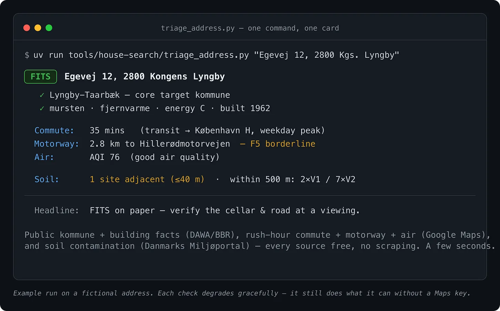
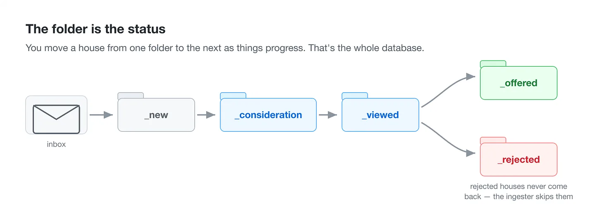
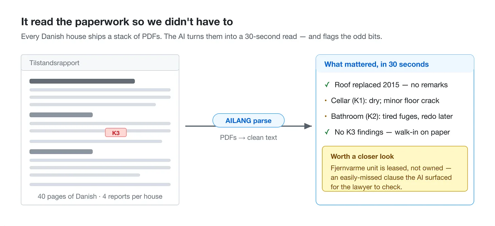

I know this newsletter can be very in-the-weeds as I explore AI’s frontiers. But this is a very practical post, I hope, as alongside my AI engineering work this summer I had a second job: selling and buying a house for my family.

<!-- truncate -->

And yes, I treated it as a work project. Since all my current projects use AI, I thought I would use AI to help with this as well. And what I was dreading as a stressful and fraught exercise turned out to be a lot smoother and more satisfying with AI’s help.

I didn’t want to replace human connection and expertise. But what really helped was walking in to see the bank mortgage advisor, the property lawyer or the estate agents with prepared information that — without AI — I wouldn’t have had the time or expertise to bring.

And it worked. We sold our house in the suburbs of Copenhagen within 5 weeks, and bought another a bit further out by some forests and lakes a few weeks after that. Along the way, AI helped me to:

- filter and parse house prospects from email and online listings
- calculate the mortgage and budget we could buy within
- keep track of our preferences on houses and locations
- read, digest and summarise all the documentation around buying and selling, highlighting the unusual bits

The main value was two things: identifying which areas we wanted to focus on, and parsing out the *tilstandsrapport* (in Denmark, every house needs a condition report before it’s sold). Having structure meant we could look through a lot of houses and triage them quickly — which to go and see, which to reject.

There was also some self-discovery about our own preferences. We *thought* we could live more than 60 minutes’ commute from central Copenhagen, but when it came down to it, we discovered that was a deal-breaker. Smelly cellars were an automatic rejection. A nice floor was a big plus. Things we perhaps knew instinctively — but only when we interviewed each other and transcribed it for the AI did it help formalise our search criteria.

## So what did the AI actually do?

**It remembered everything.** The whole hunt lived in a folder on my laptop, with a sub-folder for each house: *new*, *worth a look*, *viewed*, *offered*, *rejected*. As we assessed prospects, houses got moved through the folders. This let us triage a lot of different houses, and honestly I think without AI I would have been overwhelmed and just settled with a house that looked good on paper, but only afterwards find out that hidden gotcha in the legal or maintenance reports.

**It read the paperwork so we didn’t have to.** Every Danish house comes with a stack of PDFs — the sales listing, the condition report (*tilstandsrapport*), the electrical report, the energy label. Left to us that is a few hours per evening per house squinting at a screen. Instead, the AI read each one, pulled out what mattered, and flagged the odd or worrying bits — a damp note here, an unusual clause there. That alone turned “I’m dreading this” into “let’s take a look”.

**New listings were triaged overnight.** Estate-agent and search-alert emails came in to the inbox, and when I had a few minutes I aimed the AI to sort through and give a summary of each for me to look over as well as a recommendation for pass, investigate or strong fit.

**It checked what actually matters about a place — in seconds, from official sources.** There were a few spammy websites out there that gave you housing data but only after clicking on cookie banners and blocking out ads could you get to the useful information. And a quick investigation found they were just aggregating from free government data APIs that we could call directly ourselves, so AI helped write the scripts to pull that data directly - things like traffic noise, air pollution etc. - and use it in our rubric on what a good house should score.

**It gave us a scorecard, so we didn’t fall for one shiny feature.** Every house was marked the same way against the same things — price, commute, condition, schools, running costs, the feel of the place. It made us face up to some assumptions and let us cancel some prospects that were romantically nice looking but under the surface would have caused a lot of hassle.

**And it decoded the money and the legalese.** My Danish is conversational, but finance and real estate holds many weird and wonderful unique words that even a Dane may struggle to explain unless specialists in the field. The AI not only acted as a translator, but could explain and teach the concepts such as “kurs” which makes a big financial difference. This meant more confidence when speaking to the advisors and specialists and being able to push back or highlight preferences that I simply would not have been aware of otherwise.

## For the technically curious

If you want to see how buying a house with AI works the whole thing is open source: **[github.com/sunholo-data/danish-house-hunt-toolkit](https://github.com/sunholo-data/danish-house-hunt-toolkit)**.

It’s a set of [Claude Code](https://claude.com/claude-code) “skills” plus small tools that query Denmark’s public registers directly (addresses, buildings, contamination) and read the documents with [AILANG parse](https://www.sunholo.com/ailang-parse/) — no scraping, no paid data middlemen.

If looking for your own house and am thinking of using AI to help, you can fork it, point it at your own postcodes and fill in your own priorities, and let your AI be the housing assistant we all should have in our back pocket. **I’ll be interested if you use it and/or adapt it for non-Danish markets, please let me know if its of help!**

## The professional in the back pocket

The AI didn’t buy the house. But it gave me back the evenings I’d have spent reading documents — and the confidence to walk into every meeting knowing more than I would have known without it.

And this is, I think, the real upside that helps balance out the more dire warnings about AI - the empowerment it gives people to have an expert on your side, who doesn’t care how many stupid questions you ask, and can help you be more informed in your professional decisions.

I tried this with house buying, but things like legal advice, medical, etc could also carry benefits, **but how do we verify and trust those results?** I have a blog series about that very thing, and a new programming language that thinks about it a lot:

For the buying the house process, we the humans still took the final decision on which house to buy and were influenced mostly by the AI on what area to buy within.

We are happy with the results, but would I be comfortable trusting 100% what the AI recommended and letting it drive the whole process? I don’t think blind trust is ever going to be the right approach - outsourcing all thinking to AI - but where AI and humans are co-creators and co-collaborators it feels like a force multiplier.
