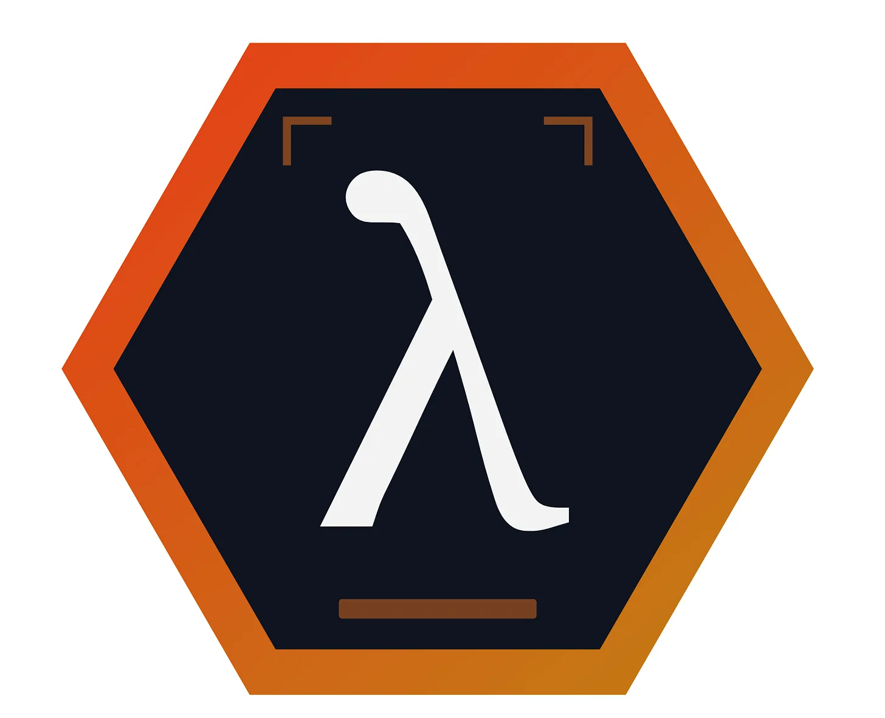

A couple of weeks ago I wrote about the [dark factory loop](/blog/ai-loop-engineering-dark-software-factory) being used to self-improve AILANG, the programming language designed for AI rather than human programmers.

<!-- truncate -->

The second project being built by that mission loop is [AILANG World](https://github.com/sunholo-data/ailang-world): an AI operating environment built around AILANG which is an entry into a new field of [Language-Based Agent Control](https://arxiv.org/abs/2605.12863), or LBAC.

The reason why this is my next top priority, is due to the interaction between AI verification, trust and abstraction which I think will be easiest explained by comparing to how cars have evolved over time, and how they are moving to being abstracted away themselves.

## Abstraction in cars: getting us from A to B

The purpose of a car is to get us from A to B.

During my lifetime, the amount of machinery a driver needs to understand to achieve this goal has steadily decreased: when I was young, my mum’s Land Rover had a hand crank on the front to start it, required double-declutching to get into first gear and had a top speed of around 50 mph.

A working knowledge of the mechanics was useful. When something went wrong, the driver was relatively close to the machinery and many parts could be understood, repaired or replaced.

A few decades later, I drive a car that I would be fairly useless at repairing beyond changing a tyre. Yet I trust it far more to get me from A to B than the Land Rover.

That trust did not appear because the machinery became simpler - the machinery became vastly more complicated. But Trust increased because car manufacturing became more standardised, common failures were engineered out, components were tested independently and complete vehicles were verified before being sold.

The complexity of the car was not removed. It was pushed beneath a trustworthy abstraction. I no longer need to understand the engine. I only need to understand the controls: steering wheel, pedals, gears etc.

In June 2026, Tesla’s Full Self-Driving Supervised system received provisional approval for use in Denmark. Despite the name, it is not fully self-driving. The driver remains responsible, must watch the road and must always be ready to take over.

The human can state a destination and allow the car to perform more of the journey, but the steering wheel remains the final interface. At any moment, the driver may be pulled abruptly from passenger back to operator.

The abstraction is still leaky. To move beyond supervised driving, assurances are not enough. We need verification.

We need accident rates, sensor data, reproducible investigations, personal experience and recommendations.

**Abstraction rises as we trust, trust rises with verification.**

We never will reach a pure 100% guarantee, but practically when we are at 99%+ and trust the machine more than a human, the steering wheel will stop being central to the experience of using a car. Instead I can imagine a car will be more like a lounge on wheels. Where people live, how cities are designed, how we travel between countries and how public transport operates may all change.

But that profound change will only be possible once we **abstract** away the need to manually drive a car, for which we will need **trust**, for which we will need **verification**.

## Abstraction in software: getting us from thought to application

The purpose of programming is to get us from thought to application.

During my software career, the amount of machinery a programmer needs to understand to achieve that goal has steadily decreased. When I was young, programming languages such as BASIC, Pascal and C++ placed the programmer relatively close to the machine. Memory, storage, processors and operating-system behaviour were more visible in everyday development.

A working knowledge of how the computer functioned was useful. The programmer did not merely describe the intended application. They participated in making the underlying machine perform it.

A few decades later, higher-level languages, managed runtimes, libraries, frameworks and cloud services pushed more of that machinery beneath abstractions. Using interpreted languages such as Python, R, PHP or JavaScript and others, we could describe and Trust much more of what we wanted and much less of how the processor should achieve it. I trust programs written in them much more than I would if using machine code.

The complexity of the underlying machine code was not removed. It was pushed beneath increasingly trustworthy abstractions.

In November 2022, OpenAI launched ChatGPT. Claude Code was launched February 2025. A person can state an intention in natural language and an AI can plan changes, write code, run tools and assemble an application. But the programmer is still currently needed to supervise the journey. When the AI makes a mistake, the human must suddenly change perspective. One moment they are expressing a business goal; the next they are inspecting a malformed database migration, debugging a race condition or reconstructing what an agent did six hours earlier.

The abstraction is still leaky. To move beyond supervised programming, assurances are not enough. We need verification.

We need task completion rates, logging, reproducible code runs, personal experience and recommendations.

**Abstraction rises as we trust, trust rises with verification.**

We never will reach a pure 100% guarantee, but practically when we are at 99%+ and trust the machine more than a human, coding will stop being central to the experience of software engineering. Instead I can imagine creating applications will be more like a lucid dream. How people create software will be to point and utter what they would like to see, wait perhaps impatiently and then see the results live.

But that profound change will only be possible once we **abstract** away the need to manually code, for which we will need **trust**, for which we will need **verification**.

### What AILANG World aims for: AI Verification

Better models have helped over the years to reduce hallucinations, but one of the biggest leaps when [coding harnesses](/blog/ai-coding-an-ai-coding-harness) like Claude Code were introduced was the ability for AI to check itself. This is often the gap between users who think AI is unreliable vs useful, since Claude Code users are used to seeing AI one-shot code files and for them to be wrong, but then **see the AI self-correct** - since code is its own feedback mechanism its a lot easier to check.

Its not perfect though, and in fact its that gap between code that looks correct but doesn’t run which is what AILANG is aiming for. And what about domains outside coding, for questions that don’t have such immediate verification possible?

To remove continuous human supervision, we need an environment that can answer questions such as:

- What exactly is the AI proposing?
- What is it allowed to modify?
- How much money, time or human attention may it spend?
- What external actions actually occurred?
- Can we reconstruct why the current state exists?

Tests, code review, design documents and deployment controls already provide fragments of this verification system.

AILANG World attempts to make them part of the operating environment itself.

## AILANG World: from thought to governed action

AILANG World is not a coding agent. AILANG World is the drive-by-wire system, the road rules, the driving licence, the fuel allowance and the sandbox around it.

A human expresses a goal:

Add the ability to export to Excel. Spend no more than $10. Staging deployment requires my approval. Never deploy to production.

Today, much of that remains prose inside a conversation. The agent is expected to remember and interpret it correctly.

In AILANG World, the ambition is to turn it into an enforceable object:

- the destination becomes a typed goal;
- the restrictions become contracts;
- permission becomes a scoped capability;
- the spending limit becomes a budget;
- actions outside the software become declared effects;
- tests and proofs become evidence;
- each accepted change becomes part of permanent history.

The AI does not yet modify the world directly. It proposes a transition from one known state to another. Only a verified and authorised proposal can be committed.

AILANG World describes itself as a new AI focused operating system, akin to Windows, Linux or OSX - but for its distinction:

Unix made everything a file. AILANG World makes everything a **typed state transition.**

A typed state transition requires all variables are declared up front. We then apply that transition to the World state space, and get a new World. Each committed transition creates a new immutable world revision rather than silently altering the old one.

It aims to provide the verification so we can increase trust, and hence abstraction.

## From human operator to human governor, AI operator

The goal of AILANG World is to make it safe for the human to let go of the wheel. That does not mean humans are gone - but that the new boundary for interaction moves upwards through the abstraction.

The intended human interface will not simply be a larger chat window, but a workbench over goals, decisions, evidence, budgets and history. Conversation remains a useful way to express intent and ask questions, but authority lives in the typed world rather than in the chat history transcript that may later be compressed or forgotten. This will also tie in the protocol work such as A2A, MCP, AG-UI and A2UI to interact with other AI systems - but the AILANG World kernel itself is envisioned to be a source of AI trust those systems can rely on.

Its ridiculously ambitious, but I believe its where AI is heading. And its not just me - several independent research groups have converged during 2026 on the idea that AI agents should express actions through typed programs that can be checked before execution.

The emerging research category is explicitly called **[Language-Based Agent Control](https://arxiv.org/abs/2605.12863)**, or **LBAC**. Check it out.
