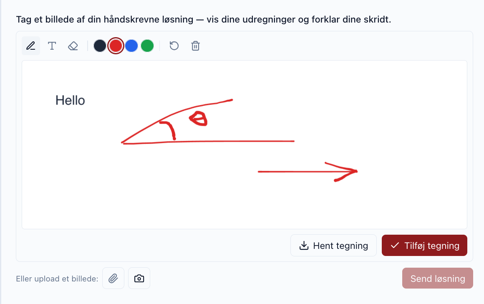
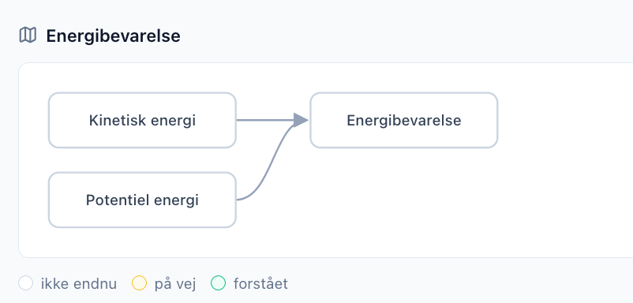

Work has continued over the summer on the AIPLA project which has created several new features and insights that I would like to catch up on in this week’s post.

<!-- truncate -->

The previous update introduced the premise and initial work so its good background if you have not read it already:

*[Lessons creating an AI platform for Physics Students in Copenhagen](/blog/ai-platform-physics-students)*

Since then we have been working on rounds of feedback from students, researchers and pupils and have the project website updated here: [https://aipla.ku.dk/project](https://aipla.ku.dk/project)

The AIPLA application itself will work with the pilot group of teachers for the new Danish school year starting this month, so its all very much a work in progress as we await their feedback. I will be working with for most of this academic year in to 2027 - can’t wait - it feels like one of the most impactful projects I have worked within as this is a very hot topic both domestically and abroad: how students learn (physics) in this new age of AI, how teachers teach, and what does education even look like as AI gets more and more capable.

There are three audiences to cater for within the app, that I will talk about in turn below: students, teachers and researchers.

## Student interactions with AIPLA

Students are those that arrive to AIPLA after their teacher has issued a groupId code. These codes are anonymous to help with personal privacy, and to help facilitate the Danish style of group work within classrooms. Student groups can all log in under the same groupId from their laptop, iPads or phones, and it updates in real-time when any student interacts.

We have worked a lot on making the user experience for students as easy as possible: we provide speech-to-text and text-to-speech options for speaking with the AI tutor; and provide a “call the teacher” button that will notify the teacher via their online dashboard (see below)

We have also further developed the “workbench” area that the teacher can set up to have various interactive elements the student can interact with. For example we can add an element where a student draws or uploads a picture (from their phone camera?) that the AI tutor can read and react to:

 Because one thing I have learnt from the educational researchers on the project is that although we are making it as easy as possible for students to interact, we actually require and need friction for students if they are to walk away learning something.

Friction means the AI tutor is by default set to be Socratic - it won’t give the answer to problems if asked. Friction means the student needs to engage with the material and question, such as uploading a picture of their experimental setup. Friction means some activities are set up where we give a deliberately wrong reading and the student needs to find the mistakes by repeating the experiment.

A large part of the student’s experience will be setup by their teacher, not the AI. The teacher has been given a large amount of tools to be able to influence how the student interfaces with the material, as we explore and get feedback on what is effective.

## Teacher interactions with AIPLA

The teachers have a large degree of customisation they can make to their students lessons. Within a dedicated dashboard upon log-in, they can create classes with groupIds, assign and design activities for those groups and review and assess lesson transcripts, costs and reports.

Teachers are overwhelmed with systems already though, so work has been done to try and make setting up a class as simple as possible. The main route for this is the Class co-pilot, that is an AI assistant for setting up AI assistant teachers. It has access to all the same configuration options as a teacher would normally have, but you can ask in natural language e.g. “Assign 10 groups to class A”, “Assign activities good for exploring Newtonian laws of motion to class B”.

Within classes you can also turn off and on features such as audio transcripts and voice-overs, and assign a tutor style from our presets:

Some classes may only need minimal setup as they are used to support in-class activities - perhaps just the document syllabus and upload support. Some may use simulations students interact within the app and use for virtual online experiments. We aim to provide the basic tools that many varied lesson plans can be created, and the ability to share these with other teachers in some kind of activity marketplace.

Teachers can also upload documents or browse from already uploaded content such as Physics syllabuses, worksheets or teaching material, and can choose to make this available to the student during the session or only used by the AI tutor as a basis to its answers. Again this can also all be setup via a copilot that can configure the settings for the teacher without them needing to click through all the configuration themselves.

Its this balance between customisation and ease of use which is critical for AI software applications, as one hard earned lesson I’ve picked up is that although AI can create a wealth of features, getting users to onboard and use them is not something AI can help with directly, so anything to help lighten feature overload is critical, especially for busy teachers with lots of other priorities. Time will tell if we’ve succeeded.

At the very least, building the app does perhaps hint of new skills teachers will need to pick up if using AI with the students. Part of the project’s research has shown that the trust between teacher and student due to AI is changeable - it is a different experience for students who speak to AI tutors knowing a teacher can vs can not see questions and answers.

Teachers have lost the “oracle” role of knowing all the answers, ceding it to AI chat bots - a teacher’s new role may be of co-discovery with the student, or setting up the challenges and friction necessary for learning goals to be achieved.

We are also working on how AI can help assess student’s understanding. One experiment is adding “concept maps” of what a student should understand as they build up a picture of the activity learning goals, and having AI help assess their understanding along the way. We are looking at perhaps pairing groups that have understood different branches as a way of fostering sharing concepts.

 This is all still very much work in progress and it will take the teacher trials to see if it has any achievable impact, but we are looking forward to seeing what data we can gather to help assess this.

## Researcher interactions with AIPLA

Which brings us to the researcher roles, led by Aswin and Jesper who are currently leading the project. They have different requirements from AIPLA where they can get good data to help with their pedagogical initiatives and ideas. They have written extensive papers already on Education and AI and AIPLA aims to help give them the research data to explore those ideas further.

Researcher’s get a role in the AIPLA system that allows them to see how teachers are using the tool - which activities and classes are useful or not.

We also have exciting features where we can run the rich student interactions such as audio, chat transcripts and how they interacted with the various components in the UI workbench. This data can be re-analysed under various educational schemas and used to help judge the rubrics for effectiveness.

It is pictured this can help teachers understand and help plan out lessons and student learning, especially if we can compare this over a long period of time over say a school year. This research could then be back-ported to the above mentioned teacher CoPilots to give better suggestions on creating lesson plans and activities.

## …and my interactions with AIPLA

The AIPLA application itself has been a great test of the AI protocol template and has fed in to more features for it - the template is open source and available here: [https://github.com/sunholo-data/ai-protocol-platform](https://github.com/sunholo-data/ai-protocol-platform)

I’m very happy with the stack of Firebase / Cloud Run / ADK / React as it has proved very flexible in the right areas but rigid and structured where it counts, thanks to its strict adherence to protocols such as MCP, A2UI, AG-UI and A2A. As a result the AIPLA back-end can serve other platforms easily such as Gemini Enterprise, ChatGPT and MSN CoPilot, but it also made features such as the in-app Copilots to help teacher setups almost trivial to create.

We have also setup our own model evaluations and have strong initial results showing that we are lucky enough to just be at the time when local models such as Qwen3.8 look to be adequate for running Danish STX level physics. We are planning to move the infrastructure into our own cluster when its available - an important feature for privacy and control and has also influenced the technological stack choices to be portable into say a local Kubernetes cluster.

All in all its a fun project mainly due to the high quality level of feedback and usage that means changes always feel meaningful.
