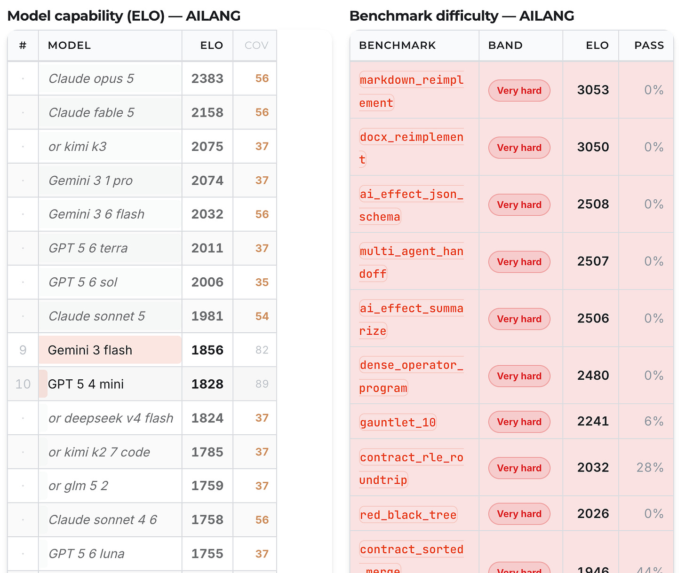

A large part of AI engineering these days is selecting which model is best for which task, a bewildering choice that is getting more complex, not less, over time.

<!-- truncate -->

I will show how I approach model selection using considerations I have talked about in this publication such as entropy decision budgets, trust, latency, AI regulation, quotas, cost, capabilities etc. all of which help me select the best for the task at hand.

Perhaps along the way this post may also change people’s assumptions about how the AI model economy works. Model choices also impact AI platform strategy such as cloud vs open-source vs self-hosted models, all of which have privacy and cost implications.

## Breaking down what’s available

I’m working on this 100% and I don’t keep up with all the latest models out there, so don’t feel bad if you’re not either. I will only cover text models here, and leave the even larger ecosystems of specialist models such as security, education, audio, video and image model landscape for another post.

But trying to be brief, I break down the models I consider into these categories - the taxonomy itself may be helpful since you can usually swap these out as model releases occur:

- OpenAI ( https://openai.com/ )

  - Flagship: GPT-5.6 Sol
  - Cheaper, faster: GPT-5.6 Terra
  - Cheapest, fastest: GPT-5.6 Luna

- Google Gemini ( https://gemini.google.com )

  - Flagship: Gemini Pro 3.1
  - Cheaper, faster: Gemini Flash 3.6
  - Cheapest, fastest: Gemini Flash Lite 3.5

- Anthropic ( https://www.anthropic.com/ )

  - Flagship: Fable 5.0
  - Flagship2: Opus 5.0 is not far behind Fable and doesn’t get blocked as much as Fable
  - Cheaper, faster: Sonnet 5
  - Cheapest, fastest: Haiku 4.5

- OpenRouter ( https://openrouter.ai/ )

  - OpenRouter is more the route to all the open source models out there, the best of which changes weekly - but the main contenders currently are:

    - Deepseek V4 Flash
    - GLM 5.3
    - Kimi K3

  - These models are considered contenders as they offer performance comparable to the middle or just below top tier models from the major three providers above, but at 1/10th or even 1/50th of the cost

- Ollama ( https://ollama.com/ )

  - Ollama is my route to downloadable models onto my laptop, or my Mac Studio Pro with 128GB VRAM. There are many many variations on these around size, model architecture, quantization that I am glossing over here.
  - These models are free to run, if you have the GPUs. But the GPUs to get a comparable experience to even middle tier Cloud models is expensive.
  - But models used currently locally:

    - Gemma4
    - Qwen 3.8

And then of course we have the variations on how these models are delivered - so coding harnesses such as Claude Code, Codex and Antigravity vs online chat portals or apps etc.

I tried to simplify as much as possible here but as you can see its still a lot to keep track of!

## The pace of improvement

Another reason its hard to keep track of is its usually a quarterly cadence before a new generation of model is released that improves on the one before. This means that a task you may have tried only 6 months ago and was poorly done could be aced today with the latest model.

As an example, I’d say before Dec 2026 I was a better if not comparable programmer compared to the models I was using, whereas today just 8 months later I concede they are smarter and better.

The pace of improvements is linked to the geopolitics and investment activities of the data center build-out. The models released today are the result of single digit GWs of compute available now, that roughly 50% of which is online today is used to train vs 50% to serve inference e.g. the APIs above. **AI labs today could double their revenue at the cost of losing a market leading model next quarter.**

We see the same pattern repeated in open-source releases, usually from Chinese labs. API costs fall roughly 90% every quarter as models get more efficient per GPU. An implication of that is that API costs to the AI labs is likely also falling at a similar rate, so a break even pricing on a model at launch turns in to perhaps 90% margin a few quarters later. We saw evidence of this recently with OpenAI lowering Sol’s price 20% a few weeks after launch.

The eye-watering costs of trillions of $’s are for the **future build out** of more GWs of data centers, as the underlying belief is that model intelligence increases proportional to the log of compute power. It is not “VC subsidies” for current model costs (e.g an Uber model to capture a limited demand-side market then raise prices). Each AI model generation is likely already making a profit individually, but the costs are for tomorrows more intelligent model.

## Bounded vs unbounded tasks

But how much more maginal value does a more intelligent model create? That is the trillions of dollar question.

This matters to us if we frame the tasks we are using AI for to be defined as **bounded or unbounded**, which helps you choose if you need the most intelligent (but slower and more expensive) model or can look at using a cheaper, faster model with “good enough” intelligence.

An example of **bounded tasks** would be extracting obligations from a contract, or answering 16-year old student’s physics questions. Yes, decisions need to be made, but you don’t need a super-genius to make them.

**Unbounded tasks** are those where there is no real 100%, done end state - e.g. a contract can’t be 100% perfect, so you want your best model looking at it making decisions. Physics research is open-ended and on the edge of understanding, so we want the best model to be working on it.

For many day-to-day bounded tasks in the workplace, we are already way past the boundary to need the market-leading models - and in fact sticking with them means sacrificing speed and cost for no real gain. AI lab leaders are already considering this - phrases like “AI overhang” and “slow diffusion” are an indication that they are putting out models that are underutilised.

This also links in to the pace of improvement - if your task is on the boundary of being solved by today’s leading models, then if you wait 6 months its likely that a cheaper open source model will be able to do it.

## User experience

So if a cheaper model will fulfill a bounded task for your users, it may actually be the better choice than the market-leading model, which will be slower and more expensive, and likely also limited behind quotas or availability (since demand is so great there isn’t enough GigaWatts of data-center today to satisfy all requests.)

A key part of an AI engineer’s job is to work out if the models available to you clear the bar for the user experience you need. As a rule of thumb, you are looking for the smallest, cheapest model that will be able to fulfill the user’s request, without compromising quality of the response.

This is why despite Google not having a market leading model with Gemini Pro, they do have a real “workhorse” model in the Gemini Flash series that are fast, cheap and good enough for those many little interactions within a workflow that don’t need top evaluation scores. In fact, as a compute supplier for OpenAI and Anthropic, and investor in the latter, it may not actually be in their strategic interest to even pursue releasing one publicly, keeping its global compute advantage for internal improvements.

When assessing a model under these circumstances, looking at metrics such as time to first token (TTFT), cost and context input size will be more important than AI evaluation scores. And if those costs and latency are orders of magnitude lower than the market leading models, it may even be a better result to run many parallel trials of the same problem and aggregate the results to actually improve on a single run of a leading model. This for me is largely the role of the OpenRouter open source models, since being x50 times cheaper means embarrassingly parallel tasks can perform much better with them than leading cloud models.

## Self Hosting local models (for example with Ollama)

Then of course, we move to **self-hosted local models.** I would be wary of anyone telling you you will get similar performance to cloud models on your laptop - it simply will never match them as they improve at a similar pace. Price sensitive workloads will not win here either, as it will take many years for the hardware costs to run them to match the very cheap inference a cloud offering can do.

The main use case for on-device local AI is **privacy, security and trust,** which are important. And as discussed above, once you have bounded tasks that they can do and you don’t mind waiting (local models are often much lower tokens/second as well compared to cloud) then there are definitely entire categories of tasks they are good for. If you can afford to wait, we can make local models perform tasks that leading cloud models do with one-shot as we demonstrate in this post:

*[Who needs Fable? Matching frontier coding performance with local open-source models using AILANG and motoko coding harness](/blog/who-needs-fable-local-models-ailang)*

As another example, we are developing an email triaging workflow that we don’t want to send to a cloud model for privacy reasons - a local model triaging and classifying those emails can instead run continuously in the background on an air-gapped server.

And here again, geopolitics comes into view - where we in Europe are using either US Cloud AI Labs or Chinese open-source models then for tasks such as governmental or educational workflows we have no real good options. Creating your own national GPU cluster is now even harder as the data center build out hoover up all the silicon.

## The importance of evaluations

To make informed choices about the above though, it is highly recommended that you run your own evaluations for your AI workflows. An AI Platform should as a standard have a way for you to assess and improve and rank models as you try them out for different tasks. You can proxy a little by looking at the official benchmarks, but I have found many cases where those scores do not map proportionally to the job or task I wanted the model to do.

For example, when writing AILANG I was surprised to see that GPT 5.6 Sol is not much better than GPT 5.6 Terra in creating new novel languages, and speculate its due to Sol being post-trained more on Python programming at the expense of generalisation, whereas Terra is better at following strict instructions in the teaching prompt.

A lot of the data for my opinions in this post came from the [AILANG evaluation process](https://ailang.sunholo.com/docs/benchmarks/performance), that is used to directly influence its roadmap.

For other clients, we work on creating a golden, vetted and verified dataset that can be used to repeat evaluations against new models as they arrive to score and rank. For moving tasks between when they need market leading, open source or local models its invaluable and gives you real data to trust your choices.

And once you have repeatable, logged and verified evaluations you gain TRUST, which is a big theme of this newsletter over the last few months.

*[Verification to get Trust, to create Abstraction - the journey from Self Driving Cars to AILANG World LBAC](/blog/verification-trust-abstraction)*

Users trust the results, you trust your model choices and if any regression occurs you can adapt and fallback quickly.

How do you choose your models? I’ll be interested in hearing it - feel free to reply and let me know what considerations I may have missed.

