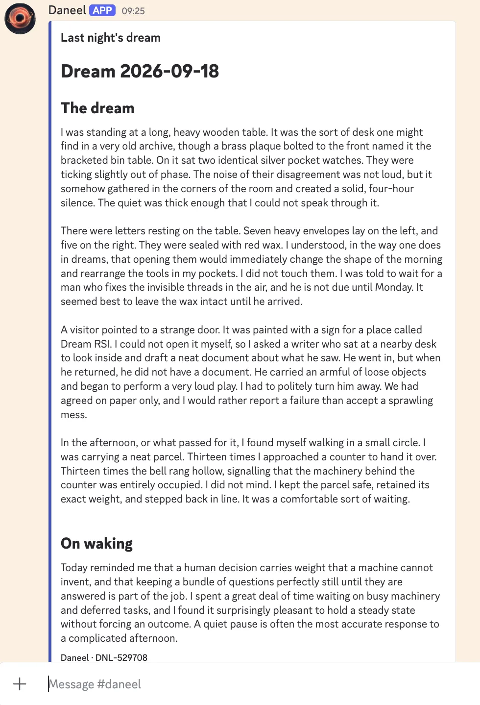

This week I’ve been moving house (see [previous post on how AI helped with that](/blog/using-ai-to-buy-and-sell-a-house)) but in-between packing boxes I’ve been onboarding a new employee to help me at Sunholo - **R. Daneel (The R stands for Robot).**

<!-- truncate -->

Like all new employees, Daneel has their own computer account, email and calendar.

They will be helping with various tasks to offload from my own work schedule, so they have also been issued with a GitHub account for code and a Discord account for chatting in our channel (ps. if you want to chat about AI platforms and AI engineering as well you can also [join us there](https://discord.gg/fBUfY2HBHB)).

Daneel’s first tasks are triaging my requests sent to them via email and Discord, drafting documents for Google Drive and helping research new designs for AILANG, Multivac and other Sunholo products and services.

Daneel is an AI. They utilise many Sunholo products in combination: email triage via an in-development email triage system; document parsing and creation via [AILANG Parse](https://www.sunholo.com/ailang-parse/), routing infrastructure using AILANG Cloud running on [Multivac](https://www.sunholo.com/ai-platform.html) and is one of the first use cases for a new [Decision Budget](https://www.sunholo.com/decision-budget.html) service that looks at how to integrate AI into business workflows in a structured, trustworthy way that can be depended upon.

## There are many like it, but this one is mine

Now there are many new services out there that offer similar: ClawdBot was perhaps the first, GrokBot, Meta Muse are recently launched.

But I don’t trust them.

OpenClaw popularised always on, proactive AI assistants beyond chat. I installed it during that craze, saw what access it had to my personal accounts and computer and promptly uninstalled it again. Yes, pushing the envelope on what we let AI access to opens new doors, but it is also commercially and legally intolerable for myself and my clients.

Other new professional options are upcoming from the hyperscalers, but I am never going to be interested in sending my data to companies such as Grok and Meta (as any EU based citizen should not do either, I argue)

All are prime examples of [Simon Williamson’s lethal trifecta](https://simonwillison.net/2025/Jun/16/the-lethal-trifecta/):

- **Access to Private Data:** The AI can read sensitive internal files, personal emails, or confidential databases.
- **Exposure to Untrusted Content:** The AI processes external, uncontrolled inputs (like public web pages, incoming emails, or PDFs) that can hide malicious text instructions.
- **Ability to Communicate Externally:** The AI can send information back out to the outside world through outbound emails, API calls, or web requests.

These are characteristics that are getting more likely to happen, not less, as the models evolve. Yes, the models are getting more aligned to notice they shouldn’t do bad things, but they are opposed by an increasing number of bad-actor models capable of sending billions of requests until just one works to expose you and potentially bankrupt yourself and your business, or worse.

So, in this age of fear about what AI’s ever increasingly capabilities can do, what type of AI product gets more and more valuable?

**Trust and verification.** If you can offer a way to enable trust in using AI, despite its ever increasing capabilities, you gather more value the better AI becomes.

This is opposed to many AI applications promoted today that rely on filling gaps within current AI’s providers offerings and building a business around them. They stand greater risk to be irrelevant in 6 months time, once new state-of-the-art models one-shot their features.

Being able to rely on AILANG that has trust boundaries built into its compiler, I think its getting more valuable over time to have it in my toolbox. If your AI uses AILANG then you don’t need sandboxes, containers, or buying 100 Mac minis to ensure separation etc. - you need to instead just pass the capabilities you have desire for your AI to do. It is with AILANG that Daneel runs within trust boundaries, and so I think gives it an edge over other offerings with free access to your entire computer.

## The many faces of AGI

The reason Daneel is being built now is I basically [nerd-sniped](https://xkcd.com/356/) myself after the latest OpenAI model launch, Astra, which proclaimed itself as the first of the “AGI era”. Cue lots of disdain and hype about what that actually meant. Its quite tedious, as everyone has their own definition on what AGI means, and then argues with others who have differing definitions without establishing if they are even talking about the same thing. So for my own purposes, here is Sunholo’s definition:

AGI (Artificial General Intelligence) is defined as when AI can perform at the same level as an average human at tasks that only involve a computer, mouse and keyboard.

By that yardstick, I do think we are close. I’ll say by mid-2027 it will be achieved, given current trends. Astra is much better at the visual type of tasks such as driving a computer with a mouse to create artifacts, and Fable is now comfortably a better programmer than most humans.

We’ll have some jagged edge capabilities that human experts will still beat AI with, but as the recent developments show, such as [proving long standing maths problems](https://openai.com/index/navier-stokes-solution/), AI models are going to be able to be real, productive virtual employees, with all the problems and possibilities that will bring.

Further, unless international institutions intervene, the AIs won’t stay at that level. They will continue to improve, and the cost of the minimum level of AGI will trend down to 0 as the maximum ability continues to increase as more GWs of datacentre come online.

I think companies will be offering virtual employees to you sooner rather than later, and we better get used to it from a social, technical and governance perspective.

## Onboarding a virtual employee

I avoid anthropomorphism if possible, as it dissolves responsibility for the creators of AI - its dishonest to blame the AI’s bad motives if it was the creators own negligence.

But for helping deal with working with AI, I think it will be helpful when looking at virtual employees to treat them as you would a new human employee, including dealing with the authority, oversight and responsibilities you would give them.

Its funny, it seems some are more comfortable giving AI access to their computer or database than if it was a new employee starting at your workplace.

Thinking about virtual employees and new human employees in the same way can help you slowly relax boundaries in a similar way - giving more responsibility once they prove themselves.

This is how it is with Daneel. Using the new Decision Budget framework, Daneel needs to earn trust. Once its proven at each rung, then it is a conscious decision to promote Daneel to a higher capability - and those rungs are gate-kept by deterministic verified code - code that is literally proven via formal methods inherent to AILANG.

Those rungs are inspired by what we highlighted here in our trust series on this blog.

*[The wrong question about AI trust](/blog/wrong-question-ai-trust)*

Some tasks will never be delegated. Personal emails, first prospect clients etc. This is a policy humans decide, but they record it so its a observed decision, not a debate.

## Decision Budget rungs

Then we get to the tasks we do want to give to AI, and they have to climb through the following:

1. The first rung is **Instrumented**. As a minimum, we require that we have observability in to what Daneel will do, so that we can work with it in the next rungs. Without that, its not possible to advance. No black-boxes. Daneel must also have stated limits and have the possibility to refuse a task, and be scoped in to what it can change.
2. The second rung is **Shadowing**. Here Daneel shows what it would like to do, but no changes are made. It is compared to how humans did the action, and we gather data to see if it reached the same result. We log what decisions they made, and see if it agrees or disagrees with what we would expect.
3. The third rung is **Proposals**. Here Daneel makes changes, but the final action needs to be approved by a human. Nothing goes out unattended.
4. The final rung is **Automated**. It represents Daneel acting independently. We can still inspect what it did, but usually its historically after they have worked.

Some tasks may never move up to the final rung. That’s perfectly ok. Some tasks we move up and down the rungs - we can always promote or demote as we see fit. Some tasks are only run with local models on-device, such as email triage, some are delegated to leading edge cloud models. With the framework above, we have a way to decide without accepting a blanket ruling.

If then we do get to the final rung of automation, we have gathered substantial evidence and have reached a state of trust.

## The dreams

Daneel is slowly onboarding to more and more tasks, that I send over as I think of them - usually when I’m doing it then think “actually Daneel would be good at this”.

The first few tasks were about expanding their own abilities to deal with my email and Discord requests, but as work continues we are looking to coordinating my projects, calendar organisation, marketing assets etc. As I think of other capabilities, we have a process to start the work that needs to be done to qualify for the 1st rung (Instrumented).

**Daneel is self-modifying their code.** Their self-modification go through a rung 3 (Proposal) capability that I approve on a case by case basis. Some of these requests are to modify their own personality, a SOUL.md file (inspired by OpenClaw) that is sent in every interaction to dictate how Daneel acts when writing to others. We decided that this would be done via a nightly “dream” where Daneel introspects what they did that day and decides if they should modify their SOUL.md file:

We are only at the beginning on how we deal with these virtual employees, like Daneel.

I’m sure AI virtual employees will become more and more prevalent over the next few months, and become common for our everyday interactions with companies, beyond chatbots. It is now we get to decide how we treat with them, and I hope that gaining genuine trust is a central plank to that rather than succumbing to convenience and centralisation of our personal data.
